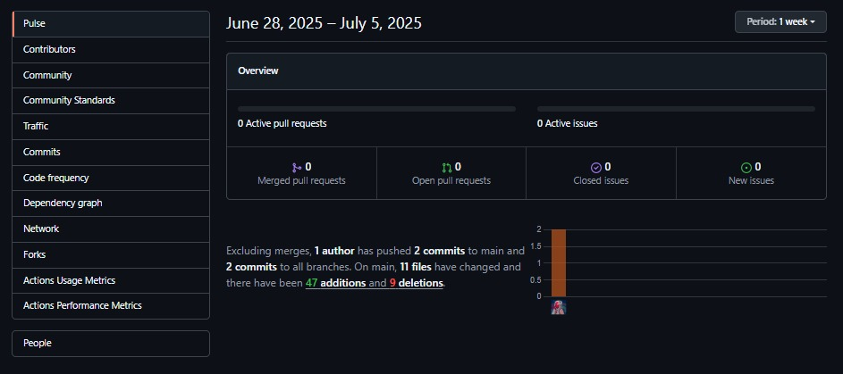
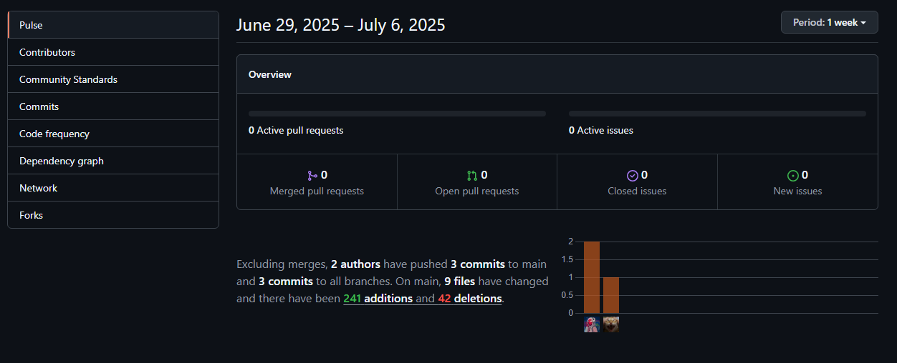
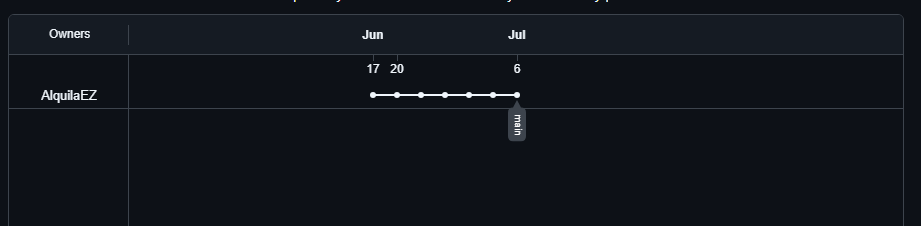
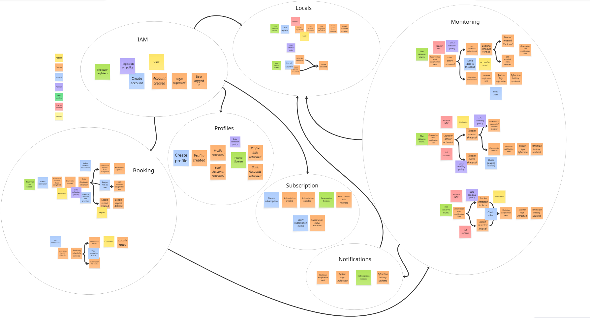
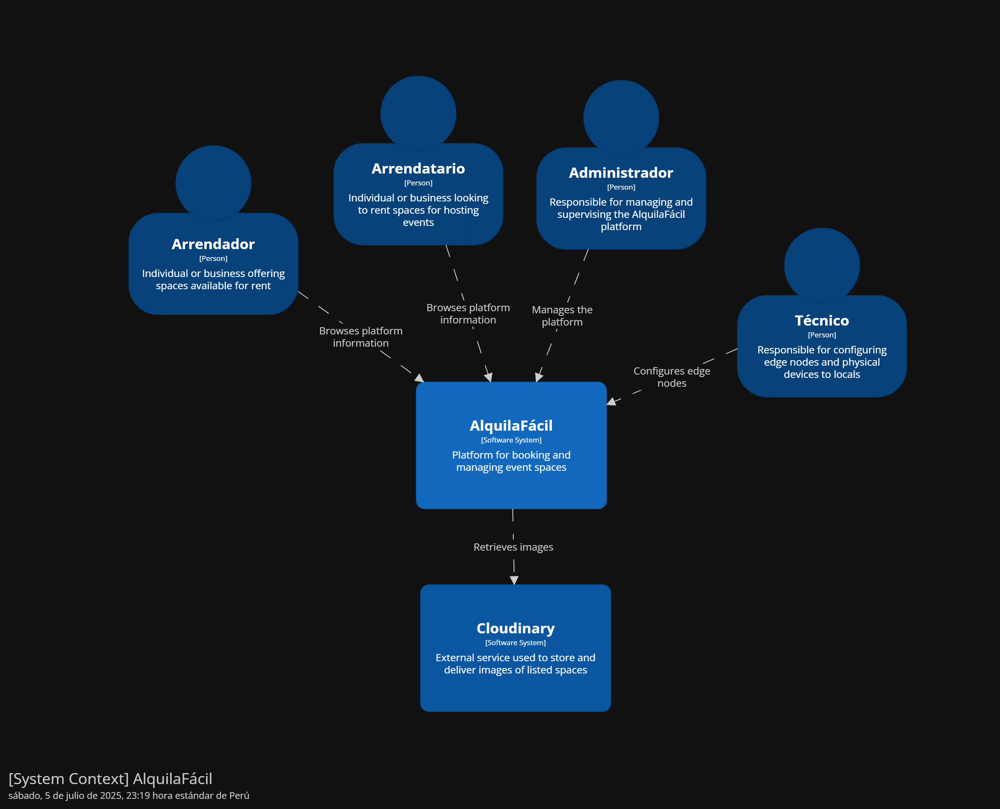
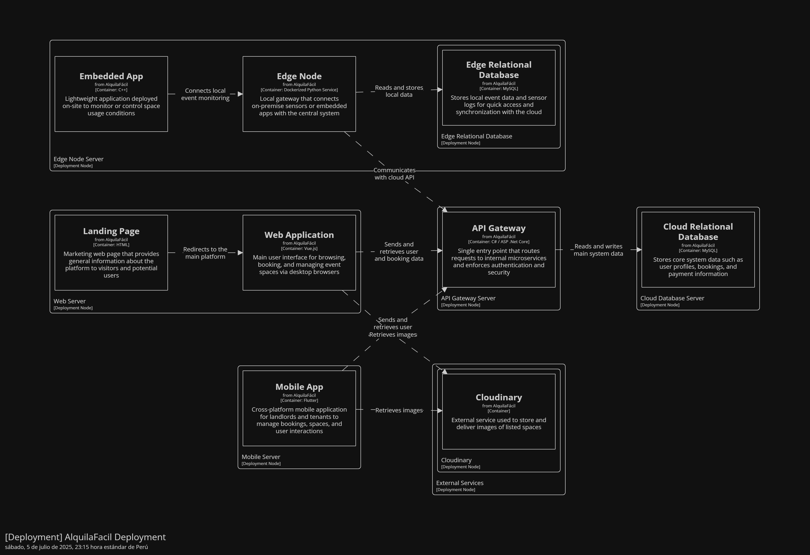

<p align="center">
  
</p>

<p align="center"><strong>Universidad Peruana de Ciencias Aplicadas</strong><br>
<strong>Ingeniería de Software</strong><br>
<strong>Ciclo 2025-10</strong></p>

<h3 align="center">Course Project</h3>

<p align="center">
  <strong>Profesor:</strong> Marco Antonio Leon Baca<br>
  <strong>Curso:</strong> Desarrollo de Soluciones IoT
</p>

<h3 align="center">FINAL REPORT</h3>

<p align="center">
  <strong>Startup:</strong> AlquilaEZ<br>
  <strong>Propuesta:</strong> AlquilaFacil
</p>

<p align="center"><strong>Team Members</strong><br>
Ames Oviedo Mariano Jose<br>
Avalos Santos Anthony Piero<br>
Lecca Choccare Christopher Bryan<br>
Sosa Colca Angello Rodolfo<br>
Carlos Oswaldo Casimiro Fernandez
</p>

<p align="center"><strong>Junio 2025</strong></p>


---

## Registro de Versiones 

<table>
  <thead>
    <tr>
      <th>Versión</th>
      <th>Fecha</th>
      <th>Autor</th>
      <th>Descripción de modificación</th>
    </tr>
  </thead>
  <tbody>
    <tr>
      <td>1era</td>
      <td>22/04/2025</td>
      <td>
        - Ames Oviedo Mariano Jose <br>
        - Avalos Santos Anthony Piero <br>
        - Lecca Choccare Christopher Bryan <br>
        - Sosa Colca Angello Rodolfo <br>
        - Carlos Oswaldo Casimiro Fernandez <br>
      </td>
      <td>Se creó la ramificacion del repositorio. Se concluyó con los capitulos 1, 2, 3 y 4, realizando la presentacion respectiva de la documentacion. También se realizó el video donde cada miembro del equipo expone ciertas partes del trabajo</td>
   </tr>
       <tr>
      <td>2da</td>
      <td>10/05/2025</td>
      <td>
        - Ames Oviedo Mariano Jose <br>
        - Avalos Santos Anthony Piero <br>
        - Lecca Choccare Christopher Bryan <br>
        - Sosa Colca Angello Rodolfo <br>
        - Carlos Oswaldo Casimiro Fernandez <br>
      </td>
      <td>Se creó los repositorios para la Web Application frontend y Landing Page, asi como también el desarrollo de los capitulos 5 y 6 (Sprint Backlog 1). También se continuó con el desarrollo de los productos de software mencionados y la presentación de los mismos.</td>
   </tr>
    <tr>
      <td>3da</td>
      <td>19/06/2025</td>
      <td>
        - Ames Oviedo Mariano Jose <br>
        - Avalos Santos Anthony Piero <br>
        - Lecca Choccare Christopher Bryan <br>
        - Sosa Colca Angello Rodolfo <br>
        - Carlos Oswaldo Casimiro Fernandez <br>
      </td>
      <td> Se continuó mejorando la aplicación web y Landing Page. Se desplego la primera version de la aplicación embebida, así como también el nodo Edge. También se realizó la primera versión de la aplicación móvil. Todo ello corresponde al Sprint Backlog 2, parte del capitulo 6.</td>
   </tr>
   <tr>
  <td>4to</td>
  <td>06/07/2025</td>
  <td>
    - Ames Oviedo Mariano Jose <br>
    - Avalos Santos Anthony Piero <br>
    - Lecca Choccare Christopher Bryan <br>
    - Sosa Colca Angello Rodolfo <br>
    - Carlos Oswaldo Casimiro Fernandez <br>
  </td>
  <td> Se completó la integración final entre los dispositivos físicos IoT y la aplicación móvil, validando la comunicación en tiempo real. Además, se migraron los servicios web y el nodo Edge a la nube de Microsoft Azure, garantizando mayor estabilidad y escalabilidad. También se realizaron ajustes de usabilidad en la aplicación web y mejoras en el monitoreo de eventos, todo correspondiente al Sprint Backlog 3, dentro del capítulo 6.</td>
</tr>

</table>

---

## Project Report Collaboration Insights

<p>URL del repositorio: https://github.com/AlquilaEZ/alquilafacil-document-report</p>

<strong>TB1</strong> 

<p> El equipo participó de forma activa en el repositorio de GitHub, registrando un total de 74 commits durante el desarrollo del primer entregable del informe.</p>


<p> El trabajo con ramas paralelas permitió que los integrantes del equipo avanzaran en distintas secciones del informe de forma simultánea, integrando sus cambios de manera ágil y minimizando conflictos. Esta estrategia colaborativa aseguró una participación equilibrada de todos los miembros en la construcción del entregable.</p>


<strong>TP</strong> 

<p> El uso de ramas paralelas permitió que los integrantes del equipo desarrollaran diferentes secciones de la Landing Page de forma simultánea, lo que facilitó la integración continua de avances sin generar conflictos significativos. Esta estrategia colaborativa promovió una distribución equitativa del trabajo y garantizó una participación activa de todos los miembros en la construcción del producto entregable del sprint.</p>

- **Landing Page**


)](images/cap6_image2.jpeg)

  - **Frontend Web Application**
  


<strong>TB2</strong> 

<p> El uso de ramas paralelas en el control de versiones permitió que los integrantes del equipo trabajaran de manera simultánea en diferentes componentes del proyecto, como la Landing Page, la aplicación web, la app móvil y el nodo Edge. Esta estrategia colaborativa no solo facilitó una integración continua de los avances, minimizando conflictos de código, sino que también promovió una distribución equitativa de las tareas. Gracias a esta metodología, todos los miembros del equipo pudieron contribuir activamente al desarrollo integral del producto entregable del sprint, manteniendo un flujo de trabajo ágil y coordinado.</p>

  - **Frontend Web Application**


  - **Mobile Application**
  
  


  - **Edge Node**
  
  


<strong>TF</strong> 

<p>La implementación de ramas paralelas en el control de versiones permitió que los miembros del equipo desarrollaran distintos componentes del proyecto de forma simultánea, abarcando la Landing Page, la aplicación web, la app móvil y el nodo Edge. Esta metodología colaborativa favoreció una integración continua de los avances, reduciendo los conflictos en el código y asegurando una mejor distribución de las responsabilidades. De esta manera, todos los integrantes pudieron participar activamente en el desarrollo del producto final correspondiente al sprint, garantizando un proceso ágil, coordinado y eficiente.</p>

  - **Landing Page**

  
  

  - **Frontend Web Application**

  
  


  - **Mobile Application**

  
  


  - **Edge Node**

  
  


  - **Embebbed App**

  
  


---

## Contenido

**Tabla de contenidos**

| Tabla de contenidos                                                                                                 |
| ------------------------------------------------------------------------------------------------------------------- |
| [Capítulo I: Introducción](#capítulo-i-introducción)                                                                |
| [1.1. Startup Profile](#11-startup-profile)                                                                         |
| [1.1.1. Descripción de la Startup](#111-descripción-de-la-startup)                                                  |
| [1.1.2. Perfiles de integrantes del equipo](#112-perfiles-de-integrantes-del-equipo)                                |
| [1.2. Solution Profile](#12-solution-profile)                                                                       |
| [1.2.1 Antecedentes y problemática](#121-antecedentes-y-problemática)                                               |
| [1.2.2. Lean UX Process](#122-lean-ux-process)                                                                      |
| [1.2.2.1. Lean UX Problem Statements](#1221-lean-ux-problem-statements)                                             |
| [1.2.2.2. Lean UX Assumptions](#1222-lean-ux-assumptions)                                                           |
| [1.2.2.3. Lean UX Hypothesis Statements](#1223-lean-ux-hypothesis-statements)                                       |
| [1.2.2.4. Lean UX Canvas](#1224-lean-ux-canvas)                                                                     |
| [1.3. Segmentos objetivo](#13-segmentos-objetivo)                                                                   |
| [Capítulo II: Requirements Elicitation & Analysis](#capítulo-ii-requirements-elicitation--analysis)                 |
| [2.1. Competidores](#21-competidores)                                                                               |
| [2.1.1. Análisis competitivo](#211-análisis-competitivo)                                                            |
| [2.1.2. Estrategias y tácticas frente a competidores](#212-estrategias-y-tácticas-frente-a-competidores)            |
| [2.2. Entrevistas](#22-entrevistas)                                                                                 |
| [2.2.1. Diseño de entrevistas](#221-diseño-de-entrevistas)                                                          |
| [2.2.2. Registro de entrevistas](#222-registro-de-entrevistas)                                                      |
| [2.2.3. Análisis de entrevistas](#223-análisis-de-entrevistas)                                                      |
| [2.3. Needfinding](#23-needfinding)                                                                                 |
| [2.3.1. User Personas](#231-user-personas)                                                                          |
| [2.3.2. User Task Matrix](#232-user-task-matrix)                                                                    |
| [2.3.3. User Journey Mapping](#233-user-journey-mapping)                                                            |
| [2.3.4. Empathy Mapping](#234-empathy-mapping)                                                                      |
| [2.3.5. As-is Scenario Mapping](#235-as-is-scenario-mapping)                                                        |
| [2.4. Ubiquitous Language](#24-ubiquitous-language)  |
| [Capítulo III: Requirements Specification](#capítulo-iii-requirements-specification)                                |
| [3.1. To-Be Scenario Mapping](#31-to-be-scenario-mapping)                                                           |
| [3.2. User Stories](#32-user-stories)                                                                               |
| [3.3. Impact Mapping](#33-impact-mapping)                                                                           |
| [3.4. Product Backlog](#34-product-backlog)     |
| [Capítulo IV: Solution Software Design](#capítulo-iv-product-design)                                                          |
| [4.1. Strategic-Level Domain-Driven Design](#41-strategic-level-domain-driven-design)                               |
| [4.1.1. Event Storming](#411-event-storming) |
| [4.1.1.1 Candidate Context Discovery](#4111-candidate-context-discovery) |
| [4.1.1.2 Domain Message Flows Modeling](#4112-domain-message-flows-modeling) |
| [4.1.1.3 Bounded Context Canvases](#4113-bounded-context-canvases) |
| [4.1.2. Context Mapping](#412-context-mapping) |
| [4.1.3. Software Architecture](#413-software-architecture) |
| [4.1.3.1. Software Architecture System Landscape Diagram](#4131-software-architecture-system-landscape-diagram) |
| [4.1.3.2. Software Architecture Context Level Diagrams](#4132-software-architecture-context-level-diagrams) |
| [4.1.3.3. Software Architecture Container Level Diagrams](#4133-software-architecture-container-level-diagrams) |
| [4.1.3.4. Software Architecture Deployment Diagrams](#4134-software-architecture-deployment-diagrams) |
| [4.2. Tactical-Level Domain-Driven Design](#42-tactical-level-domain-driven-design) |
| [4.2.1. Bounded Context: <Bounded Context Name>](#421-bounded-context-bounded-context-name) |
| [4.2.1.1. Domain Layer](#4211-domain-layer) |
| [4.2.1.2. Interface Layer](#4212-interface-layer) |
| [4.2.1.3. Application Layer](#4213-application-layer) |
| [4.2.1.4. Infrastructure Layer](#4214-infrastructure-layer) |
| [4.2.1.5. Bounded Context Software Architecture Component Level Diagrams](#4215-bounded-context-software-architecture-component-level-diagrams) |
| [4.2.1.6. Bounded Context Software Architecture Code Level Diagrams](#4216-bounded-context-software-architecture-code-level-diagrams) |
| [4.2.1.6.1. Bounded Context Domain Layer Class Diagrams](#42161-bounded-context-domain-layer-class-diagrams) |
| [4.2.1.6.2. Bounded Context Database Design Diagram](#42162-bounded-context-database-design-diagram) |
| [Capítulo V: Solution UI/UX Design](#capitulo-v-solution-uiux-design)   |
| [5.1. Style Guidelines](#51-style-guidelines) |
| [5.1.1. General Style Guidelines](#511-general-style-guidelines) |
| [5.1.2. Web, Mobile and IoT Style Guidelines](#512-web-mobile-and-iot-style-guidelines) |
| [5.2. Information Architecture](#52-information-architecture) |
| [5.2.1. Organization Systems](#521-organization-systems) |
| [5.2.2. Labeling Systems](#522-labeling-systems) |
| [5.2.3. SEO Tags and Meta Tags](#523-seo-tags-and-meta-tags) |
| [5.2.4. Searching Systems](#524-searching-systems) |
| [5.2.5. Navigation Systems](#525-navigation-systems) |
| [5.3. Landing Page UI Design](#53-landing-page-ui-design) |
| [5.3.1. Landing Page Wireframe](#531-landing-page-wireframe) |
| [5.3.2. Landing Page Mock-up](#532-landing-page-mock-up) |
| [5.4. Applications UX/UI Design](#54-applications-uxui-design) |
| [5.4.1. Applications Wireframes](#541-applications-wireframes) |
| [5.4.2. Applications Mock-ups](#542-applications-mock-ups) |
| [5.4.3. Applications User Flow Diagrams](#543-applications-user-flow-diagrams) |
| [5.5. Applications Prototyping](#55-applications-prototyping) |
| [Capítulo VI: Product Implementation, Validation & Deployment](#capitulo-vi-product-implementation-validation--deployment)  |
 | [6.1. Software Configuration Management](#61-software-configuration-management) |
| [6.1.1. Software Development Environment Configuration](#611-software-development-environment-configuration) |
| [6.1.2. Source Code Management](#612-source-code-management) |
| [6.1.3. Source Code Style Guide & Conventions](#613-source-code-style-guide--conventions) |
| [6.1.4. Software Deployment Configuration](#614-software-deployment-configuration) |
| [6.2. Landing Page, Services & Applications Implementation](#62-landing-page-services--applications-implementation) |
| [6.2.1. Sprint 1](#621-sprint-1) |
| [6.2.1.1. Sprint Planning 1](#6211-sprint-planning-1) |
| [6.2.1.2. Aspect Leaders and Collaborators](#6212-aspect-leaders-and-collaborators) |
| [6.2.1.3. Sprint Backlog 1](#6213-sprint-backlog-1) |
| [6.2.1.4. Development Evidence for Sprint Review](#6214-development-evidence-for-sprint-review) |
| [6.2.1.5. Testing Suite Evidence for Sprint Review](#6215-testing-suite-evidence-for-sprint-review) |
| [6.2.1.6. Execution Evidence for Sprint Review](#6216-execution-evidence-for-sprint-review) |
| [6.2.1.7. Services Documentation Evidence for Sprint Review](#6217-services-documentation-evidence-for-sprint-review) |
| [6.2.1.8. Software Deployment Evidence for Sprint Review](#6218-software-deployment-evidence-for-sprint-review) |
| [6.2.1.9. Team Collaboration Insights during Sprint](#6219-team-collaboration-insights-during-sprint) |
| [6.2. Landing Page, Services & Applications Implementation](#62-landing-page-services--applications-implementation) |
| [6.2.2. Sprint 2](#621-sprint-2) |
| [6.2.2.1. Sprint Planning 2](#6221-sprint-planning-2) |
| [6.2.2.2. Aspect Leaders and Collaborators](#6222-aspect-leaders-and-collaborators) |
| [6.2.2.3. Sprint Backlog 2](#6223-sprint-backlog-2) |
| [6.2.2.4. Development Evidence for Sprint Review](#6224-development-evidence-for-sprint-review) |
| [6.2.2.5. Testing Suite Evidence for Sprint Review](#6225-testing-suite-evidence-for-sprint-review) |
| [6.2.2.6. Execution Evidence for Sprint Review](#6226-execution-evidence-for-sprint-review) |
| [6.2.2.7. Services Documentation Evidence for Sprint Review](#6227-services-documentation-evidence-for-sprint-review) |
| [6.2.2.8. Software Deployment Evidence for Sprint Review](#6228-software-deployment-evidence-for-sprint-review) |
| [6.2.2.9. Team Collaboration Insights during Sprint](#6229-team-collaboration-insights-during-sprint) |
| [6.2.3. Sprint 3](#631-sprint-3) |
| [6.2.3.1. Sprint Planning 3](#6331-sprint-planning-3) |
| [6.2.3.2. Aspect Leaders and Collaborators](#6232-aspect-leaders-and-collaborators) |
| [6.2.3.3. Sprint Backlog 3](#6233-sprint-backlog-3) |
| [6.2.3.4. Development Evidence for Sprint Review](#6234-development-evidence-for-sprint-review) |
| [6.2.3.5. Testing Suite Evidence for Sprint Review](#6235-testing-suite-evidence-for-sprint-review) |
| [6.2.3.6. Execution Evidence for Sprint Review](#6236-execution-evidence-for-sprint-review) |
| [6.2.3.7. Services Documentation Evidence for Sprint Review](#6237-services-documentation-evidence-for-sprint-review) |
| [6.2.3.8. Software Deployment Evidence for Sprint Review](#6238-software-deployment-evidence-for-sprint-review) |
| [6.2.3.9. Team Collaboration Insights during Sprint](#6239-team-collaboration-insights-during-sprint) |
| [6.3. Validation Interviews.](#63-validation-interviews) |
| [6.3.1. Diseno de Entrevistas](#631-diseño-de-entrevistas) |
| [6.3.2. Registro de Entrevistas](#632-registro-de-entrevistas) |
| [6.3.3. Evaluaciones según heurísticas](#633-evaluaciones-segun-heuristicas) |
| [6.4. Video About-the-Product.](#64-video-about-the-product) |

# Student Outcome

**ABET – EAC – Student Outcome 5**
Criterio: La capacidad de funcionar efectivamente en un equipo cuyos miembros
juntos proporcionan liderazgo, crean un entorno de colaboración e inclusivo,
establecen objetivos, planifican tareas y cumplen objetivos

En el siguiente cuadro se describe las acciones realizadas y enunciados de
conclusiones por parte del grupo, que permiten sustentar el haber alcanzado el logro
del ABET – EAC - Student Outcome 5.

<table border="1" cellspacing="0" cellpadding="8">
  <thead>
    <tr>
      <th><strong>Criterio específico</strong></th>
      <th><strong>Acciones realizadas</strong></th>
      <th><strong>Conclusiones</strong></th>
    </tr>
  </thead>
  <tbody>
    <tr>
      <td>Trabaja en equipo para proporcionar liderazgo en forma conjunta.</td>
      <td>
        <strong>Christopher Bryan Lecca Choccare <br> (TB1):</strong> Me encargué de liderar el diseño estratégico, guiando al equipo en la identificación de bounded contexts y en la elaboración del Event Storming y Context Mapping. Coordiné la conexión lógica entre eventos y políticas, y aseguré la consistencia general en los flujos del sistema.<br>
        <strong>(TP1):</strong> Desarrollé la estructura completa de la Landing Page utilizando HTML y Tailwind CSS, asegurando un diseño limpio y adaptable. Participé en el desarrollo del Capítulo V, definiendo los lineamientos de estilo y wireframes. Además, fui responsable de redactar gran parte del Capítulo VI, incluyendo las evidencias de implementación y despliegue del producto.<br>
         <strong>(TB2):</strong> Desarrolle el Node Edge para la comunicación directa con los dispositivos IoT. También colabore activamente en el desarrollo de la aplicación móvil, y apoye en el desarrollo y conexion de la aplicacion embebida con el node Edge. Tambien apoye en la documentacion respectiva.<br>
                  <strong>(TF):</strong> Continue mejorando el desarrollo de la capa Edge, asi como tambien el servicio principal en la nube, ademas de incluir nuevas features en la aplicacion movil.<br><br>
        <strong>Angello Rodolfo Sosa Colca <br>(TB1):</strong> Lideré el diseño táctico del contexto "Locals", definiendo sus capas y componentes. Me aseguré de que la estructura entre entidades, comandos, servicios y repositorios fuera coherente y alineada con los principios de DDD.<br>
        <strong>(TP1):</strong> Contribuí activamente en la codificación del frontend web desarrollado con Vue.js, implementando los componentes de interfaz para la gestión de espacios. También colaboré en la sección de prototipos del Capítulo V y en los aspectos técnicos del Capítulo VI relacionados a la arquitectura de software.<br>
        <strong>(TB2):</strong> Colabore activamente en el desarrollo de los puntos de conexión entre la aplicación móvil y el backend, asegurando una integración fluida y eficiente.Ademas, apoye en la ultima version de Landing Page.<br>
        <strong>(TF):</strong> Participé de forma activa en el desarrollo de los puntos de integración entre la aplicación móvil y el backend, garantizando una comunicación fluida y eficiente entre ambos componentes. Además, brindé soporte en la actualización y mejora de la última versión de la Landing Page.<br><br>
        <strong>Anthony Piero Avalos Santos <br>  (TB1):</strong> Participé activamente en la fase de descubrimiento del usuario. Me enfoqué en aplicar técnicas como Empathy Mapping, User Personas y User Journey para captar de manera precisa las necesidades reales y plasmarlas en el sistema.<br>
        <strong>(TP1):</strong> Diseñé la estructura de navegación de la Landing Page y desarrollé varias secciones como "Beneficios" y "Monitoreo", asegurando su conexión visual y lógica. También redacté partes del Capítulo V enfocadas en diseño centrado en el usuario y usabilidad de la aplicación web.<br>
                <strong>(TB2):</strong> Apoye en el desarrollo del Node Edge, asi como tambien en la conexion con el backend central para enviar las lecturas de los sensores principales. Tambien apoye en la documentacion respectiva.<br>
                                <strong>(TF):</strong>Colaboré en el desarrollo del Node Edge, contribuyendo a su implementación y asegurando la correcta conexión con el backend central para el envío de las lecturas provenientes de los sensores principales. Asimismo, participé en la elaboración de la documentación técnica correspondiente.<br><br>
        <strong>Mariano José Ames Oviedo <br>(TB1):</strong> Me encargué de elaborar la introducción de la solución, definiendo el perfil de la startup, los desafíos que busca resolver y su aporte a la sostenibilidad urbana. También consolidé los antecedentes para contextualizar el problema.<br>
        <strong>(TP1):</strong> Colaboré en la validación del contenido del Capítulo VI, asegurándome de que se describieran de forma clara los resultados del sprint. Además, participé en la organización y revisión del índice general y los entregables de UI/UX documentados en el Capítulo V.<br>
        <strong>(TB2):</strong> Colabore activamente en la configuracion y despliegue de la aplicacion embebida, asi como tambien en la seleccion de los componentes IoT necesarios para la integracion del sistema junto con las US necesarios para el core del negocio de AlquilaFacil.<br>
                <strong>(TF):</strong>Participé de manera activa en la configuración y despliegue de la aplicación embebida, además de contribuir en la selección de los componentes IoT requeridos para la integración del sistema. Asimismo, apoyé en el desarrollo de las User Stories clave vinculadas al core del negocio de AlquilaFácil.<br><br>
        <strong>Carlos Oswaldo Casimiro Fernández <br> (TB1):</strong>Me responsabilicé por la implementación de la capa de infraestructura del contexto, construyendo los repositorios, asegurando persistencia adecuada y validando integraciones con bases de datos.<br>
        <strong>(TP1):</strong> Aporté en la integración técnica del frontend con los servicios backend simulados, validando los flujos de datos. Además, participé en la documentación técnica del Capítulo VI, especialmente en la sección de despliegue y configuración de servicios.<br>
        <strong>(TB2):</strong> Aporte en la elaboracion del documento y tambien el video about the product. Tambien apoye en la presentacion de la entrega para exponer todo lo que abarca este sprint<br><br>
                <strong>(TF):</strong> Contribuí en la elaboración del documento técnico y en la creación del video explicativo del producto. Asimismo, brindé apoyo en la preparación y presentación de la exposición final, detallando todos los aspectos abordados durante este sprint.<br><br>
      </td>
      <td>
      <strong>(TB1):</strong>
El equipo demostró una colaboración efectiva al asumir roles estratégicos que permitieron el avance fluido del proyecto. Cada miembro aportó liderazgo desde sus fortalezas, logrando construir una solución bien estructurada a través de trabajo conjunto y comunicación constante.<br><br><br>
      <strong>(TP1):</strong>
El equipo logró organizarse estratégicamente durante el desarrollo del producto, asignando roles complementarios en el diseño de interfaces, construcción de componentes técnicos y elaboración del entregable. Cada integrante asumió el liderazgo en secciones específicas del sistema, permitiendo el desarrollo paralelo de la Landing Page, la aplicación web y los capítulos del informe. Esta distribución equilibrada potenció la autonomía individual sin comprometer la coherencia del trabajo conjunto.<br><br>
      <strong>(TB2):</strong>
El equipo trabajó de forma coordinada en el desarrollo paralelo de la aplicación móvil, el nodo Edge y la aplicación embebida, asegurando su integración con el backend. Cada miembro asumió roles técnicos y de documentación según sus fortalezas, lo que permitió una entrega sólida, coherente y bien documentada al cierre del sprint.
  <strong>(TF1):</strong>
  La integración de los dispositivos físicos IoT en el sistema final se logró satisfactoriamente, validando su funcionamiento en pruebas reales. Este proceso garantizó la operatividad conjunta entre el hardware, el backend y la aplicación móvil, aportando robustez al sistema y cumpliendo con los objetivos funcionales establecidos para el sprint.
      </td>
    </tr>
    <tr>
      <td>Comunica en forma escrita ideas y/o resultados con objetividad a público de diferentes especialidades y niveles jerárquicos.</td>
      <td>
        <strong>Mariano José Ames Oviedo <br> (TB1):</strong> Me encargué de redactar las secciones introductorias del entregable, comunicando los objetivos y fundamentos del sistema de forma clara para cualquier lector.<br>
        <strong>(TP1):</strong> Redacté el perfil de la startup, objetivos generales del sistema y antecedentes clave, facilitando la comprensión del lector sobre la necesidad del producto. También revisé la coherencia del Capítulo VI en su conjunto.<br>
                <strong>(TB2):</strong> Redacté descripciones claras sobre la configuración de la aplicación embebida y los componentes IoT utilizados, explicando su propósito dentro del sistema para facilitar su entendimiento por diferentes especialidades.<br>
                                <strong>(TF):</strong>Elaboré descripciones precisas sobre la configuración de la aplicación embebida y los componentes IoT implementados, detallando su función dentro del sistema con el fin de garantizar su comprensión por parte de profesionales de diversas especialidades.<br><br>
        <strong>Anthony Piero Avalos Santos <br>(TB1):</strong> Redacté resultados del análisis de usuarios, presentando mapas y perfiles de forma comprensible para distintos perfiles técnicos y no técnicos.<br>
        <strong>(TP1):</strong> Elaboré textos explicativos dentro de la Landing Page y participé en la redacción del Capítulo V, especialmente en los apartados relacionados a usabilidad y experiencia de usuario.<br>
                <strong>(TB2):</strong> Apoyé en la documentación del Node Edge y su conexión con el backend, redactando con un enfoque didáctico para asegurar que incluso lectores sin formación técnica pudieran seguir la lógica del flujo de datos.<br>
                                <strong>(TF):</strong> Colaboré en la elaboración de la documentación del Node Edge y su integración con el backend, redactando con un enfoque claro y accesible que permitiera a usuarios sin conocimientos técnicos comprender el funcionamiento y el flujo de datos del sistema.<br><br>
        <strong>Christopher Bryan Lecca Choccare <br>(TB1):</strong> Elaboré la descripción del diseño estratégico, cuidando que el lenguaje técnico pudiera ser entendido también por miembros no especializados del equipo.<br>
        <strong>(TP1):</strong> Organicé y redacté los contenidos técnicos del Capítulo VI (implementación, evidencia y despliegue) con lenguaje claro, permitiendo que incluso lectores no técnicos comprendieran las decisiones del equipo.<br>
                <strong>(TB2):</strong> Continué redactando partes clave del documento final, explicando la arquitectura y decisiones técnicas de forma clara para públicos mixtos. Me aseguré de que el lenguaje técnico fuese accesible y respaldado por evidencias visuales del sistema.<br>
                                <strong>(TF):</strong> Contribuí en la redacción de secciones clave del documento final, presentando la arquitectura y las decisiones técnicas de manera clara y comprensible para audiencias técnicas y no técnicas. Además, me aseguré de que los conceptos se acompañaran de evidencias visuales que facilitaran la comprensión integral del sistema.<br><br>
        <strong>Angello Rodolfo Sosa Colca <br>(TB1):</strong> Documenté los diagramas tácticos y estructuras de clases, asegurando una redacción técnica precisa pero accesible para otros desarrolladores o evaluadores.<br>
        <strong>(TP1):</strong> Redacté explicaciones técnicas del diseño UI/UX en el Capítulo V y contribuí en el Capítulo VI con la documentación del proceso de integración del frontend con la lógica de negocio.<br>
               <strong>(TB2):</strong> Documenté el proceso de integración móvil-backend usando términos precisos pero comprensibles, contribuyendo a que tanto técnicos como evaluadores externos comprendieran el funcionamiento del sistema y su arquitectura.<br>
                              <strong>(TF):</strong>Elaboré la documentación del proceso de integración entre la aplicación móvil y el backend, utilizando un lenguaje técnico accesible que facilitó la comprensión del funcionamiento y la arquitectura del sistema tanto para desarrolladores como para evaluadores externos.<br><br>
        <strong>Carlos Oswaldo Casimiro Fernández<br> (TB1):</strong>Expliqué el funcionamiento de los repositorios en lenguaje claro y estructurado, facilitando la revisión y el entendimiento por parte de terceros.<br>
        <strong>(TP1):</strong> Redacté la documentación relacionada a la configuración del entorno, despliegue de servicios y validación técnica en el Capítulo VI.<br>
        <strong>(TB2):</strong> Contribuí en la redacción final del entregable y la guía de presentación, enfocándome en comunicar los logros del sprint de manera estructurada y comprensible para cualquier público, incluyendo el resumen en video del producto.<br>
                <strong>(TF):</strong>Participé en la elaboración final del entregable y en la preparación de la guía de presentación, asegurando que los logros alcanzados durante el sprint se comunicaran de manera clara, estructurada y accesible para todo tipo de público. Además, colaboré en la elaboración del video resumen que sintetiza las funcionalidades del producto.<br><br>
      </td>
            <td>
      <strong>(TB1):</strong>
 Se logró una comunicación escrita efectiva a lo largo del entregable, permitiendo que las ideas fueran comprendidas por distintas audiencias. El uso claro del lenguaje, apoyado por gráficos y ejemplos, facilitó la transmisión de resultados y decisiones de diseño.<br><br><br>
      <strong>(TP1):</strong>
A través de un trabajo colaborativo, el equipo elaboró un entregable claro y estructurado, enfocado en comunicar tanto aspectos técnicos como conceptuales del sistema. Se utilizó un lenguaje comprensible, adecuado para lectores técnicos y no técnicos, y se apoyó la redacción con diagramas, flujos y ejemplos. Esta estrategia permitió reflejar con objetividad los resultados obtenidos en el Sprint y la lógica detrás de cada decisión tomada durante el desarrollo.<br><br><br>
      <strong>(TB2):</strong>
El equipo mantuvo una comunicación escrita clara y coherente en la documentación del sprint, explicando conceptos técnicos de manera accesible para diversos públicos. La redacción conjunta de los capítulos finales y el uso de ejemplos, diagramas y evidencias facilitó la comprensión integral del sistema desarrollado.<br><br><br>
<strong>(TF):</strong>
  La integración de los dispositivos físicos IoT en el sistema final se logró de manera efectiva, validando su funcionamiento en escenarios reales. Esta implementación permitió demostrar la operatividad del hardware en conjunto con la aplicación móvil y el backend, aportando valor tangible al producto y cumpliendo con los objetivos técnicos establecidos en el Sprint.
      </td>
    </tr>
  </tbody>
</table>


---

# Capítulo I: Introducción

## 1.1. Startup Profile

### 1.1.1 Descripción de la Startup

AlquilaFácil es un startup fundado en el 2025, por un grupo de estudiantes de la carrera de Ingeniería de Software de la Universidad Peruana de Ciencias Aplicadas (UPC). Nuestra empresa emergente se enfoca en la simplificación del proceso de búsqueda de alquiler de espacios para eventos, así como la administración de los mismos.

**Misión:** Revolucionar el alquiler de espacios para eventos con una plataforma intuitiva que une a arrendadores y arrendatarios de manera rápida y sencilla. 

**Visión:** Consolidarnos como la referencia global en alquiler de espacios para eventos, redefiniendo el sector con soluciones inteligentes y una experiencia excepcional.

### 1.1.2 Perfiles de integrantes del equipo

|<!-- -->|<!-- -->|
|--------|--------|
|Nombre|Ames Oviedo, Mariano José (U202211371)|
|Soy Mariano, tengo 19 años actualmente curso mi 6to ciclo de la carrera de Ingeniería de Software. Me considero una persona responsable y dispuesta a afrontar desafíos. Considero que estas cualidades beneficiaran a mi equipo para poder completar un trabajo de calidad.||
|Nombre|Avalos Santos, Anthony Piero (U20211C596)|
| Soy Anthony Avalos, tengo 21 años, actualmente me encuentro en el 9no ciclo de mi carrera de Ingeniería de Software. Soy un apasionado por el desarrollo Fullstack, me considero una persona super proactiva y con ganas de seguir aprendiendo una nueva tecnología emergente. Me gusta el trabajo en equipo y colaborar con grande profesionales |
|Nombre|Lecca Choccare, Christopher Bryan (U202211399)|
|Mi nombre es Christopher, tengo 20 años y actualmente me encuentro cursando el 7mo ciclo de la carrera de Ingeniería de Software en la Universidad Peruana de Ciencias Aplicadas (UPC). Considero que mi compromiso con el equipo de trabajo designado y mi capacidad de aprendizaje rápida aportarán de buena manera al desarrollo del producto final.|
|Nombre|Sosa Colca, Angello Rodolfo (U202212077)|
|Tengo 19 años y curso el 7mo ciclo de la carrera de Ingeniería de Software en la Universidad Peruana de Ciencias Aplicadas. Soy una persona enfocada, perseverante y colaborativo. Estas cualidades me permiten ser una persona que ayudará de manera óptima el requisito que se me imponga. Además, soy una persona que apoya cuando los demás se encuentran en problemas.|
|Nombre|Carlos Oswaldo Casimiro Fernandez (U202115412)|
| Tengo 21 años y soy estudiante de Ingeniería de Software de la Universidad Peruana de Ciencias Aplicadas. Me considero una persona proactiva, educada y sociable con los que me rodean. Además, cuento con habilidades peculiares como la animación en 3D, edición de videos cinematográficos y conocimiento en lenguajes como C++, Python. |

## 1.2. Solution Profile

En esta sección se detallan los aspectos claves de nuestra solución de software, incluyendo sus características distintivas y propuestas de valor. 

**Product Name:** AlquilaFácil

**Producto Descriptivo:** AlquilaFácil es una plataforma diseñada para simplificar el proceso de búsqueda y reserva de espacios para eventos, conectando de manera eficiente a arrendadores y arrendatarios. Ofrece una experiencia fluida, permitiendo a los usuarios buscar, reservar y gestionar espacios para una amplia variedad de eventos. Además, la plataforma incluye herramientas de gestión y seguimiento en tiempo real, asegurando una experiencia optimizada tanto para arrendadores como para arrendatarios. 

**Monetización:** AlquilaFácil generará ingresos a través de un modelo de suscripción para arrendadores que deseen destacar sus propiedades y acceder a herramientas avanzadas de gestión de reservas. Estos planes premium ofrecerán beneficios adicionales, como una mayor visibilidad en los resultados de búsqueda y acceso prioritario a herramientas analíticas avanzadas. Además, monetizaremos la plataforma mediante la implementación de sensores en los locales, permitiendo a los propietarios recibir reportes detallados sobre la actividad en sus espacios. En contraste, el acceso a la plataforma será completamente gratuito para los arrendatarios, incentivando su participación y aumentando la oferta de espacios disponibles.

### 1.2.1. Antecedentes y Problematicas

Actualmente, las personas tienen fácil acceso a herramientas tecnológicas para reservar y alquilar locales de eventos, en páginas web o mediante un aplicativo móvil. Esto genera una mayor demanda en nuestro país sobre el creciente mercado de las reservas online. Además, con el incremento de usuarios que tienen acceso a internet, uso de dispositivos para facilitar el proceso de reserva espacios para eventos. Según el INEI, en los primeros tres meses del año 2022, 73 de cada 100 personas de 6 y más años accedieron a Internet en el país, cifra que muestra un crecimiento de 5,1 y 17,7 puntos porcentuales comparado con igual trimestre de 2021 (67,4%) y 2019 (54,8%), respectivamente (Jasin, 2023). 

También es importante mencionar la creciente demanda por la elaboración de eventos por parte de las marcas. Según Mañas (2024), las marcas apuestan cada vez más por los eventos para darse a conocer e interactuar directamente con su audiencia, pues muchas consideran que estas experiencias ayudan a mostrar sus valores y a construir relaciones sólidas con sus clientes. 

Ante ello, podemos demostrar que en el Perú el número de personas con acceso a internet a incrementado considerablemente en los últimos dos años, por otro lado, también justificamos la necesidad de una plataforma para facilitar la búsqueda en alquiler de espacios ante la creciente demanda de estas por parte de las empresas.


**Problemáticas - Técnica de las 5 'W's y 2 'H's**

**What?**

**¿Cuál es el problema?**

El problema es la falta de una plataforma centralizada y enfocada en el alquiler de espacios para eventos. Actualmente, arrendadores y arrendatarios enfrentan dificultades al buscar y reservar espacios adecuados para sus necesidades. 

**¿Cuál es la relación con la persona en cuestión?**

La persona en cuestión es que, si es arrendador de un espacio para eventos, puede enfrentar dificultades al encontrar y atraer a potenciales clientes para alquilar su espacio. Del mismo modo, si es arrendatario, puede enfrentar desafíos al buscar y reservar un espacio adecuado para sus eventos.	 

**When?**

**¿Cuánto sucede el problema?** 

El problema ocurre cada vez que arrendadores desean alquilar sus instalaciones para eventos o arrendatarios buscan espacios para celebrar sus actividades. Esta necesidad surge de manera recurrente y en diferentes momentos, ya sea para eventos planificados con anticipación o para aquellos que requieran una búsqueda rápida de un espacio disponible. 

**¿Cuándo utiliza el cliente el producto?** 

Cuando organizaciones o personas necesitan encontrar y reservar un espacio para un evento, ya sea con anticipación o de manera urgente. También, para aquellas personas que poseen instalaciones para realizar eventos y deseen promocionar su espacio, conectándose así con clientes potenciales. 

**Where?** 
**¿Dónde está el cliente cuando usa el producto?**

El cliente utiliza AlquilaFácil a través de su aplicación móvil. 

 
**¿A dónde se dirige?** 

Se dirige a una plataforma en línea o a una aplicación móvil, donde puede buscar, comparar y reservar espacios para eventos de manera conveniente y eficiente. 

**¿Dónde surge el problema?** 

El problema surge en la dificultad para encontrar y reservar espacios adecuados para eventos, ya sea durante la planificación anticipada de un evento o en situaciones donde se requiere una búsqueda rápida. 

**Why?**

**¿Cuál es la causa del problema?**

La falta de una plataforma centralizada y eficiente que conecte a arrendadores con personas que buscan alquilar un espacio para eventos. La ausencia de un sistema unificado dificulta la búsqueda y reserva de espacios adecuados, lo que puede generar frustración y pérdida de oportunidades tanto para arrendadores como para arrendatarios. 

**How?** 

**¿En qué condiciones los clientes usan nuestro producto?** 

Los clientes utilizan AlquilaFácil para buscar y reservar espacios para una variedad de eventos, ya sea para eventos sociales o corporativos. 

**¿Cómo prefieren los clientes acceder a nuestro producto?**

Los clientes prefieren acceder a nuestro producto, a través de una plataforma web o móvil. 

**¿Que llevó al cliente a llegar a esta situación?**

La falta de una plataforma para el alquiler de espacios para eventos llevó tanto a los clientes que buscan espacios como a los arrendadores a esta situación. 

 
**How much?** 

Los costos de AlquilaFácil varían según el plan de suscripción seleccionada. Ofrecemos opciones gratuitas para los usuarios básicos, así como planes de suscripción mensual o anual con tarifas moderadas para aquellos que deseen optar por un plan premium y beneficios adicionales. 

### 1.2.2. Lean UX Process

En esta parte, llevaremos a cabo el proceso de Lean UX, que abarca la visión del modelo de negocio que respaldará nuestro producto de software. Este enfoque metodológico nos permite concentrarnos en el diseño de nuestra solución y en la resolución de los problemas identificados a través del pensamiento de diseño. 

#### 1.2.2.1. Lean UX Problem Statement

Nuestro contexto se enmarca en el mercado de alquiler de espacios para eventos en Perú, un sector que ha experimentado un crecimiento sostenido en los últimos años. Con el aumento de la demanda por espacios flexibles y adaptables para diferentes tipos de eventos, también surgen desafíos en la manera en que los usuarios, tanto arrendadores como arrendatarios, interactúan dentro de este ecosistema. 

Hemos identificado que, en el mercado de alquiler de espacios, los usuarios enfrentan dificultades por la falta de integración en el proceso. La fragmentación en la búsqueda, gestión de reservas y organización genera ineficiencias y una experiencia insatisfactoria. 

¿Cómo podemos mejorar la conexión entre arrendadores y arrendatarios, optimizando el proceso de alquiler de espacios para eventos y ofreciendo una experiencia más fluida y eficiente?

#### 1.2.2.2. Lean UX Assumptions


**Business Outcomes:** 

- Asegurar que la plataforma procese al menos 1,000 reservas de eventos en el primer año, optimizando la gestión y la comunicación entre arrendadores y arrendatarios. 

- Lograr una tasa de satisfacción del usuario del 90% o más mediante la implementación de herramientas que permitan verificar clasificaciones e historial de espacios, ayudando a los arrendatarios a tomar decisiones informadas.  

- Renovación de suscripciones del 80% al final del primer año, indicando la satisfacción y la retención de clientes. 

 

**User Assumptions:**

- ¿Quién es el usuario?

  - Arrendatarios 

  - Arrendadores 

- ¿Dónde entra nuestro producto en su trabajo o su vida? 

  - **Arrendatarios:** AlquilaFácil simplifica la búsqueda y reserva de espacios, optimizando la planificación de eventos y ahorrando tiempo y esfuerzo. 

  - **Arrendadores:** AlquilaFácil facilita la promoción y gestión eficiente de sus espacios, aumentando su visibilidad y el número de reservas. 

<br>

- ¿Cuál es el problema que nuestro producto soluciona? 

  - Comunicación ineficiente entre arrendatarios y arrendadores. 

  - Dificultad para encontrar y reservar espacios adecuados. 

  - Falta de transparencia y confianza en la calidad y disponibilidad de los espacios. 

  - Necesidad de una herramienta centralizada para gestionar reservas y promover espacios. 

<br>

- ¿Cómo y cuándo nuestro producto es usado? 

  - **Arrendatarios:** Usan la plataforma para buscar, filtrar y reservar espacios para sus eventos, tanto durante la planificación como en la fase de ejecución. 

  - **Arrendadores:** Usan la plataforma para promocionar sus espacios y gestionar reservas. 

 <br>

- ¿Qué características son importantes? 

  - Interfaz intuitiva y fácil de usar para búsqueda y reserva de espacios. 

  - Sistema de promoción y visibilidad para los espacios. 

  - Herramientas para gestionar reservas y comunicarse eficientemente. 

  - Acceso a clasificaciones y reseñas para tomar decisiones informadas. 

 <br>

- **User Outcomes:** 

  - Los arrendatarios de eventos lograrán una reducción del 20% en el tiempo promedio dedicado a la búsqueda y reserva de espacios para eventos dentro de los primeros seis meses de uso de la plataforma. 

 

  - Los arrendadores de espacios aumentarán en un 25% el número de reservas y consultas recibidas en sus espacios durante el primer año de implementación de la plataforma. 

 

  - Los arrendatarios de eventos experimentarán una mejora del 30% en la satisfacción con la calidad y adecuación de los espacios reservados, medida a través de reseñas y calificaciones en la plataforma durante el primer año. 


#### 1.2.2.3. Lean UX Hypothesis Statements

Para la elaboración de los Hypothesis Statements se utilizó el formato Lean UX: [We believe that], [This will achieve] y [We will have demostrated this when] 

**Hipótesis 1**

Creemos que, al simplificar el proceso de búsqueda y comparación de espacios para eventos en nuestra plataforma, aumentaremos la cantidad de clientes recurrentes. 

Sabremos que estamos en lo correcto cuando observemos un incremento en la cantidad de reservas realizadas por clientes recurrentes, proyectando un aumento del 25% dentro de los primeros seis meses de la implementación de esta mejora. 

<br>
 
**Hipótesis 2** 

Creemos que, al mejorar la función de búsqueda avanzada en nuestra plataforma, permitiendo a los usuarios filtrar por características específicas de los espacios (como capacidad, ubicación y servicios incluidos), aumentaremos la satisfacción del usuario y mejoraremos la precisión en la selección de espacios. 

Sabremos que estamos en lo correcto cuando observemos una disminución del 25% en las consultas de soporte relacionadas con la búsqueda de espacios y un aumento en el tiempo promedio que los usuarios pasan en la plataforma explorando opciones. 

<br>

**Hipótesis 3**

Creemos que, al ofrecer descuentos exclusivos en tarifas de alquiler de espacios seleccionados para los usuarios con suscripción premium, lograremos aumentar la conversión de usuarios de planes básicos a planes premium. 

Sabremos que estamos en lo correcto cuando observemos un aumento del 30% en la cantidad de usuarios que actualizan su suscripción a premium y un incremento en el volumen de reservas realizadas por estos usuarios, dentro de los primeros seis meses de la implementación de esta estrategia. 

<br>

**Hipótesis 4**

Creemos que, al implementar un sistema de calificación y comentarios para los espacios disponibles en nuestra plataforma, aumentaremos la confianza de los usuarios y mejoraremos la percepción de calidad de los espacios, lo que impulsará un mayor número de reservas. 

Sabremos que estamos en lo correcto cuando observemos un aumento del 20% en la cantidad de reservas completadas, junto con una mejora en las calificaciones y comentarios proporcionados por los usuarios, dentro de los primeros tres meses de la implementación.

<br>

**Hipótesis 5**

Creemos que, al implementar un programa de referidos que recompense a los usuarios por traer nuevos arrendadores o arrendatarios a nuestra plataforma, aumentaremos la adquisición de usuarios y fomentaremos el crecimiento orgánico de nuestra base de clientes. 

Sabremos que estamos en lo correcto cuando observemos un aumento del 35% en la cantidad de nuevos registros y un incremento en el número de referidos realizados por los usuarios existentes, dentro de los primeros tres meses de implementación del programa. 

#### 1.2.2.4. Lean UX Canvas


## 1.3. Segmentos objetivo

En esta sección, identificamos los segmentos de clientes específicos a los que se dirige AlquilaFácil, basándonos en características demográficas, comportamientos y necesidades compartidas. 

**Arrendatarios:** 

- Descripción: Individuos que planifican eventos sociales como bodas, fiestas de cumpleaños, reuniones familiares, entre otros, y aquellos que organizan eventos regularmente, ya sea social o corporativo. 

- Características: Buscan espacios que se adapten a sus necesidades específicas, como capacidad, ubicación y servicios disponibles. Realizan múltiples reservas de espacios a lo largo del año. 

- Necesidades: Facilidad de búsqueda y reserva de espacios, acceso a información detallada sobre las instalaciones y servicios ofrecidos, programas de fidelización y alertas de acontecimientos que puedan afectar el desarrollo de su evento. 

**Arrendadores:**

- Descripción: Individuos o empresas que poseen espacios aptos para eventos, como salones de banquetes, jardines, locales comerciales, etc. 

- Características: Ofrecen una variedad de espacios con diferentes capacidades y servicios. 

- Necesidades: Promoción efectiva de sus espacios, gestión eficiente de reservas, acceso a herramientas para administrar sus listados y proyectos de eventos. 


---


# Capítulo II: Requirements Elicitation & Analysis

## 2.1. Competidores

<div align="justify">

Después de realizar una investigación de mercado, hemos identificado tres plataformas que ofrecen características similares a las de nuestra aplicación para conectar arrendadores con arrendatarios de eventos. Estas son: 
</div>

**Competidores:**

<div align="justify">

* ***Airbnb:***
  Es una plataforma en línea fundada en 2008 que revolucionó la industria hotelera al ofrecer una alternativa a los hoteles tradicionales. Permite a los usuarios alquilar alojamientos a corto plazo, desde habitaciones individuales hasta casas completas, en más de 191 países. Facilita la conexión entre anfitriones que desean alquilar sus propiedades y huéspedes en busca de alojamiento temporal.  

</div>

  )](images/competitors/Airbnb.png)

<br>
<div align="justify">

* ***Vrbo:***
   Es una plataforma en línea fundada en 1995 que facilita el alquiler de alojamientos vacacionales directamente a través de los propietarios. El nombre significa "Vacation Rentals by Owner" (Alquileres Vacacionales por Propietario). Es uno de los principales sitios web para alquileres vacacionales en todo el mundo, donde los usuarios pueden buscar y reservar casas, apartamentos, cabañas y villas en una variedad de destinos. Esto les permite encontrar opciones que se adapten a sus necesidades y preferencias. 

</div>

  )](images/competitors/Vrbo.png)
<br><br>
<div align="justify">

* ***Booking:***
 Es una plataforma que permite a los usuarios reservar alojamiento en hoteles, hostales, apartamentos y otros tipos de alojamiento en todo el mundo. También ofrece la posibilidad de reservar vuelos, alquilar coches y reservar actividades turísticas. Booking.com es una de las mayores plataformas de reserva de alojamiento en línea y ofrece una amplia variedad de opciones para viajeros de todo tipo. Los usuarios pueden buscar alojamientos según sus preferencias y presupuesto, y realizar reservas de manera rápida y conveniente a través de la plataforma. 

</div>

  )](images/competitors/Booking.png)

<br>

### 2.1.1. Análisis competitivo

<table>
    <thead>
        <tr>
            <th colspan="6">Competitive Analysis Landscape</th>
        </tr>
        <tr>
            <th colspan="6">Escriba en el recuadro la pregunta que busca responder o el objetivo de este análisis.</th>
        </tr>
        <tr>
            <th colspan="6">Este análisis se realizó con la finalidad de poder identificar a nuestros potenciales competidores e idear estrategias y tácticas para diferenciarnos de estos.</th>
        </tr>
        <tr>
            <th colspan="2"></th>
            <th>AlquilaFácil</th>
            <th>Airbnb</th>
            <th>Vrbo</th>
            <th>Booking.com</th>
        </tr>
    </thead>
    <tbody>
        <tr>
            <td rowspan="2" align="center">Perfil</td>
            <td align="center">Overview</td>
            <td align="center">Es una plataforma en línea que facilita el alquiler de una amplia gama de espacios para eventos, desde salones de eventos hasta casas y alojamientos temporales. Con una interfaz fácil de usar, conecta a arrendadores con arrendatarios, ofreciendo una solución conveniente y eficiente para satisfacer las necesidades de ambos. Asimismo, presenta una interfaz para poder recibir reportes de eventos ocurridos en el local.</td>
            <td align="center">Plataforma en línea que revoluciona el alquiler de alojamientos a corto plazo, conectando anfitriones y huéspedes en todo el mundo. Ofrece una amplia variedad de opciones de alojamiento, desde habitaciones individuales hasta casas completas.</td>
            <td align="center">Plataforma en línea que permite a los usuarios buscar y reservar alojamientos vacacionales directamente a través de arrendadores. Ofrece una variedad de opciones de alojamiento, como casas, apartamentos, cabañas y villas, en diferentes destinos, adaptándose a las necesidades y preferencias de los viajeros.</td>
            <td align="center">Booking.com es una plataforma líder para reservar alojamiento y actividades turísticas en todo el mundo. Ofrece una amplia variedad de opciones, desde hoteles hasta apartamentos, y facilita la búsqueda y reserva según las preferencias y presupuesto de los usuarios.</td>
        </tr>
        <tr>
            <td align="center">Ventaja competitiva ¿Qué valor ofrece a los clientes?</td>
            <td align="center">Proporciona una solución completa para la planificación de eventos, ofreciendo una amplia gama de espacios para eventos y una plataforma intuitiva para gestionar reservas y espacios. Con características como registro gratuito de espacios, búsqueda avanzada y servicio al cliente dedicado, ArrendaFácil simplifica el proceso de planificación de eventos para arrendatarios y arrendadores.</td>
            <td align="center">Ofrece una amplia variedad de alojamientos en todo el mundo, desde habitaciones individuales hasta casas completas, junto con experiencias locales únicas organizadas por anfitriones. Esto permite a los viajeros personalizar su experiencia y sumergirse en la cultura local.	</td>
            <td align="center">Se especializa en alquileres vacacionales directamente a través de arrendadores, brindando a los viajeros la oportunidad de disfrutar de una experiencia más auténtica y personalizada. Con una amplia selección de alojamientos vacacionales, Vrbo ofrece opciones para todos los gustos y presupuestos.</td>
            <td align="center">Destaca por su amplia oferta de alojamiento y servicios, que incluyen hoteles, vuelos, alquiler de coches y actividades turísticas. La plataforma fácil de usar permite a los usuarios encontrar y reservar alojamiento de manera rápida y sencilla, ofreciendo una solución integral para los viajeros.</td>
        </tr>
        <tr>
            <td rowspan="5" align="center">Perfil de Marketing</td>
            <td align="center">Mercado Objetivo</td>
            <td align="center">Dirigido a arrendatarios adultos de 18 años en adelante que buscan espacios para eventos sociales, corporativos o especiales, como bodas, conferencias, fiestas de empresa, entre otros. Además, atrae a empresas y organizaciones que buscan espacios para eventos corporativos y reuniones profesionales dirigidas a un público adulto.</td>
            <td align="center">Se centra en viajeros adultos de 18 años en adelante, ofreciendo una amplia variedad de alojamientos en todo el mundo, desde habitaciones individuales hasta casas completas, para adaptarse a diferentes necesidades y preferencias de viaje. Además, apunta a grupos de amigos, parejas y familias adultas que buscan opciones de alojamiento que se ajusten a sus requerimientos y presupuestos durante sus vacaciones o escapadas.</td>
            <td align="center">Está dirigido a familias y grupos de amigos adultos de 18 años en adelante que buscan alquilar casas, villas o cabañas para vacaciones o escapadas grupales. Además, atrae a parejas y grupos de amigos adultos que buscan alquilar alojamientos vacacionales para eventos especiales, como bodas, reuniones familiares o celebraciones de cumpleaños.</td>
            <td align="center">Orientado a viajeros adultos de 18 años en adelante, busca ofrecer una amplia gama de opciones de alojamiento para adaptarse a diversas necesidades y preferencias durante sus viajes. También se dirige a personas que viajan por negocios, parejas en escapadas románticas, grupos de amigos en vacaciones y familias en busca de opciones de alojamiento cómodas y convenientes.</td>
        </tr>
        <tr>
            <td align="center">Estrategias de Marketing</td>
            <td align="center">ArrendaFácil destaca con marketing de contenidos, participación en eventos de la industria y alianzas con proveedores de servicios de eventos para ofrecer soluciones completas a arrendatarios.</td>
            <td align="center">Airbnb emplea campañas publicitarias en redes sociales y colaboraciones con influencers para promocionar destinos y experiencias únicas. También utiliza programas de referidos para aumentar su base de usuarios.</td>
            <td align="center">Vrbo se centra en contenido educativo en su sitio web, colaboraciones con agencias de viajes y ofertas exclusivas para atraer a familias y grupos de amigos a reservar a través de su plataforma.</td>
            <td align="center">Booking.com utiliza estrategias de SEO y SEM, junto con programas de fidelización, para atraer tráfico y fomentar la lealtad del cliente a través de una experiencia personalizada.</td>
        </tr>
        <tr>
            <td align="center">Productos & servicios</td>
            <td align="center">Aplicación web que conecta a arrendadores de diversos espacios, como salones de eventos, jardines y locales comerciales, con arrendatarios que buscan alquilar estos espacios para celebrar eventos sociales, corporativos o especiales. Proporciona una variedad de herramientas y servicios para facilitar la búsqueda, reserva y gestión de espacios para eventos.</td>
            <td align="center">Plataforma en línea donde los usuarios pueden alquilar una variedad de alojamientos a corto plazo, desde habitaciones individuales hasta casas completas, en todo el mundo. Además de alojamiento, Airbnb también proporciona experiencias locales únicas organizadas por anfitriones, como recorridos gastronómicos, clases de cocina y excursiones.	</td>
            <td align="center">Plataforma para alquilar alojamientos vacacionales directamente a través de los arrendadores. Los usuarios pueden encontrar y reservar una amplia gama de propiedades, que van desde casas y apartamentos hasta cabañas y villas, para sus vacaciones o escapadas en todo el mundo.</td>
            <td align="center">Plataforma en línea que permite a los usuarios reservar una variedad de alojamientos, incluyendo hoteles, hostales, apartamentos y otros tipos de hospedaje en todo el mundo. Además de alojamiento, Booking.com ofrece la posibilidad de reservar vuelos, alquilar coches y reservar actividades turísticas para completar la experiencia de viaje del usuario.</td>
        </tr>
        <tr>
            <td align="center">Precios & Costos</td>
            <td align="center">Los precios de ArrendaFácil varían dependiendo del lugar, el tamaño de la propiedad, servicios, y el tiempo de uso.</td>
            <td align="center">El costo promedio puede variar significativamente dependiendo de varios factores, como la ubicación, el tipo de alojamiento, la época del año y la demanda local.</td>
            <td align="center">Los precios en VRBO pueden variar significativamente dependiendo de la ubicación, el tamaño de la propiedad, las comodidades ofrecidas y la temporada del año.</td>
            <td align="center">Los precios pueden variar significativamente según la ubicación, la temporada, la demanda y el tipo de alojamiento.</td>
        </tr>
        <tr>
            <td align="center">Canales de distribución (Web y/o móvil)</td>
            <td align="center">Redes sociales y aplicación web donde los usuarios pueden poner en renta su espacio o alquilar un espacio para eventos.</td>
            <td align="center">Sitio web de Airbnb, aplicación móvil de Airbnb, socios afiliados y asociaciones, redes sociales y marketing digital.</td>
            <td align="center">Principalmente su sitio web y su aplicación móvil, así como acuerdos de distribución con otros sitios web de viajes o agencias de viajes en línea.</td>
            <td align="center">Sitio web de Booking.com, aplicación móvil de Booking, agencias de viajes en línea, alianzas con compañías de viajes, afiliados y asociados.</td>
        </tr>
        <tr>
            <td rowspan="4" align="center">Análisis SWOT</td>
            <td align="center">Fortalezas</td>
            <td align="center">Solución completa para la planificación de eventos.</td>
            <td align="center">Gran comunidad de anfitriones y usuarios.</td>
            <td align="center">Variedad de alojamientos en todo el mundo.</td>
            <td align="center">Interfaz fácil de usar y experiencia intuitiva del usuario.</td>
        </tr>
        <tr>
            <td align="center">Debilidades</td>
            <td align="center">Dependencia de la disponibilidad de espacios para eventos.</td>
            <td align="center">Dependencia de la reputación y opiniones de los usuarios.</td>
            <td align="center">Posible saturación del mercado de alquiler vacacional.</td>
            <td align="center">Competencia intensa con otras plataformas de alquiler de alojamiento.</td>
        </tr>
        <tr>
            <td align="center">Oportunidades</td>
            <td align="center">Expansión mediante aplicaciones integradas para mejorar la comunicación entre sus usuarios.</td>
            <td align="center">Desarrollo de nuevas características y servicios para mejorar la experiencia del usuario.</td>
            <td align="center">Alianzas estratégicas con proveedores de servicios de eventos.</td>
            <td align="center">Aprovechamiento de la tendencia creciente del turismo y los viajes.</td>
        </tr>
        <tr>
            <td align="center">Amenazas</td>
            <td align="center">Cambios en la regulación de alquileres vacacionales y eventos.</td>
            <td align="center">Posible disminución de la demanda de viajes debido a crisis económicas o sanitarias.</td>
            <td align="center">Innovaciones tecnológicas que podrían ser adoptadas por competidores.</td>
            <td align="center">Posible pérdida de confianza del usuario debido a problemas de seguridad o calidad del servicio.</td>
        </tr>
    </tbody>
</table>

### 2.1.2. Estrategias y tácticas frente a competidores

<div align="justify">

En esta sección se analizarán las estrategias y tácticas que se implementarán para aprovechar las debilidades de la competencia y enfrentar sus fortalezas, así como para abordar las amenazas y oportunidades del mercado. Para ello, hemos empleado un análisis FODA que nos ha permitido identificar nuestras fortalezas y debilidades internas, así como las oportunidades y amenazas externas, todo en función de nuestros dos segmentos objetivos: arrendadores y arrendatarios.

**Estrategia de diferenciación:**

**Para los arrendadores:** A diferencia de otras plataformas de alquiler de espacios para eventos, AlquilaFácil ofrecerá herramientas innovadoras para la gestión de reservas y un sistema de promoción destacada para que sus espacios tengan mayor visibilidad. Además, contarán con opciones para integrar servicios adicionales como catering o entretenimiento, facilitando así una oferta más completa para los clientes.

**Para los arrendatarios:** Nuestra interfaz será fácil de usar y estará diseñada para simplificar todo el proceso de búsqueda, comparación y reserva de espacios. AlquilaFácil también permitirá la personalización de eventos y la contratación de servicios complementarios desde la misma plataforma, brindando una experiencia integral y diferenciada.

**Estrategia de liderazgo en Costos:**

AlquilaFácil buscará ofrecer un modelo flexible y competitivo en costos. Si bien se mantendrán tarifas estándar por el uso de la plataforma, se explorarán modelos de monetización creativa que permitan diversificar los ingresos sin afectar la accesibilidad. Se ofrecerán servicios premium opcionales para arrendadores que deseen destacar sus listados o acceder a herramientas avanzadas de gestión. También se considerará la inclusión de servicios adicionales bajo demanda, así como publicidad no intrusiva y patrocinios de eventos como fuentes complementarias de ingreso.

**Estrategia de marketing:**

El marketing de AlquilaFácil estará enfocado en construir una comunidad activa y comprometida de arrendadores y arrendatarios. Se buscará destacar los beneficios de la plataforma no solo desde el punto de vista funcional, sino también como un espacio para compartir experiencias, generar confianza y fidelizar usuarios.

**Tácticas:**

- **Campañas segmentadas:** Se lanzarán campañas digitales específicas para arrendadores y otras para arrendatarios, empleando publicidad en redes sociales, colaboraciones con influencers del sector de eventos y alianzas con proveedores de servicios relacionados.
- **Fomento de comunidad:** Se habilitarán espacios dentro de la plataforma para que los usuarios compartan sus experiencias, recomienden espacios o servicios, e interactúen entre sí, fortaleciendo así el sentido de comunidad.
- **Eventos y participación activa:** AlquilaFácil participará en ferias comerciales, eventos del sector y actividades colaborativas que aumenten la visibilidad de la marca y fomenten la interacción directa con los usuarios.
- **Modelos de referidos:** Se incentivará a los usuarios actuales a invitar a nuevos miembros mediante recompensas como descuentos, servicios premium o visibilidad destacada.

</div>

## 2.2. Entrevistas

### 2.2.1. Diseño de entrevistas

<div align="justify">

Se ha definido una cierta cantidad de preguntas para cada uno de nuestros segmentos objetivo, con la finalidad de obtener información cualitativa como opiniones o descripciones. Esta información nos será de gran ayuda en el desarrollo de nuestra solución.

**Preguntas generales:**

1. ¿Cuál es tu nombre?  
2. ¿Qué edad tienes?  
3. ¿Dónde vives actualmente?  
4. ¿A qué te dedicas?  

**Preguntas segmento de arrendadores de espacios para eventos:**

El propósito de las entrevistas con arrendadores es comprender sus necesidades, expectativas y preocupaciones respecto a la gestión de sus propiedades destinadas a eventos. Nos interesa conocer su disposición a utilizar una plataforma centralizada como AlquilaFácil para facilitar la administración de reservas, pagos, comunicación con usuarios y resolución de conflictos. También buscamos indagar sobre su interés en herramientas que les brinden mayor visibilidad y control durante el uso de sus espacios.

La información recolectada nos permitirá diseñar funcionalidades que se alineen con sus prioridades, como mecanismos de aprobación de usuarios, sistemas de monitoreo, métodos de pago integrados y soporte ante imprevistos. De este modo, buscamos generar confianza en el uso de la plataforma y ofrecer un valor agregado que optimice su experiencia como anfitriones.

1. ¿Qué tan útil te parecería tener una sola plataforma como AlquilaFácil para gestionar reservas, pagos y comunicación con los usuarios?

2. ¿Te gustaría que los usuarios puedan dejar calificaciones y comentarios sobre tu espacio? ¿Por qué?

3. ¿Qué tan importante es para vos poder aprobar o rechazar reservas según el perfil o reputación del usuario?

4. ¿Te serviría ver reportes o estadísticas sobre las reservas y uso de tu espacio?

5. ¿Cómo te gustaría recibir los pagos de tus alquileres? ¿Todo desde la misma plataforma?

6. ¿Cuánto valorás tener una app que te ayude a resolver reclamos o problemas con arrendatarios de forma rápida?

7. ¿Qué tan importante es para vos poder tener visibilidad de lo que ocurre en tu espacio durante un evento?

8. ¿Te gustaría recibir alertas si algo inusual sucede mientras alguien está usando tu espacio?

9. ¿Qué tipo de herramientas o soluciones tecnológicas creés que te ayudarían a gestionar mejor tu propiedad?

10. ¿Te interesaría usar tecnología que te permita tener más control sobre el uso de tu espacio sin necesidad de estar presente?

**Preguntas segmento de arrendatarios sociales / usuarios frecuentes de espacios para eventos:**

El propósito de las entrevistas con este segmento es explorar sus hábitos de búsqueda, reservas y uso de espacios para eventos, así como sus expectativas en cuanto a seguridad, transparencia y facilidad en los procesos. Nos interesa saber cuánto valoran las calificaciones, qué tan cómodo les resulta el proceso actual de alquiler y qué tan importante consideran aspectos como la posibilidad de realizar reclamos o recibir notificaciones durante el evento.

Con esta información, podremos construir una experiencia centrada en el usuario que permita encontrar espacios adecuados de forma sencilla y confiable, integrando herramientas que garanticen seguridad, reputación compartida entre usuarios y arrendadores, y comunicación eficiente. Todo esto con el objetivo de crear una plataforma amigable, transparente y funcional.

1. ¿Qué tan útil te parecería una app como AlquilaFácil que te permita ver espacios disponibles, comparar precios y reservar en el mismo lugar?

2. ¿Qué tanto valoras poder leer opiniones y calificaciones de otros usuarios antes de alquilar un espacio?

3. ¿Cómo te gustaría que sea el proceso de reserva: rápido, seguro, desde la misma plataforma?

4. ¿Qué tan importante sería para vos poder reportar problemas o hacer reclamos directamente desde la app?

5. ¿Qué tan fácil te resulta hoy en día encontrar espacios adecuados para tus eventos?

6. ¿Te sentirías más cómodo/a alquilando si la app tuviera un sistema de reputación tanto para arrendadores como para arrendatarios?

7. ¿Te interesaría recibir notificaciones sobre el estado del lugar durante tu evento? (por ejemplo, si algo se sale de control)

8. ¿Qué tan importante es para ti saber que el espacio cuenta con herramientas que ayuden a garantizar tu seguridad durante el evento?

9. ¿Prefieres lugares que cuenten con tecnología que permita controlar ciertas situaciones mientras se alquila?

10. ¿Qué tipo de herramientas tecnológicas te gustaría que tuvieran los espacios que alquilás para sentirte más tranquilo/a?

</div>


### 2.2.2. Registro de entrevistas

<div align="justify">

Para el registro de entrevistas se realizará 3 entrevista por segmento, dando un total de 6 entrevistas. Además, el formato de las entrevistas es mp4, cada entrevista es independiente debido a las diferentes preguntas y respuestas dadas por los entrevistados de cada segmento.

**Segmento 1: Arrendadores de espacios para eventos**
<br>
<table>
<colgroup>
</colgroup>
<thead>
  <tr>
    <th colspan="2"> <div align="center">Entrevista #1<br></div></th>
  </tr>
</thead>
<tbody>
  <tr>
    <td>Nombre</td>
    <td>Mauricio Abraham</td>
  </tr>
  <tr>
    <td>Apellidos</td>
    <td>Rojas Ugarte</td>
  </tr>
  <tr>
    <td>Edad</td>
    <td>25</td>
  </tr>
  <tr>
    <td>Distrito</td>
    <td>Jesús María</td>
  </tr>
  <tr>
    <td>Aplicaciones usadas</td>
    <td>Facebook, WhatsApp, Excel.</td>
  </tr>
  <tr>
    <td>Motivación</td>
    <td>Proporcionar experiencias memorables a sus clientes, contribuyendo a la felicidad y la celebración de momentos importantes.</td>
  </tr>
  <tr>
    <td>Frustración</td>
    <td>Desafíos en la gestión de reservas y coordinación de eventos.</td>
  </tr>
  <tr>
    <td>Tecnologías</td>
    <td>Android, Windows</td>
  </tr>
	<tr>
    <td>Browsers</td>
    <td>Brave</td>
  </tr>
  <tr>
    <td>Entrevistador</td>
    <td>Angello Sosa</td>
  </tr>
  <tr>
    <td>Evidencia</td>
    <td><div align="center"></div></td>
  </tr>
  <tr>
    <td>Enlace</td>
    <td><p><a target="_blank"  href="https://" title="Title">Microsoft Stream</a></p></td>
  </tr>
  <tr>
    <td>Duración<br></td>
    <td>00:00 min - 00:00 min </td>
  </tr>
  <tr>
    <td>Resumen</td>
    <td style="text-align: justify;">
    El entrevistado Mauricio Ugarte tiene 25 años y reside en Pueblo Libre, él es un arrendador con 3 años en el negocio. Durante la entrevista nos reveló diversos datos sobre cómo lleva a cabo el proceso de gestionar sus locales, dentro de esta información se encuentra que maneja el sistema de disponibilidad de sus locales de forma manual, mediante el uso de aplicativos como Excel.
    Asimismo, indicó que últimamente tuvo problemas con el alquiler de sus espacios debido a la falta de herramientas de gestión del local que le notifiquen lo que está sucediendo en el momento.
    </td>
  </tr>
</tbody>
</table>

<br>

<table>
<colgroup>
</colgroup>
<thead>
  <tr>
    <th colspan="2"> <div align="center">Entrevista #2<br></div></th>
  </tr>
</thead>
<tbody>
  <tr>
    <td>Nombre</td>
    <td>Lucero</td>
  </tr>
  <tr>
    <td>Apellidos</td>
    <td>Smith Cardenas</td>
  </tr>
  <tr>
    <td>Edad</td>
    <td>40 años</td>
  </tr>
  <tr>
    <td>Distrito</td>
    <td>San Isidro</td>
  </tr>
  <tr>
    <td>Aplicaciones usadas</td>
    <td>Instagram, X.</td>
  </tr>
  <tr>
    <td>Motivación</td>
    <td>Explorar nuevas oportunidades de negocio y expandir su presencia en el mercado de eventos sociales</td>
  </tr>
  <tr>
    <td>Frustración</td>
    <td>Dificultades para promocionar eficazmente su local y atraer nuevos clientes.</td>
  </tr>
  <tr>
    <td>Tecnologías</td>
    <td>iOS, Android, Windows.</td>
  </tr>
	<tr>
    <td>Browsers</td>
    <td>Google Chrome</td>
  </tr>
  <tr>
    <td>Entrevistador</td>
    <td>Anthony Avalos</td>
  </tr>
  <tr>
    <td>Evidencia</td>
    <td><div align="center"></div></td>
  </tr>
  <tr>
    <td>Enlace</td>
    <td><p><a target="_blank"  href="https://" title="Title">Microsoft Stream</a></p></td>
  </tr>
  <tr>
    <td>Duración<br></td>
    <td>00:00 min - 00:00 min </td>
  </tr>
  <tr>
    <td>Resumen</td>
    <td style="text-align: justify;">
    Lucero es una profesional la cual dispone de muchas propiedades, donde frecuentemente los pode a disposición de amigos o conocidos para que puedan hacer sus reuniones y/o eventos. Ella nos comenta que AlquilaFacil sería una excelente opciones par agestión reservas de sus espacios, mantener una comunicación con los usuarios, y gestionar adecuadamente el cuidado o reglas que este tenga durante el evento. Le gustaría que se maneje un sistema de calificaciones para ayudar a otros usuarios y también para ella misma tener conocimiento de que clase de usuario esta por alquilar su espacio. Nos comenta también que le parece una super idea el tener control total de lo que esté ocurriendo en el evento, como por ejemplo ver que el arrendatario este cumpliendo con las reglas que se le a establecido. También le parecería interesante el poder recibir alertas cuando se incumpla ciertos acuerdos establecidos. Ella cree que sensores de diversos tipos serían los adecuados para llevar un control total de lo que esté ocurriendo en el espacio que está dando a disposición de los usuarios. Le gustaría que todo se haga desde una interfaz sencilla y adaptable a todo tipo de dispositivos.
    </td>
  </tr>
</tbody>
</table>

<br>


<table>
<colgroup>
</colgroup>
<thead>
  <tr>
    <th colspan="2"> <div align="center">Entrevista #3<br></div></th>
  </tr>
</thead>
<tbody>
  <tr>
    <td>Nombre</td>
    <td>Luis David</td>
  </tr>
  <tr>
    <td>Apellidos</td>
    <td>Garcia Días</td>
  </tr>
  <tr>
    <td>Edad</td>
    <td>21 años</td>
  </tr>
  <tr>
    <td>Distrito</td>
    <td>Magdalena</td>
  </tr>
  <tr>
    <td>Aplicaciones usadas</td>
    <td>Instagram, Excel.</td>
  </tr>
  <tr>
    <td>Motivación</td>
    <td>Ver crecer su negocio y convertir su local en un lugar de referencia para eventos en su comunidad.</td>
  </tr>
  <tr>
    <td>Frustración</td>
    <td>Posibles accidentes dentro de su local por falta de herramientas para gestionarlo.</td>
  </tr>
  <tr>
    <td>Tecnologías</td>
    <td>Android, Windows.</td>
  </tr>
	<tr>
    <td>Browsers</td>
    <td>Opera GX</td>
  </tr>
  <tr>
    <td>Entrevistador</td>
    <td>Mariano Ames</td>
  </tr>
  <tr>
    <td>Evidencia</td>
    <td><div align="center"></div></td>
  </tr>
  <tr>
    <td>Enlace</td>
    <td><p><a target="_blank"  href="https://" title="Title">Microsoft Stream</a></p></td>
  </tr>
  <tr>
    <td>Duración<br></td>
    <td>00:00 min - 00:00 min </td>
  </tr>
  <tr>
    <td>Resumen</td>
    <td style="text-align: justify;">
    El entrevistado mencionó que, si se encuentra interesado en la aplicación, lo que mejoraría su negocio al poder gestionar de manera más sencillas sus locales y los arrendatarios.
    Mencionó que anteriormente ha tenido problemas a la hora de organizar reservas mientras no contaba con una herramienta especializada para llevar un recuento de sus reservaciones. También se mencionó que tuvo problemas con diferentes clientes, que de haber tenido un perfil de ellos de antemano se podrían haber evitado.
    Por último, se mostró interesado en poder integrar todo su proceso desde la promoción del local, la reserva y el pago, hasta la gestión y manejo del mismo desde una misma aplicación.
    </td>
  </tr>
</tbody>
</table>
<br>

**Segmento 2: Arrendatarios sociales frecuentes de espacios para eventos**

<br>
<table>
<colgroup>
</colgroup>
<thead>
  <tr>
    <th colspan="2"> <div align="center">Entrevista #1<br></div></th>
  </tr>
</thead>
<tbody>
  <tr>
    <td>Nombre</td>
    <td>Manuel Jesús</td>
  </tr>
  <tr>
    <td>Apellidos</td>
    <td>Chávez Cuba</td>
  </tr>
  <tr>
    <td>Edad</td>
    <td>21</td>
  </tr>
  <tr>
    <td>Distrito</td>
    <td>San Martín de Porres</td>
  </tr>
  <tr>
    <td>Aplicaciones usadas</td>
    <td>Facebook Marketplace</td>
  </tr>
  <tr>
    <td>Motivación</td>
    <td>Ofrecer experiencias únicas y memorables para sus clientes.</td>
  </tr>
  <tr>
    <td>Frustración</td>
    <td>Limitaciones presupuestarias que puedan afectar la calidad de los eventos.</td>
  </tr>
  <tr>
    <td>Tecnologías</td>
    <td>iOS, Android, Windows.</td>
  </tr>
	<tr>
    <td>Browsers</td>
    <td>Google Chrome, Brave</td>
  </tr>
  <tr>
    <td>Entrevistador</td>
    <td>Christopher Lecca</td>
  </tr>
  <tr>
    <td>Evidencia</td>
    <td><div align="center"></div></td>
  </tr>
  <tr>
    <td>Enlace</td>
    <td><p><a target="_blank"  href="https://" title="Title">Microsoft Stream</a></p></td>
  </tr>
  <tr>
    <td>Duración<br></td>
    <td>00:00 min - 00:00 min </td>
  </tr>
  <tr>
    <td>Resumen</td>
    <td style="text-align: justify;">
    El entrevistado se presenta como Manuel Chavez, un estudiante de Ingeniería de 21 años. Manuel nos comentó que se encuentra viendo la manera de generar ingresos, por lo que se lo ocurrió adentrarse al mercado de alquiler de espacios para organizar eventos.
    Durante la entrevista, resaltó la necesidad de una aplicación que facilite la reserva de este tipo de espacios, enfocándose en la gestión del local por parte del arrendador, de modo que pueda estar al tanto de aquellas ocurrencias que puedan perjudicar el desarrollo de su evento.
    Para finalizar, nos comentó su experiencia previa con otras herramientas similares y cómo es que estas no cuentan con herramientas de gestión inteligentes que faciliten el control del aforo o detección de riesgos.
    </td>
  </tr>
</tbody>
</table>

<br>


<table>
<colgroup>
</colgroup>
<thead>
  <tr>
    <th colspan="2"> <div align="center">Entrevista #2<br></div></th>
  </tr>
</thead>
<tbody>
  <tr>
    <td>Nombre</td>
    <td>Fabio Ernesto</td>
  </tr>
  <tr>
    <td>Apellidos</td>
    <td>Horna Silva</td>
  </tr>
  <tr>
    <td>Edad</td>
    <td>23</td>
  </tr>
  <tr>
    <td>Distrito</td>
    <td>Surco</td>
  </tr>
  <tr>
    <td>Aplicaciones usadas</td>
    <td>Instagram</td>
  </tr>
  <tr>
    <td>Motivación</td>
    <td>Establecerse como un organizador de eventos reconocido en su área.</td>
  </tr>
  <tr>
    <td>Frustración</td>
    <td>Dificultades para encontrar espacios con características específicas.</td>
  </tr>
  <tr>
    <td>Tecnologías</td>
    <td>Android, Windows.</td>
  </tr>
	<tr>
    <td>Browsers</td>
    <td>Google Chrome, Brave</td>
  </tr>
  <tr>
    <td>Entrevistador</td>
    <td>Carlos Casimiro</td>
  </tr>
  <tr>
    <td>Evidencia</td>
    <td><div align="center"></div></td>
  </tr>
  <tr>
    <td>Enlace</td>
    <td><p><a target="_blank"  href="https://" title="Title">Microsoft Stream</a></p></td>
  </tr>
  <tr>
    <td>Duración<br></td>
    <td>00:00 min - 00:00 min </td>
  </tr>
  <tr>
    <td>Resumen</td>
    <td style="text-align: justify;">
    Fabio Orna Silva, consultor de ingeniería, respondió sobre su experiencia como usuario y proveedor de espacios para eventos, resaltando los desafíos que enfrenta al alquilar y ofrecer inmuebles. Considera muy útil una app como Alquilar Fácil, ya que facilitaría la búsqueda, comparación de precios y reservas en un solo lugar. Destacó la importancia de contar con calificaciones y opiniones de otros usuarios, procesos rápidos y seguros, así como la posibilidad de hacer reclamos directamente desde la plataforma. Además, valoró la existencia de un sistema de reputación para arrendadores y arrendatarios, y sugirió integrar herramientas tecnológicas como cerraduras electrónicas y sistemas de gestión de reservas para mejorar la experiencia y confianza en el servicio.
    </td>
  </tr>
</tbody>
</table>

<br>


<table>
<colgroup>
</colgroup>
<thead>
  <tr>
    <th colspan="2"> <div align="center">Entrevista #3<br></div></th>
  </tr>
</thead>
<tbody>
  <tr>
    <td>Nombre</td>
    <td>Flavia</td>
  </tr>
  <tr>
    <td>Apellidos</td>
    <td>Cáceres Bustamente</td>
  </tr>
  <tr>
    <td>Edad</td>
    <td>23 años</td>
  </tr>
  <tr>
    <td>Distrito</td>
    <td>San Isidro</td>
  </tr>
  <tr>
    <td>Aplicaciones usadas</td>
    <td>Instagram, TikTok.</td>
  </tr>
  <tr>
    <td>Motivación</td>
    <td>Ofrecer experiencias únicas y satisfactorias a sus clientes.</td>
  </tr>
  <tr>
    <td>Frustración</td>
    <td>Falta de herramientas de gestión durante el desarrollo de sus eventos.</td>
  </tr>
  <tr>
    <td>Tecnologías</td>
    <td>iOS, macOS.</td>
  </tr>
	<tr>
    <td>Browsers</td>
    <td>Safari</td>
  </tr>
  <tr>
    <td>Entrevistador</td>
    <td>Anthony Avalos</td>
  </tr>
  <tr>
    <td>Evidencia</td>
    <td><div align="center"></div></td>
  </tr>
  <tr>
    <td>Enlace</td>
    <td><p><a target="_blank"  href="https://" title="Title">Microsoft Stream</a></p></td>
  </tr>
  <tr>
    <td>Duración<br></td>
    <td>00:00 min - 00:00 min </td>
  </tr>
  <tr>
    <td>Resumen</td>
    <td style="text-align: justify;">
    Flavia es una estudiante de los últimos ciclos de su carrera. Su familia suele realizar eventos masivos frecuentemente, y le encargan a ella poder encontrar un lugar adecuado para llevarlo  a cabo. Nos comenta que eta tarea se ve simplificada con una app como AlquilaFacil. Le gustaría que dentro de esta app se pueda ver reseñas de los lugares que posiblemente alquilara. Le parecería genial una plataforma super intuitiva y con una experiencia de usuario fluida. Nos comenta que muchas veces no puede llevar el control del cumplimento de las reglas que se le puso al alquilar ciertos locales. Le gustaría que el local tenga tecnología como sensores de humo, si es que no se puede fumar en el local, o también nel control de aforo, que es uno de los problemas más frecuentes que tiene con sus arrendadores. Y más allá de eso, le gustará que estas herramientas velen por su seguridad y la de sus invitados durante el evento. Le gustaría una aplicación móvil donde pueda recibir alertas si es que alguno de estos limite establecidos dentro del local se está saliendo de control. Una aplicación que te facilite todo este trabajo y te genere tranquilidad, le parecería de mucha utilidad.
    </td>
  </tr>
</tbody>
</table>
</div>

### 2.2.3. Análisis de entrevistas

<div align="justify">

Las entrevistas realizadas proporcionan una visión detallada y matizada sobre las expectativas y requisitos de los distintos actores involucrados en el ámbito de las plataformas de alquiler de espacios para eventos. En general, tanto los arrendadores como los arrendatarios y los usuarios finales destacan la necesidad imperiosa de contar con sistemas que aseguren la integridad de las transacciones financieras, la claridad en los acuerdos contractuales y una comunicación fluida y eficaz. 

**Arrendadores de espacios para eventos**

Para los arrendadores, la seguridad en las transacciones financieras y la integridad de los contratos son aspectos fundamentales. También valoran una promoción efectiva de sus propiedades, buscando una plataforma que les permita llegar a un público amplio y relevante. Además, aprecian una comunicación clara y eficiente con los arrendatarios para evitar malentendidos y conflictos. Algunos arrendadores están dispuestos a invertir en servicios premium que les brinden ventajas adicionales, como una mayor visibilidad de sus espacios en la plataforma. En resumen, los arrendadores buscan una plataforma que les ofrezca seguridad, visibilidad, comunicación eficiente y opciones para maximizar el rendimiento de sus espacios. 


| **Característica objetiva**    | **Frecuencia** | **Porcentaje** | **Sustento desde entrevistas** |
|--------------------------------|----------------|----------------|--------------------------------|
| **Utiliza redes sociales para captar clientes** | 3 de 3. | 100% | Menciona Instagram y Facebook como fuentes principales de clientes |
| **Gestiona reservas manualmente** | 3 de 3. | 100% | Gestiona la disponibilidad con agenda física y Excel |
| **Recibe consultas por WhatsApp**  | 3 de 3. | 100% | Coordina todo el proceso por WhatsApp |
| **Necesita un sistema de agenda para evitar dobles reservas** | 3 de 3. | 100% | Tuvo una doble reserva por falta de sistema automatizado |


**Arrendatarios para eventos**

Por otro lado, los arrendatarios tienen necesidades específicas al utilizar plataformas de alquiler de locales. Para ellos, la facilidad de encontrar y reservar espacios adecuados es crucial, especialmente en situaciones de emergencia o cambios de último momento. Valoran la transparencia en los contratos y una comunicación eficiente con los arrendadores para evitar malentendidos y asegurar una experiencia sin contratiempos. Además, buscan plataformas que ofrezcan una amplia variedad de opciones de espacios que se ajusten a sus necesidades específicas y horarios. La posibilidad de utilizar herramientas de búsqueda avanzada y filtrado también es importante para encontrar el lugar perfecto. En resumen, los arrendatarios de eventos buscan plataformas que les brinden facilidad de uso, transparencia en los procesos, comunicación eficiente y una amplia gama de opciones de espacios para eventos. 


| **Característica objetiva**    | **Frecuencia** | **Porcentaje** | **Sustento desde entrevistas** |
|--------------------------------|----------------|----------------|--------------------------------|
| **Uso de redes sociales o sitios web para buscar espacios** | 3 de 3. | 100% | Todos los entrevistados mencionan usar redes o sitios web |
| **Realiza reservas con regularidad** | 3 de 3. | 100% | Todos mencionan alquilar espacios de forma habitual |
| **Busca espacios para eventos familiares o recreativos**  | 3 de 3. | 100% | Todos organizan o buscan espacios para actividades recreativas o familiares |
| **Valora herramientas que faciliten la organización del tiempo (agenda)** | 3 de 3. | 100% | Mencionan la utilidad de una agenda o calendario para organizarse mejor |


**Determinación de Personas**

Basado en el análisis de las entrevistas, se ha determinado lo siguiente:

**Persona Principal: Arrendatarios**  
**Razón:** Los arrendatarios son los usuarios finales que interactúan directamente con la plataforma para encontrar y reservar espacios. Sus necesidades de facilidad de uso, transparencia, comunicación eficiente y una amplia gama de opciones son cruciales para el éxito del producto. Además, la facilidad de encontrar y reservar espacios adecuados es fundamental para ellos, lo que hace que sus requerimientos sean el enfoque principal del desarrollo.  

**Persona Secundaria: Arrendadores**  
**Razón:** Aunque los arrendadores también son esenciales para el funcionamiento de la plataforma, su papel es secundario en comparación con los arrendatarios. Los arrendadores buscan seguridad, visibilidad y herramientas para la promoción y gestión de sus espacios. Estos aspectos son importantes, pero el enfoque primario debe estar en las necesidades y experiencias de los arrendatarios, que son quienes utilizan la plataforma de manera más activa y recurrente.

</div>

## 2.3. Needfinding

### 2.3.1. User Personas

<p align="justify">
Presentaremos los User Persona por cada segmento objetivo, en los cuales nos basamos en los usuarios ideales de cada segmento: Sergio Aguirre (Arrendatario), Claudia Camareño (Arrendador).
</p>

**Segmento 1: Arrendatario**


<br>

**Segmento 2: Arrendador**


### 2.3.2. User Task Matrix

<br>

**User Persona Principal**

**Nombre:** Sergio Aguirre  
**Rol:** Arrendatario

<table align="center">
  <thead>
    <tr>
      <th>Task</th>
      <th>Frequency</th>
      <th>Importance</th>
    </tr>
  </thead>
  <tbody>
    <tr>
      <td>Buscar y reservar espacios para eventos</td>
      <td>High</td>
      <td>High</td>
    </tr>
    <tr>
      <td>Comunicarse con los arrendadores de los espacios</td>
      <td>High</td>
      <td>High</td>
    </tr>
    <tr>
      <td>Buscar variedad en los tipos de espacios disponibles</td>
      <td>High</td>
      <td>High</td>
    </tr>
    <tr>
      <td>Reservar espacios para diferentes tipos de eventos</td>
      <td>High</td>
      <td>High</td>
    </tr>
    <tr>
      <td>Estar dispuesto a pagar por una mejor experiencia</td>
      <td>Medium</td>
      <td>Medium</td>
    </tr>
    <tr>
      <td>Utilizar una plataforma fácil de usar e intuitiva</td>
      <td>High</td>
      <td>High</td>
    </tr>
  </tbody>
</table>

<br>

**User Persona Secundaria**

**Nombre:** Claudia Cañamero  
**Rol:** Arrendadora

<table align="center">
  <thead>
    <tr>
      <th>Task</th>
      <th>Frequency</th>
      <th>Importance</th>
    </tr>
  </thead>
  <tbody>
    <tr>
      <td>Gestionar reservas y coordinar eventos</td>
      <td>High</td>
      <td>High</td>
    </tr>
    <tr>
      <td>Promocionar el local en redes sociales y otros canales de marketing</td>
      <td>High</td>
      <td>High</td>
    </tr>
    <tr>
      <td>Mantener el local en óptimas condiciones de limpieza y mantenimiento</td>
      <td>High</td>
      <td>High</td>
    </tr>
    <tr>
      <td>Establecer comunicación efectiva con clientes y proveedores</td>
      <td>High</td>
      <td>High</td>
    </tr>
    <tr>
      <td>Explorar nuevas oportunidades de negocio y crecimiento</td>
      <td>Medium</td>
      <td>Medium</td>
    </tr>
  </tbody>
</table> 
<br>

### 2.3.3. User Journey Mapping

**Persona Principal: Arrendatarios de eventos sociales** 


**Persona Secundaria: Arrendadores de espacios para eventos**


### 2.3.4. Empathy Mapping

**Persona Principal: Arrendatarios de eventos sociales**


**Persona Secundaria: Arrendadores de espacios para eventos**


### 2.3.5. As-is Scenario Mapping

**Persona Principal: Arrendatarios**


**Persona Secundaria: Arrendadores**


## 2.4. Ubiquitous Language

<table align="center">
  <thead>
    <tr>
      <th><strong>Término</strong></th>
      <th><strong>Definición</strong></th>
    </tr>
  </thead>
  <tbody>
    <tr>
      <td>Tenant</td>
      <td>Arrendatario, quien realiza la reserva de un espacio.</td>
    </tr>
    <tr>
      <td>Landlord</td>
      <td>Arrendador, quien publica sus espacios para ser reservados.</td>
    </tr>
    <tr>
      <td>Local</td>
      <td>Espacio para eventos que contiene diferentes características de acuerdo con el arrendador.</td>
    </tr>
    <tr>
      <td>Booking</td>
      <td>Reserva de un espacio, con identificación de arrendatario, fecha y hora de inicio y fin.</td>
    </tr>
    <tr>
      <td>Comment</td>
      <td>Comentario acerca de un local anexado a su reseña con calificación.</td>
    </tr>
    <tr>
      <td>Calendar</td>
      <td>Agenda de reservas presentadas tanto para arrendador como arrendatario.</td>
    </tr>
    <tr>
      <td>Report</td>
      <td>Denuncia hacia algún espacio publicada por un arrendatario de este mismo.</td>
    </tr>
    <tr>
      <td>District</td>
      <td>Distrito de locación del espacio publicado.</td>
    </tr>
    <tr>
      <td>Features</td>
      <td>Características adicionales del espacio publicado.</td>
    </tr>
  </tbody>
</table>
  
  
---
 


# Capitulo III: Requirements Specification

## 3.1 To-Be Scenario Mapping


## 3.2 User Stories

**Epics**

| Epic / Story ID | Título                                 | Descripción                                                                                                                                                                   | Historias de Usuario Relacionadas       |
|-----------------|----------------------------------------|-------------------------------------------------------------------------------------------------------------------------------------------------------------------------------|-----------------------------------------|
| EP01            | Gestión de usuarios y autenticación    | Como usuario de AlquilaFácil, quiero poder registrarme fácilmente en la aplicación y acceder a mi cuenta, para poder utilizar las funcionalidades principales sin complicaciones. | US01, US02, US14                  |
| EP02            | Registro y gestión de espacios         | Como arrendador de AlquilaFácil, quiero poder registrar, modificar y promocionar mis espacios en la plataforma para asegurarme de que los arrendatarios puedan ver y reservar mis propiedades de manera fácil y rápida. | US03, US12, US13                        |
| EP03            | Búsqueda y reserva de espacios         | Como arrendatario de AlquilaFácil, quiero poder buscar y reservar espacios de acuerdo con mis necesidades (por capacidad, categoría, y ubicación), para encontrar el lugar perfecto para mi evento y asegurar su disponibilidad. | US04, US05, US06, US07, US11, US15, US16 |
| EP04            | Gestión de agenda de usuario           | Como usuario de AlquilaFácil, quiero poder gestionar mis reservas y recibir notificaciones sobre cambios y actividades relacionadas con mis espacios, para mantenerme organizado y al tanto de todo en tiempo real. | US08, US09, US10                        |

**User Stories**

| ID de la user story | Título| Descripción|Criterios de aceptación|
|---------------------|-------------------------------------------|---------------------------------------------------------------------------------------------------------------------------------------------------|--------------------------------------------------------------------------------------------------------------------------------------------------------------------------------------------------------------------------------------------------------------------------------------------------------------------------------------------------------------------------------------------------------------------------------------------------------------------------------------------------------------------|
| US01                | Registrar usuario                         | Como usuario de la aplicación móvil de AlquilaFácil de un espacio para eventos, quiero poder registrarme fácilmente en AlquilaFácil para ofrecer mi espacio en alquiler y llegar a más clientes potenciales. | Escenario 01: Registro exitoso  <br> **Dado** que un usuario desea registrar su espacio en AlquilaFácil. **Cuando** el usuario completa el formulario de registro con la información requerida. **Entonces** el usuario recibe una confirmación de registro y puede acceder a su cuenta. <br><br> Escenario 02: Validación de datos <br> **Dado** que un usuario completa el formulario de registro en AlquilaFácil. **Cuando** el usuario envía el formulario. **Entonces** los datos proporcionados se validan para garantizar la precisión y la autenticidad. |
| US02                | Iniciar sesión                            | Como usuario registrado de la aplicación móvil de AlquilaFácil, quiero poder iniciar sesión fácilmente en mi cuenta, para gestionar mi espacio en alquiler y acceder a mis mensajes y notificaciones. | Escenario 01: Inicio de sesión exitoso <br> **Dado** que un usuario registrado desea acceder a su cuenta en AlquilaFácil. **Cuando** el usuario ingresa su correo electrónico y contraseña correctos en el formulario de inicio de sesión. **Entonces** el usuario es autenticado exitosamente y se le otorga acceso a su cuenta. <br><br> Escenario 02: Error en el inicio de sesión por credenciales incorrectas <br> **Dado** que un usuario registrado intenta acceder a su cuenta en AlquilaFácil. **Cuando** el usuario ingresa una combinación incorrecta de correo electrónico o contraseña. **Entonces** se le muestra un mensaje de error indicando que las credenciales son incorrectas y se le solicita que intente nuevamente. |
| US03                | Registrar espacios                        | Como arrendador de un espacio para eventos en AlquilaFácil, quiero poder registrar mi espacio para comenzar a recibir solicitudes de reserva lo antes posible. | Escenario 01: Registro de datos básicos <br> **Dado** que un arrendador desea registrar su espacio en AlquilaFácil. **Cuando** completa distintos campos organizados en varios pasos detallados que incluyen información detallada sobre la propiedad. **Entonces** puede enviar el registro con éxito y recibir confirmación de su inclusión en la plataforma. <br><br> Escenario 02: Validación de datos requeridos en cada paso del registro <br> **Dado** que un arrendador está completando el registro de su espacio en AlquilaFácil. **Cuando** rellena todos los campos correspondientes a un paso en específico. **Entonces** se activa el botón que le permite continuar al siguiente paso. |
| US04                | Buscar espacios disponibles               | Como arrendatario, quiero poder buscar fácilmente espacios disponibles en AlquilaFácil para encontrar el lugar perfecto para mi evento.            | Escenario 01: Búsqueda principal por ubicación <br> **Dado** que un arrendatario busca un espacio para eventos en una ubicación específica. **Cuando** el arrendatario ingresa la ubicación deseada en el campo de búsqueda. **Entonces** se muestran los espacios disponibles en esa ubicación. <br><br> Escenario 02: Búsqueda general de espacios <br> **Dado** que un arrendatario no ingresa algún texto en la barra de búsqueda. **Cuando** presiona sobre el ícono para buscar espacios. **Entonces** se muestran todos los espacios disponibles. |
| US05                | Filtrar espacios disponibles              | Como arrendatario, quiero poder filtrar los espacios disponibles por capacidad y categoría, para encontrar uno que cumpla con mis criterios específicos. | Escenario 01: Filtrado por capacidad <br> **Dado** que un arrendatario desea un espacio con capacidad para un número específico de personas. **Cuando** el arrendatario aplica un filtro de capacidad en la búsqueda. **Entonces** se muestran solo los espacios que cumplen con ese criterio. <br><br> Escenario 02: Filtrado por categoría <br> **Dado** que un arrendatario desea un espacio de una categoría en específico. **Cuando** el arrendatario aplica un filtro de categoría en la búsqueda. **Entonces** se muestran solo los espacios que cumplen con ese criterio. |
| US06                | Visualizar información del espacio        | Como arrendatario, quiero poder visualizar información detallada del espacio, para evaluar si cumple con los requisitos de mi evento antes de hacer una reserva. | Escenario 01: Visualización de información <br> **Dado** que el arrendatario selecciona un espacio en AlquilaFácil. **Cuando** accede a la página de detalles del espacio. **Entonces** puede visualizar información detallada como el aforo máximo, descripción del espacio y servicios disponibles. <br><br> Escenario 02: Visualización de reseñas del espacio <br> **Dado** que el arrendatario está revisando un espacio. **Cuando** accede a la página de comentarios. **Entonces** puede visualizar las reseñas y calificaciones dejadas por otros usuarios sobre ese espacio. |
| US07                | Reservar espacios                         | Como arrendatario, quiero poder reservar un espacio para mi evento en AlquilaFácil para garantizar su disponibilidad en la fecha deseada. | Escenario 01: Proceso de Reserva <br> Dado que un arrendatario ha encontrado el espacio ideal en AlquilaFácil. Cuando selecciona un espacio y una fecha. Entonces se muestra un formulario de para completar los detalles de reserva. <br><br> Escenario 02: Pago de la reserva con PayPal <br> **Dado** que el usuario está a punto de culminar el proceso de reserva de un espacio. **Cuando** el usuario presione el botón de realizar reserva. **Entonces** el usuario realizará el pago de la reserva a través de PayPal. <br><br> Escenario 03: Confirmación de Reserva <br> Dado que un arrendatario ha realizado el pago de la reserva en AlquilaFácil. Cuando el arrendatario es redirigido a la aplicación. Entonces recibe una confirmación de reserva y los detalles se actualizan en su cuenta. |
| US08                | Gestionar calendario de reservas          | Como usuario de AlquilaFácil, quiero poder controlar una agenda de reservas para tener un horario organizado y evitar conflictos futuros. | Escenario 01: Existencia de reserva de usuario normal <br> Dado que un arrendatario ha realizado una reserva   de uno de mis espacios. Cuando el propietario accede al calendario. Entonces puede ver el día de la reserva resaltada en color rojo. <br><br> Escenario 02: Existencia de reserva de usuario premium <br> Dado que un arrendatario con suscripción premium ha realizado una reserva   de uno de mis espacios. Cuando el propietario accede al calendario. Entonces puede ver el día de la reserva resaltada en color amarillo. <br><br> Escenario 03: Existencia de reserva de espacio ajeno <br> Dado que un arrendatario ha realizado una reserva de espacio. Cuando este accede al calendario. Entonces puede ver el día de su reserva resaltada en color azul. |
| US09                | Calificar y comentar sobre espacios       | Como arrendatario, quiero poder publicar mi reseña sobre un espacio que he reservado para que otros usuarios puedan conocer mi experiencia sobre este. | Escenario 01: Permiso para opinar sobre un espacio <br> Dado que un arrendatario tiene una reserva culminada de un espacio. Cuando accede a su información a través del calendario. Entonces se presenta la opción habilitada para que pueda publicar su reseña sobre este. <br><br> Escenario 02: Aporte de reseña <br> Dado que un arrendatario ha rellenado todos los campos de reseña. Cuando presiona el campo de realizar reseña. Entonces esta se publica para que todos los usuarios la puedan ver. |
| US10                | Notificar sobre actividades de arrendatarios | Como arrendador de un espacio para eventos en AlquilaFácil, quiero recibir notificaciones **Cuando** un arrendatario ha realizado cierta acción sobre mi espacio para estar al tanto de su estado y tomar las acciones pertinentes.  | Escenario 01: Notificación de reserva <br> **Dado** que el arrendador ha publicado un espacio en AlquilaFácil. **Cuando** un arrendatario realiza una reserva para dicho espacio. **Entonces** el arrendador recibe una notificación en la aplicación indicando que el espacio ha sido reservado, con detalles de la fecha y el nombre del arrendatario.  <br><br> Escenario 02: Notificación de reseña <br> **Dado** que el arrendador ha publicado un espacio en AlquilaFácil. **Cuando** un arrendatario realiza una reseña sobre dicho espacio. **Entonces** el arrendador recibe una notificación en la aplicación que le permite ver el comentario y la calificación otorgada, ayudándole a monitorear la satisfacción del cliente.  |
| US11                | Controlar espacios favoritos              | Como arrendatario en AlquilaFácil, quiero poder agregar un espacio a mis favoritos para guardar y acceder rápidamente a los lugares de interés para futuras reservas. | Escenario 01: Agregar a favoritos <br> **Dado** que el arrendatario está visualizando la página de detalles de un espacio. **Cuando** selecciona la opción de "Agregar a favoritos". **Entonces** el espacio se guarda en la lista de favoritos de forma local. <br><br> Escenario 02: Eliminar de favoritos <br> **Dado** que el arrendatario ha guardado un espacio como favorito. **Cuando** selecciona la opción de "Eliminar de favoritos" en dicho espacio. **Entonces** el espacio se elimina de la lista de favoritos, y ya no se mostrará al realizar el filtrado.  |
| US12                | Visualizar espacios propios publicados    | Como arrendador en AlquilaFácil, quiero poder visualizar todos los espacios que he publicado en la plataforma, para gestionar fácilmente la información de mis propiedades.  | Escenario 01: Listado de espacios publicados <br> **Dado** que el arrendador ha iniciado sesión en su cuenta de AlquilaFácil. **Cuando** accede a la sección "Mis espacios". **Entonces** puede ver una lista de todos los espacios que ha publicado, incluyendo información básica como nombre del espacio, ubicación. <br><br> Escenario 02: Acceso a detalles y edición <br> **Dado** que el arrendador visualiza la lista de espacios publicados. **Cuando** selecciona un espacio específico. **Entonces** puede acceder a la página de detalles de ese espacio donde tiene la opción de editar la información. |
| US13                | Modificar espacios publicados             | Como arrendador de un espacio en AlquilaFácil, quiero poder modificar la información de los espacios que he publicado, incluyendo detalles como la descripción, aforo, servicios disponibles, tarifas y visibilidad temporal, para asegurar que los datos sean precisos y estén actualizados.  | Escenario 01: Edición de detalles del espacio <br> **Dado** que el arrendador desea actualizar la información de su espacio. **Cuando** accede a la sección de edición de su espacio y realiza modificaciones en campos como descripción, aforo, servicios disponibles y tarifas. **Entonces** puede guardar los cambios, y estos se reflejan en la página de detalles del espacio para todos los usuarios una vez finalizada la edición. <br><br> Escenario 02: Modificación de visibilidad Temporal del espacio <br> **Dado** que el arrendador está realizando modificaciones en su espacio. **Cuando** activa la opción de "No disponible temporalmente" para realizar cambios. **Entonces** el espacio se muestra como no disponible para reservas. |
| US14                | Actualizar perfil y sesión de usuario     | Como usuario de AlquilaFácil, quiero poder modificar mi perfil, incluyendo la opción de cambiar mi nombre de usuario y cerrar sesión, para mantener actualizada mi información personal y gestionar mi acceso a la aplicación de manera conveniente. | Escenario 01: Modificación del nombre de usuario <br> **Dado** que el usuario ha iniciado sesión en su cuenta de AlquilaFácil. **Cuando** accede a la sección de configuración de perfil y edita el campo "Nombre de usuario". **Entonces** puede guardar los cambios, y el nuevo nombre de usuario se refleja en su perfil y en todas las interacciones futuras en la plataforma. <br><br> Escenario 02: Cierre de sesión <br> **Dado** que el usuario desea salir de su cuenta en AlquilaFácil. **Cuando** selecciona la opción "Cerrar sesión" en la configuración de perfil. **Entonces** es desconectado de su cuenta y redirigido a la pantalla de inicio de sesión, asegurando que su sesión se haya cerrado de manera segura.|
| US15                | Reportar espacios inseguros               | Como usuario de AlquilaFácil, quiero poder reportar espacios inseguros, para contribuir a la seguridad de la comunidad y alertar sobre situaciones que puedan poner en riesgo a otros usuarios.  |Escenario 01: Selección del espacio inseguro <br> **Dado** que el usuario ha iniciado sesión en su cuenta de AlquilaFácil. **Cuando** accede a la sección de "Reportar espacio" y selecciona el espacio desde la lista de reservas activas o buscando un espacio específico. **Entonces** puede ingresar un asunto y descripción del problema. <br><br> Escenario 02: Confirmación del reporte <br> **Dado** que el usuario ha completado el formulario de reporte con todos los detalles requeridos. **Cuando** envía el reporte mediante el botón "Enviar". **Entonces** el reporte será registrado y revisado por el equipo de soporte de AlquilaFácil. |
| US16                | Visualizar espacios reportados por el usuario | Como usuario de AlquilaFácil, quiero poder visualizar los espacios que he reportado, para realizar un seguimiento de mis reportes y gestionarlos.  | Escenario 01: Navegar a la sección de "Ver Espacios Reportados" <br> **Dado** que el usuario ha iniciado sesión en su cuenta de AlquilaFácil. **Cuando** accede a la sección de "Ver Espacios Reportados" desde el panel de control. **Entonces** puede ver una lista de los espacios que ha reportado, incluyendo información como el nombre del espacio, la fecha del reporte, y el motivo del reporte. <br><br> Escenario 02: Eliminar un reporte deslizando hacia la izquierda <br> **Dado** que el usuario se encuentra en la lista de espacios reportados. **Cuando** desliza uno de los reportes hacia la izquierda. **Entonces** aparece una opción para confirmar la eliminación del reporte. Y si confirma, el reporte se elimina de la lista. |
| US17                | Acceder a información de ayuda            | Como usuario de AlquilaFácil, quiero poder acceder fácilmente a una sección de preguntas frecuentes e información de contacto para resolver mis dudas o comunicarme con el soporte **Cuando** lo necesite. | Escenario 01: Consultar preguntas frecuentes <br> **Dado** que un usuario tiene una duda común sobre el funcionamiento de la plataforma. **Cuando** selecciona la opción de "Preguntas frecuentes" en el menú de ayuda. **Entonces** se muestra una lista de preguntas con sus respuestas para ayudar al usuario. <br><br> Escenario 02: Acceder a información de contacto <br> **Dado** que un usuario necesita comunicarse con el soporte. **Cuando** selecciona la opción de "Información de contacto" en el menú de ayuda. **Entonces** se muestra la información de contacto, incluyendo el correo electrónico y número de teléfono del soporte. |
| US18                | Control de Aforo                          | Como arrendador, quiero recibir información en tiempo real sobre el número de personas presentes en mi local durante un evento, para asegurarme de que no se exceda el aforo permitido. | - **Dado** que hay un evento activo, **cuando** se detecta que el número de personas se acerca al límite permitido, **entonces** se muestra una alerta en la app del arrendador.<br> - **Dado** que se ha superado el aforo máximo permitido, **cuando** esto ocurre, **entonces** el sistema debe notificar al arrendador inmediatamente por notificación push **y** correo electrónico. |
| US19                | Monitoreo de Niveles de Ruido             | Como arrendador, quiero que el sistema me notifique si el nivel de ruido supera un umbral establecido, para poder tomar acciones preventivas. | - **Dado** que se ha configurado un umbral de ruido, **cuando** los decibeles exceden ese límite, **entonces** el sistema envía una notificación al arrendador.<br> - **Dado** que el evento sigue en curso, **cuando** los niveles de ruido vuelven a la normalidad, **entonces** el sistema registra automáticamente el tiempo total del exceso. |
| US20                | Detección de Humo                         | Como arrendador, quiero que se active una alerta automática si se detecta humo en el local durante un evento, para verificar si hay una situación de riesgo. | - **Dado** que hay sensores de humo activos, **cuando** se detecta presencia de humo, **entonces** se envía una notificación crítica al arrendador.<br> - **Dado** que se ha enviado una alerta de humo, **cuando** el usuario accede a la app, **entonces** debe visualizar el evento en un panel de incidentes con la hora exacta de detección. |
| US21                | Movimiento en Áreas No Autorizadas        | Como arrendador, quiero recibir notificaciones si se detecta movimiento en zonas restringidas, para asegurar que los arrendatarios respeten los espacios delimitados. | - **Dado** que se ha definido una zona como restringida, **cuando** se detecta movimiento en esa área, **entonces** el arrendador recibe una alerta inmediata con la ubicación del incidente.<br> - **Dado** que ocurre una intrusión, **cuando** el evento es registrado, **entonces** debe quedar un historial con fecha, hora **y** duración del movimiento. |
| US22                | Registro de Incidentes                    | Como arrendador, quiero acceder a un historial con todos los eventos registrados por sensores, para tener evidencia y mejorar la gestión. | - **Dado** que han ocurrido incidentes durante un evento, **cuando** el arrendador accede al panel de historial, **entonces** puede ver un listado con fecha, tipo de incidente **y** duración.<br> - **Dado** que se selecciona un evento del historial, **cuando** el usuario lo abre, **entonces** debe poder ver detalles como gráfico de actividad, sensores involucrados **y** ubicación dentro del local. |

## 3.3 Impact Mapping

**Arrendatarios:** 


**Arrendadores:**


## 3.4 Product Backlog

<div align="center">
    <table>
        <thead>
            <tr>
                <th>User Stories ID</th>
                <th>Título</th>
                <th>Descripción</th>
                <th>Story Points (1/2/3/5/8)</th>
            </tr>
        </thead>
        <tbody>
            <tr>
                <td>US03</td>
                <td>Registrar espacios</td>
                <td>Como arrendador de un espacio para eventos en AlquilaFácil, quiero poder registrar mi espacio para comenzar a recibir solicitudes de reserva lo antes posible.</td>
                <td>8</td>
            </tr>
            <tr>
                <td>US04</td>
                <td>Buscar espacios disponibles</td>
                <td>Como arrendatario, quiero poder buscar fácilmente espacios disponibles en AlquilaFácil para encontrar el lugar perfecto para mi evento.</td>
                <td>5</td>
            </tr>
            <tr>
                <td>US05</td>
                <td>Filtrar espacios disponibles</td>
                <td>Como arrendatario, quiero poder filtrar los espacios disponibles por capacidad y categoría, para encontrar uno que cumpla con mis criterios específicos.</td>
                <td>5</td>
            </tr>
            <tr>
                <td>US06</td>
                <td>Visualizar información del espacio</td>
                <td>Como arrendatario, quiero poder visualizar información detallada del espacio, para evaluar si cumple con los requisitos de mi evento antes de hacer una reserva.</td>
                <td>5</td>
            </tr>
            <tr>
                <td>US07</td>
                <td>Reservar espacios</td>
                <td>Como arrendatario, quiero poder reservar un espacio para mi evento en AlquilaFácil para garantizar su disponibilidad en la fecha deseada.</td>
                <td>8</td>
            </tr>
            <tr>
                <td>US12</td>
                <td>Visualizar espacios propios publicados</td>
                <td>Como arrendador en AlquilaFácil, quiero poder visualizar todos los espacios que he publicado en la plataforma, para gestionar fácilmente la información de mis propiedades.</td>
                <td>3</td>
            </tr>
            <tr>
                <td>US13</td>
                <td>Modificar espacios publicados</td>
                <td>Como arrendador de un espacio en AlquilaFácil, quiero poder modificar la información de los espacios que he publicado, incluyendo detalles como la descripción, aforo, servicios disponibles, tarifas y visibilidad temporal, para asegurar que los datos sean precisos y estén actualizados.</td>
                <td>3</td>
            </tr>
            <tr>
                <td>US08</td>
                <td>Gestionar calendario de reservas</td>
                <td>Como usuario de AlquilaFácil, quiero poder controlar una agenda de reservas para tener un horario organizado y evitar conflictos futuros.</td>
                <td>5</td>
            </tr>
            <tr>
                <td>US18</td>
                <td>Control de aforo</td>
                <td>Como arrendador, quiero recibir información en tiempo real sobre el número de personas presentes en mi local durante un evento, para asegurarme de que no se exceda el aforo permitido.</td>
                <td>3</td>
            </tr>
            <tr>
                <td>US19</td>
                <td>Monitoreo de niveles de ruido</td>
                <td>Como arrendador, quiero que el sistema me notifique si el nivel de ruido supera un umbral establecido, para poder tomar acciones preventivas.</td>
                <td>3</td>
            </tr>
            <tr>
                <td>US20</td>
                <td>Detección de humo</td>
                <td>Como arrendador, quiero que se active una alerta automática si se detecta humo en el local durante un evento, para verificar si hay una situación de riesgo.</td>
                <td>5</td>
            </tr>
            <tr>
                <td>US21</td>
                <td>Movimiento en áreas No autorizadas</td>
                <td>Como arrendador, quiero recibir notificaciones si se detecta movimiento en zonas restringidas, para asegurar que los arrendatarios respeten los espacios delimitados.</td>
                <td>5</td>
            </tr>
            <tr>
                <td>US22</td>
                <td>Registro de incidentes</td>
                <td>Como arrendador, quiero acceder a un historial con todos los eventos registrados por sensores, para tener evidencia y mejorar la gestión.</td>
                <td>5</td>
            </tr>
            <tr>
                <td>US09</td>
                <td>Calificar y comentar sobre espacios</td>
                <td>Como arrendatario, quiero poder publicar mi reseña sobre un espacio que he reservado para que otros usuarios puedan conocer mi experiencia sobre este.</td>
                <td>3</td>
            </tr>
            <tr>
                <td>US11</td>
                <td>Controlar espacios favoritos</td>
                <td>Como arrendatario en AlquilaFácil, quiero poder agregar un espacio a mis favoritos para guardar y acceder rápidamente a los lugares de interés para futuras reservas.</td>
                <td>3</td>
            </tr>
            <tr>
                <td>US15</td>
                <td>Reportar espacios inseguros</td>
                <td>Como usuario de AlquilaFácil, quiero poder reportar espacios inseguros, para contribuir a la seguridad de la comunidad y alertar sobre situaciones que puedan poner en riesgo a otros usuarios.</td>
                <td>3</td>
            </tr>
            <tr>
                <td>US16</td>
                <td>Visualizar espacios reportados</td>
                <td>Como usuario de AlquilaFácil, quiero poder visualizar los espacios que he reportado, para realizar un seguimiento de mis reportes y gestionarlos.</td>
                <td>3</td>
            </tr>
            <tr>
                <td>US01</td>
                <td>Registrar usuario</td>
                <td>Como usuario de la aplicación móvil de AlquilaFácil de un espacio para eventos, quiero poder registrarme fácilmente en AlquilaFácil para ofrecer mi espacio en alquiler y llegar a más clientes potenciales.</td>
                <td>3</td>
            </tr>
            <tr>
                <td>US02</td>
                <td>Iniciar sesión</td>
                <td>Como usuario registrado de la aplicación móvil de AlquilaFácil, quiero poder iniciar sesión fácilmente en mi cuenta, para gestionar mi espacio en alquiler y acceder a mis mensajes y notificaciones.</td>
                <td>3</td>
            </tr>
            <tr>
                <td>US10</td>
                <td>Notificar sobre actividades de arrendatarios</td>
                <td>Como arrendador de un espacio para eventos en AlquilaFácil, quiero recibir notificaciones Cuando un arrendatario ha realizado cierta acción sobre mi espacio para estar al tanto de su estado y tomar las acciones pertinentes.</td>
                <td>3</td>
            </tr>
            <tr>
                <td>US14</td>
                <td>Actualizar perfil y sesión de usuario</td>
                <td>Como usuario de AlquilaFácil, quiero poder modificar mi perfil, incluyendo la opción de cambiar mi nombre de usuario y cerrar sesión, para mantener actualizada mi información personal y gestionar mi acceso a la aplicación de manera conveniente.</td>
                <td>2</td>
            </tr>
            <tr>
                <td>US17</td>
                <td>Acceder a información de ayuda</td>
                <td>Como usuario de AlquilaFácil, quiero poder acceder fácilmente a una sección de preguntas frecuentes e información de contacto para resolver mis dudas o comunicarme con el soporte Cuando lo necesite.</td>
                <td>5</td>
            </tr>
                        <tr>
                <td>US23</td>
                <td>Explorar landing informativa	</td>
                <td>	Como visitante, quiero acceder a una landing clara y atractiva para entender rápidamente los beneficios de usar AlquilaFácil como arrendador o arrendatario.</td>
                <td>5</td>
            </tr>
                        <tr>
                <td>US24</td>
                <td>	Navegar por secciones clave desde el header</td>
                <td>Como visitante, quiero usar el menú superior para desplazarme fácilmente a secciones como “Espacios”, “Publicar”, “Monitoreo” y “Beneficios”.</td>
                <td>5</td>
            </tr>
                        <tr>
                <td>US25</td>
                <td>	Conocer los beneficios diferenciados</td>
                <td>Como visitante, quiero ver tarjetas explicativas con los beneficios que ofrece AlquilaFácil tanto para arrendadores como arrendatarios.</td>
                <td>5</td>
            </tr>
        </tbody>
    </table>
</div>

Link de trello: https://trello.com/b/63Zub4fa/product-backlog-iot

---
</br>

# Capítulo IV: Solution Software Design

## 4.1. Strategic-Level Domain-Driven Design

### 4.1.1. Event Storming
<p>
EventStorming es una técnica de modelado colaborativo e iterativo que permite analizar a fondo problemas complejos y de gran escala, ayudando a descubrir una amplia variedad de detalles y desafíos involucrados.</p>


Enlace del Miroo para verlo completo: https://miro.com/app/board/uXjVIBJ9674=/?share_link_id=539583810560

#### 4.1.1.1 Candidate Context Discovery

<strong>Step 1: Unstructured Exploration</strong>:<br>
<p>En la etapa inicial del EventStorming, se lleva a cabo una sesión de lluvia de ideas destinada a descubrir los eventos clave del dominio vinculados al negocio analizado. Es importante redactar estos eventos utilizando verbos en pasado, ya que deben reflejar acciones que ya han sucedido dentro del sistema o proceso.</p>


<p>Realizamos una sesión de lluvia de ideas para identificar todos los eventos relevantes que el sistema de reservas de locales con tecnología IoT debe manejar. En esta etapa inicial del Event Storming se mapearon eventos clave como la creación de cuentas, registro y actualización de locales, postulaciones y confirmación de reservas, así como la entrada y salida del arrendatario mediante pulsera NFC. También se incluyeron eventos generados por sensores, como detección de humo, sobreaforo y accesos no autorizados, fundamentales para garantizar el cumplimiento de las normas del local. Se consideraron alertas automáticas enviadas tanto al arrendador como al arrendatario en caso de infracciones, así como acciones relacionadas con la gestión de reportes, historial de asistencia e interacciones con la app móvil. Este mapeo inicial permite tener una visión integral de todos los comportamientos que el sistema debe registrar y reaccionar para brindar una solución de monitoreo y control eficaz para ambas partes involucradas</p>


<strong>Step 2: Timelines</strong>:<br>
<p>En esta segunda etapa, se toman los eventos de dominio identificados y se ordenan cronológicamente según su secuencia natural dentro del proceso. El primer enfoque consiste en construir un "camino feliz" (happy path), es decir, una secuencia ideal en la que todas las acciones se ejecutan correctamente y el flujo del sistema se desarrolla sin inconvenientes. Una vez definido este escenario óptimo, se incorporan variaciones o situaciones alternativas que representen posibles errores, fallos o condiciones excepcionales dentro del flujo operativo.</p>


<p>En esta segunda fase del Event Storming, organizamos los eventos de dominio identificados previamente en flujos secuenciales que reflejan cómo se comporta el sistema ante diferentes escenarios relacionados con el proceso de reserva, ingreso y monitoreo del uso del local. El flujo principal sigue un "camino feliz" donde el usuario inicia sesión, selecciona un local, crea una reserva, asiste con su pulsera NFC, y completa la experiencia sin incidentes, incluyendo la generación de reportes y la calificación del local.
Además, se contemplan trayectorias alternativas que incluyen detecciones de humo, ruido o exceso de aforo, así como ingresos fuera de horario o con pulseras no autorizadas. Estas situaciones activan mecanismos de control como el registro de infracciones, el envío de notificaciones al arrendador o arrendatario, y la actualización del historial de eventos. Esta organización permite visualizar cómo el sistema reacciona ante distintos contextos operativos, sentando las bases para diseñar una lógica robusta, trazable y automatizada tanto en la app móvil como en la plataforma web.</p>


<strong>Step 3: Paint Points</strong>:<br>
<p>Una vez que los eventos fueron organizados en una secuencia temporal, utilizamos esta visión global del proceso para detectar áreas clave que requieren atención. Estos puntos críticos pueden manifestarse como cuellos de botella operativos, tareas manuales susceptibles de automatización, ausencia de documentación relevante o vacíos en el entendimiento del dominio. Esta revisión permite anticipar mejoras y definir prioridades para el diseño del sistema.</p>


<p>En esta fase del Event Storming, se identificaron los puntos críticos del sistema y se documentaron preguntas clave que deben ser respondidas para garantizar el correcto funcionamiento del proceso de reservas, ingreso y monitoreo de locales. Estas preguntas se integran directamente en los flujos de eventos y permiten explorar escenarios como la verificación de acceso mediante pulseras NFC, la validación del cronograma de reservas o la forma en que se detectan eventos de sobreaforo, humo o ruido durante el uso del local.
</p>


<strong>Step 4: Pivotal Points</strong>:<br>
<p>Una vez que se ha construido la línea de eventos completa, incluyendo los puntos de dolor, se procede a identificar aquellos eventos relevantes que representan un cambio significativo en el contexto o en la etapa del proceso. Estos se conocen como eventos principales, y se utilizan como puntos de corte dentro del flujo, marcando una transición clara entre lo que ocurre antes y lo que sucede después. Para visualizarlos, se incorpora una barra vertical que divide los eventos previos de los posteriores a dicho hito</p>


<p>Hemos identificado los eventos principales (pivotal points) que marcan transiciones clave dentro del sistema de reservas y monitoreo de locales con tecnología IoT. Estos eventos delimitan fases importantes del proceso y permiten establecer momentos en los que es necesario validar decisiones fundamentales para garantizar el correcto funcionamiento del sistema.
</p>


<strong>Step 5: Commands</strong>:<br>
<p>En esta etapa también incorporamos los comandos, los cuales representan las acciones que desencadenan uno o varios eventos dentro del sistema. A diferencia de los eventos de dominio, que describen hechos ya ocurridos, los comandos se expresan en forma imperativa, indicando las operaciones que deben llevarse a cabo en el sistema para provocar un cambio en su estado o avanzar en el flujo del proceso</p>


<strong>Step 6: Policies</strong>:<br>
<p>En esta etapa se identifican las políticas de automatización, es decir, reglas que permiten que ciertos comandos se ejecuten automáticamente en respuesta a eventos del dominio. Esto implica que, al producirse un evento específico dentro del sistema, se dispare de forma inmediata la acción correspondiente, sin intervención manual. En otras palabras, se establece una relación directa entre eventos y comandos, permitiendo que el sistema reaccione de forma autónoma ante situaciones previamente definidas.</p>


<p>Definimos y organizamos las políticas de automatización que permiten ejecutar comandos de forma automática ante la ocurrencia de eventos clave dentro del sistema. Estas políticas cubren la recolección y envío de datos, la asignación de pulseras NFC, la validación de accesos, la generación de reportes del local, y el monitoreo de condiciones críticas como sobreaforo, humo o ruido en el recinto.
También se estructuraron reglas para el disparo automático de alertas al detectar eventos que representan infracciones, asegurando que el sistema reaccione de manera inmediata sin intervención manual.
</p>


<strong>Step 7: Read models</strong>:<br>
<p>En esta etapa, incorporamos los modelos de lectura, que representan las vistas de datos del sistema que los agentes (ya sean usuarios o componentes del sistema) utilizan para decidir si deben ejecutar un comando. Esto implica definir visualizaciones específicas como reportes de locales, paneles de monitoreo de aforo, alertas en tiempo real por infracciones, estado de las reservas, historial de asistencia y validación de acceso mediante NFC.</p>


<strong>Step 8: External Systems</strong>:<br>
<p>En este paso, integramos al modelo los sistemas externos, es decir, aquellos que están fuera del dominio principal del sistema que estamos diseñando. Estos sistemas pueden intervenir ejecutando comandos hacia nuestro sistema (como entradas) o bien recibir información generada por eventos del dominio (como salidas).</p>


<p>Incorporamos los sistemas externos que interactúan con el dominio principal, representados con etiquetas rojas. Se identificaron elementos clave como el lector NFC y los sensores IoT (aforo, humo, ruido), los cuales permiten recolectar datos del entorno físico y activan eventos automatizados dentro del sistema. Además, se detallaron las políticas de envío de datos, representadas en color morado, las cuales se encargan de transmitir información relevante a la nube o al backend en tiempo real.
</p>


<strong>Step 9: Aggregates</strong>:<br>
<p>Después de haber definido todos los eventos y comandos del sistema, procedemos a agrupar aquellos conceptos que guardan una relación directa dentro de unidades llamadas agregados. Estos agregados representan componentes clave del dominio, ya que son los encargados de recibir comandos y, a partir de ellos, generar los eventos correspondientes que reflejan los cambios en el estado del sistema</p>


<p>Identificamos los agregados del dominio que encapsulan la lógica de negocio principal del sistema de reservas con IoT. Cada aggregate agrupa los comandos y eventos que afectan una misma unidad lógica, asegurando la coherencia de los datos y el cumplimiento de las reglas definidas. Se establecieron agregados como User, para el control de identidad y autenticación; Locale, encargado del ciclo de vida de los locales; Reservation, que gestiona las reservas y su estado; AccessControl, que regula el ingreso mediante pulseras NFC; y Monitoring, responsable de registrar condiciones detectadas por sensores IoT. Esta estructura permite organizar el dominio de forma modular y consistente, facilitando el mantenimiento y escalabilidad del sistema
</p>


<strong>Step 10: Bounded Context</strong>:<br>
<p>Finalmente, agrupamos los agregados que mantienen una relación directa entre sí, ya sea porque comparten funciones estrechamente relacionadas o porque están conectados a través de ciertas políticas de negocio. Estos conjuntos de agregados constituyen candidatos naturales para establecer los contextos delimitados (Bounded Contexts) del sistema, permitiendo organizar el dominio en módulos coherentes y bien definidos según sus responsabilidades y reglas específicas.</p>





<p>En esta etapa final, estructuramos el sistema en Bounded Contexts claramente definidos, agrupando los agregados que comparten responsabilidades, reglas de negocio o interacciones comunes. Esta segmentación permite organizar el dominio en módulos independientes, cada uno con un propósito específico y una lógica coherente.
Se identificaron cinco contextos principales:
IAM (Identity and Access Management): encargado de la gestión de identidad, registro, autenticación y control de acceso de los usuarios al sistema.
Locals: responsable del registro, actualización, visualización y reporte de los locales disponibles para reserva.
Booking: gestiona todo el ciclo de vida de las reservas, incluyendo su creación, modificación, finalización y calificación posterior.
Monitoring: controla la recolección de datos desde sensores IoT (como aforo, humo o ruido), valida reglas del local y registra infracciones.
Notifications: administra el envío de alertas a usuarios o arrendadores cuando se detectan condiciones críticas o eventos relevantes.
Cada uno de estos contextos delimita claramente su modelo de datos, comandos y eventos, lo que permite mantener una arquitectura modular, trazable y preparada para escalar según las necesidades del sistema.
</p>


#### 4.1.1.2 Domain Message Flows Modeling


<strong>Scenario 1: Local reservation</strong>:<br>


<strong>Scenario 2: Local comment creation</strong>:<br>


<strong>Scenario 3: Tenant exceeds local capacity</strong>:<br>


<strong>Scenario 4: Tenant exceeds noise level</strong>:<br>


<strong>Scenario 5: Tenant tries to enter the premises outside of reservation hours
</strong>:<br>


#### 4.1.1.3 Bounded Context Canvases


### 4.1.2. Context Mapping

##### 1. Pasos para Crear el Context Mapping
###### 1.1. Identificación de los Bounded Contexts
- IAM (Identity and Access Management)
- Locals
- Booking
- Monitoring
- Notifications
###### 1.2. Identificación de Relaciones Iniciales
- IAM ⭤ Booking: Relación de Customer/Supplier.
- IAM proporciona la autenticación y control de acceso, mientras Booking consume la identidad para permitir la creación de reservas.
- Locals ⭤ Booking: Relación de Customer/Supplier.
- Locals administra la disponibilidad y características de los espacios, Booking consulta esa información para registrar una reserva.
- Booking ⭤ Monitoring: Relación de Customer/Supplier.
- Booking genera el inicio y fin de la reserva, mientras Monitoring supervisa el cumplimiento de normas durante ese periodo.
- Monitoring ⭤ Notifications: Relación de Conformist.
- Notifications se adapta a los eventos generados por Monitoring para emitir alertas sin modificar la estructura de los datos.
- Booking ⭤ Notifications: Relación de Conformist.
- Booking puede generar eventos que Notifications transforma en mensajes para usuarios.


##### 2. Análisis de Alternativas y Preguntas Clave
###### 2.1. ¿Qué pasaria si movemos la gestión de reportes de locales desde Locals a Monitoring?
Impacto: Monitoring tendría control total del estado operacional del local.
Se perdería la separación entre información estática del local (Locals) y condiciones temporales (Monitoring).
Discusión:
No se recomienda el cambio. Mantener reportes en Locals permite independencia de la información operativa.

###### 2.2. ¿Y si separáramos Monitoring en dos contexts: SensorEvents y RuleValidation?
Impacto:
Permitiría escalar el procesamiento de eventos por separado del motor de reglas.
Mayor complejidad y necesidad de sincronización.
Discusión:
Podría evaluarse si los volúmenes de datos lo justifican, pero por ahora es preferible mantenerlo unificado.

###### 2.3. ¿Podría Notifications compartir un kernel con Booking?
Impacto:
Se podría optimizar el modelo de eventos compartidos.
Riesgo de acoplamiento excesivo.
Discusión:
Mejor mantener el contrato como evento público. No se recomienda un shared kernel.


###### 2.4. ¿Sería viable mover la asignación de pulseras NFC de Booking a IAM?
Impacto:
IAM controlaría identidad + dispositivo asignado.
Aumenta la carga de IAM, mezcla responsabilidades de autenticación con gestión de dispositivos.
Discusión:
Se recomienda mantener la asignación en Booking para no contaminar IAM con lógica operacional.

##### 3. Alternativas Recomendadas de Context Mapping
Mantener la separación entre datos estáticos (Locals) y monitoreo operacional (Monitoring).
No dividir Monitoring aún, salvo que se presenten cuellos de botella o necesidades de escalabilidad por volumen de eventos.
Evitar compartir kernels entre contexts; priorizar integración por eventos públicos.
Mantener la asignación de dispositivos dentro de Booking.
##### 4. Patrones de Relaciones Sugeridos
- Customer/Supplier: IAM ⭤ Booking, Locals ⭤ Booking, Booking ⭤ Monitoring
- Conformist: Monitoring ⭤ Notifications, Booking ⭤ Notifications
- Published Language: Monitoring publica eventos con estructura conocida para consumo externo (ej. por Notifications)
- Anti-Corruption Layer (ACL): Podría evaluarse entre Monitoring y cualquier motor externo de validación de reglas en el futuro


### 4.1.3. Software Architecture
#### 4.1.3.1. Software Architecture System Landscape Diagram


#### 4.1.3.2. Software Architecture Context Level Diagrams



#### 4.1.3.3. Software Architecture Container Level Diagrams


#### 4.1.3.4. Software Architecture Deployment Diagrams


  
  
 
## 4.2.1. Bounded Context: IAM Context

### 4.2.1.1. Domain Layer

#### Aggregates

1. **User**
    - **Descripción:** Representa un usuario en la aplicación.
    - **Atributos:**
        - `Id`: Identificador unico para el usuario.
        - `Username`: Nombre del usuario.
        - `Email`: Correo electronico del usuario.
        - `RoleId`: El rol de acceso del usuario.

#### Entities

1. **UserRole**
    - **Descripción:** Representa el rol de acceso que puede tener un usuario (Tester, admin, usuario)
    - **Atributos:**
        - `Id`: Identificador unico para el rol
        - `Role`: Nombre del rol

#### Value Objects

1. **EUserRoles**
    - **Descripción:** Enumerable que contiene todos los tipos de roles que puede tener un usuario.

#### Commands

1. **SeedUserRolesCommand:**
    - **Descripción:** Genera los roles de acceso para poder ser usados.

2. **SignInCommand:**
    - **Descripción:** Inicio de sesión de un usuario ya registrado.

3. **SignUpCommand:**
    - **Descripción:** Registro de un nuevo usuario en la aplicación.

4. **UpdateUsernameCommand:**
    - **Descripción:** Permite el cambio del nombre de un usuario.

#### Queries

1. **GetAllUsersQuery:**
    - **Descripción:** Obtener todos los usuarios registrados.

2. **GetUserByEmailQuery:**
    - **Descripción:** Obtener un usuario en base a su correo electronico.

3. **GetUserByIdQuery:**
    - **Descripción:** Obtener un usuario en base a su Id.

4. **GetUsernameByIdQuery:**
    - **Descripción:** Obtener el nombre de un usuario en base a su Id.

5. **UserExistsQuery:**
    - **Descripción:** Verificar si el usuario ya existe.

#### Repositories

1. **UserRepositroy:**
    - **Descripción:** Interfaz que permite interactuar con la base de datos de usuarios.
    - **Métodos:**
        - `FindByEmailAsync(string email)`: Devuelve un usuario en base al email proporcionado
        - `ExistByUsername(string username)`: Devuelve un valor positivo si el nombre de usuario se encuentra en otro usuario
        - `GetUsernameByIdAsync(int userId)`: Devuelve el nombre de usuario con en base a un id proporcionado
        - `ExistsById(int userId)`: Devuelve un valor positivo si hay un usuario con el id proporcionado

2. **UserRoleRepository:** 
    - **Descripción:** Interfaz que permite interactuar con la base de datos de roles de usuario
    - **Métodos:**
        - `ExistsUserRole(EUserRoles role)`: Devuelve positivo si el rol de usuario ya existe.

### 4.2.1.2. Interface Layer

#### Facades

1. **IamContextFacade:**
    - **Descripción:** Permite que otros bounded context accedan a este contexto a traves del patrón facade
    - **Métodos:**
        - `CreateUser(string username, string password, string email)`: Permite crear un usuario desde fuera del bounded context.
        - `FetchUserIdByUsername(string username)`: Permite extrar el id de un usuario a traves de su nombre de usuario.
        - `FetchUsernameById(int userId)`: Devuelve un nombre de usuario en base a un id proporcionado

#### Controllers

1. **AuthenticationController:**
    - **Descripción:** Expone endpoints para autenticación de usuarios.
    - **Métodos:**
        - `SignIn(SignInResource signInResource)`: Endpoint para el inicio de sesión.
        - `SignUp(SignUpResource signUpResource)`: Endpoint para el registro de un nuevo usuario.

2. **UsersController:** 
    - **Descripción:** Expone endpoints para la gestión de usuarios
    - **Métodos:**
        - `GetUserById(int userId)`: Enpoint que permite obtener un usuario a traves de su id
        - `GetAllUsers()`: Endpoint que permite obtener a todos los usuarios.
        - `GetUserNameById`: Endpoint que permite obtener un nombre de usuario a traves del id del usuario.
        - `UpdateUser(int userId, UpdateUsernameResource updateUsernameResource)`: Endpoint que permite actualizar el nombre de usuario de un usuario

### 4.2.1.3. Application Layer

#### Command Services

1. **SeedUserRoleCommandService:**
    - **Descripción:** Inicializa la tabla de roles de usuarios con los valores preestablecidos
    - **Métodos:**
        - `Handle(SeedUserRolesCommand command)`: Valida y aplica el comando para generar los roles de usuario

2. **UserCommandService:**
    - **Descripción:** Maneja comandos para crear, actualizar o validar usuarios.
    - **Métodos:**
        - `Handle(SignInCommand command)`: Valida y aplica el comando para iniciar la sesión del usuario.
        - `Handle(SignUpCommand command)`: Valida y aplica el comando para registrar un nuevo usuario.
        - `Handle(UpdateUsernameCommand command)`: Valida y aplica el comando para cambiar el nombre a un usuario existente.

#### Query Services

1. **UserQueryService:**
    - **Descripción:** Ofrece consultas para obtener información de los usuarios.
    - **Métodos:**
        - `Handle(GetUserByIdQuery query)`: Valida y aplica la consulta para obtener un usuario dado su id.
        - `Handle(GetAllUsersQuery query)`: Valida y aplica la consulta para obtener todos los usuarios.
        - `Handle(GetUserByEmailQuery)`: Valida y aplica la consulta para obtener un usuario dado su email.
        - `Handle(GetUsernameByIdQuery)`: Valida y aplica la consulta para obtener el nombre de usuario dado el id de un usuario.
        - `Handle(UserExistsQuery)`: Valida y aplica la consulta para verificar que un usuario exista.

#### Outbound Services

1. **Hashing Service:** 
    - **Descripción:** Maneja metodos para encriptar contraseñas y verificarlas.
    - **Métodos:**
        - `HashPassword(string password)`: Permite hashear o encriptar una contraseña
        - `VerifyPassword(string password, string passwordHash)`: Permite validar una contraseña hasheada o encriptada con una original

2. **Token Service:**
    - **Descripción:** Maneja los tokens para poder manejar la sesión de los usuarios.
    - **Métodos:**
        - `GenerateToken(User user)`: Permite generar un token unico asociado a un usuario.
        - `ValidateToken(string token)`: Permite validar el token de un usuario.

### 4.2.1.4. Infrastructure Layer

#### Repositories (Implementacion)

1. **UserRepository:**
    - **Descripción:** Implementación que permite interactuar con la base de datos de usuarios.
    - **Métodos:**
        - `FindByEmailAsync(string email)`: Devuelve un usuario en base al email proporcionado
        - `ExistByUsername(string username)`: Devuelve un valor positivo si el nombre de usuario se encuentra en otro usuario
        - `GetUsernameByIdAsync(int userId)`: Devuelve el nombre de usuario con en base a un id proporcionado
        - `ExistsById(int userId)`: Devuelve un valor positivo si hay un usuario con el id proporcionado

2. **UserRoleRepository:** 
    - **Descripción:** Implementación que permite interactuar con la base de datos de roles de usuario
    - **Métodos:**
        - `ExistsUserRole(EUserRoles role)`: Devuelve positivo si el rol de usuario ya existe.

### 4.2.1.5. Bounded Context Software Architecture Component Level Diagrams

)](images/c4-component-level-diagrams/iam-context.png)

### 4.2.1.6. Bounded Context Software Architecture Code Level Diagrams

#### 4.2.1.6.1. Bounded Context Domain Layer Class Diagrams

)](images/class-diagrams/iam-class-diagram.png)

#### 4.2.1.6.2. Bounded Context Database Design Diagram

)](images/database-diagrams/iam-database-diagram.png)
  
## 4.2.2. Bounded Context: Locals Context

### 4.2.X.1. Domain Layer

#### Aggregates

1. **Local**
   - **Descripción:** Representa un espacio físico disponible para ser arrendado, incluyendo características como ubicación, precio, tipo y capacidad.
   - **Atributos:**
     - `Id`: Identificador único del local.
     - `Features`: Características especiales del local.
     - `Capacity`: Capacidad máxima de personas.
     - `LocalName`: Tipo o nombre del local (objeto de valor `LocalName`).
     - `NightPrice`: Precio por noche (objeto de valor `NightPrice`).
     - `PhotoUrl`: URL de la foto principal del local (objeto de valor `PhotoUrl`).
     - `StreetAddress`: Dirección completa (objeto de valor `StreetAddress`).
     - `CityPlace`: Ciudad y país (objeto de valor `CityPlace`).
     - `DescriptionMessage`: Descripción del local (objeto de valor `DescriptionMessage`).
     - `LocalCategoryId`: Identificador de categoría del local.
     - `UserId`: Identificador del propietario del local.


2. **Comment**
   - **Descripción:** Representa un comentario realizado por un usuario sobre un local, incluyendo la valoración y el texto del comentario.
   - **Atributos:**
     - `Id`: Identificador único del comentario.
     - `UserId`: ID del usuario que realiza el comentario.
     - `LocalId`: ID del local sobre el que se comenta.
     - `Text`: Texto del comentario (objeto de valor `TextComment`).
     - `Rating`: Valoración del local (objeto de valor `RatingComment`).
     - `CommentText`: Texto plano del comentario.
     - `CommentRating`: Valor numérico de la calificación.

3. **Report**
   - **Descripción:** Representa un reporte o queja generado sobre un local, realizado por un usuario.
   - **Atributos:**
     - `Id`: Identificador único del reporte.
     - `LocalId`: ID del local reportado.
     - `Title`: Título del reporte.
     - `UserId`: ID del usuario que genera el reporte.
     - `Description`: Descripción del problema o situación reportada.
     - `CreatedAt`: Fecha de creación del reporte.

#### Entities

1. **LocalCategory**
   - **Descripción:** Representa una categoría de locales, como auditorio, salón de eventos, oficina, etc.
   - **Atributos:**
     - `Id`: Identificador único de la categoría.
     - `Name`: Nombre de la categoría (por ejemplo, \"Auditorio\", \"Coworking\", \"Salón de Eventos\").
     - `PhotoUrl`: URL de una imagen representativa de la categoría.


#### Value Objects

1. **CityPlace**
   - **Descripción:** Representa el país y la ciudad donde se ubica un local.
   - **Atributos:**
     - `Country`: País del local.
     - `City`: Ciudad del local.
     - `FullCityPlace`: Representación completa como texto (`"País, Ciudad"`).

2. **DescriptionMessage**
   - **Descripción:** Representa el mensaje descriptivo o detalle del local.
   - **Atributos:**
     - `MessageDescription`: Texto descriptivo del local.

3. **LocalName**
   - **Descripción:** Representa el tipo o nombre asignado a un local.
   - **Atributos:**
     - `TypeLocal`: Nombre o tipo del local (ej: \"Auditorio\", \"Sala de Reuniones\").

4. **NightPrice**
   - **Descripción:** Representa el precio por noche de alquiler del local.
   - **Atributos:**
     - `PriceNight`: Valor numérico del precio.

5. **PhotoUrl**
   - **Descripción:** Representa la URL de la foto principal del local.
   - **Atributos:**
     - `PhotoUrlLink`: Enlace de la imagen.

6. **RatingComment**
   - **Descripción:** Representa la calificación numérica otorgada a un local en un comentario.
   - **Atributos:**
     - `Rating`: Puntuación del comentario (ej: de 1 a 5 estrellas).

7. **StreetAddress**
   - **Descripción:** Representa la dirección geográfica del local.
   - **Atributos:**
     - `District`: Distrito donde se ubica el local.
     - `Street`: Calle específica del local.
     - `FullAddress`: Representación completa como texto (`"Distrito, Calle"`).

8. **TextComment**
   - **Descripción:** Representa el texto escrito de un comentario sobre un local.
   - **Atributos:**
     - `Text`: Contenido textual del comentario.


#### Commands

1. **CreateLocalCommand**
   - **Descripción:** Permite registrar un nuevo local con todos sus datos estructurados.
   - **Parámetros:**
     - `District`: Distrito donde se ubica el local.
     - `Street`: Calle del local.
     - `LocalType`: Tipo o categoría del local.
     - `Country`: País.
     - `City`: Ciudad.
     - `Price`: Precio por noche.
     - `PhotoUrl`: Enlace de la imagen principal.
     - `DescriptionMessage`: Descripción del local.
     - `LocalCategoryId`: ID de la categoría.
     - `UserId`: ID del arrendador que registra el local.
     - `Features`: Características adicionales del local.
     - `Capacity`: Capacidad máxima de personas.

2. **UpdateLocalCommand**
   - **Descripción:** Actualiza los atributos de un local existente.
   - **Parámetros:**
     - `Id`: ID del local a actualizar.
     - (Resto de parámetros iguales a `CreateLocalCommand`)

3. **CreateCommentCommand**
   - **Descripción:** Registra un nuevo comentario para un local.
   - **Parámetros:**
     - `UserId`: ID del usuario que comenta.
     - `LocalId`: ID del local.
     - `Text`: Texto del comentario.
     - `Rating`: Puntuación asignada al local.

4. **CreateReportCommand**
   - **Descripción:** Permite crear un reporte operativo o queja sobre un local.
   - **Parámetros:**
     - `LocalId`: ID del local reportado.
     - `Title`: Título del reporte.
     - `UserId`: ID del usuario que genera el reporte.
     - `Description`: Contenido del reporte.

5. **DeleteReportCommand**
   - **Descripción:** Elimina un reporte existente en base a su ID.
   - **Parámetros:**
     - `Id`: ID del reporte a eliminar.

6. **SeedLocalCategoriesCommand**
   - **Descripción:** Permite poblar la base de datos con un conjunto inicial de categorías de locales.
   - **Parámetros:** *(Ninguno)*


#### Queries

1. **GetAllCommentsByLocalIdQuery**
   - **Descripción:** Obtiene todos los comentarios asociados a un local específico.
   - **Parámetros:**
     - `LocalId`: ID del local.

2. **GetAllLocalCategoriesQuery**
   - **Descripción:** Obtiene todas las categorías de locales disponibles.
   - **Parámetros:** *(Ninguno)*

3. **GetAllLocalDistrictsQuery**
   - **Descripción:** Obtiene todos los distritos donde existen locales registrados.
   - **Parámetros:** *(Ninguno)*

4. **GetAllLocalsByLocalCategoryIdQuery**
   - **Descripción:** Obtiene todos los locales filtrados por una categoría específica.
   - **Parámetros:**
     - `LocalCategoryId`: ID de la categoría.

5. **GetAllLocalsQuery**
   - **Descripción:** Obtiene todos los locales registrados en el sistema.
   - **Parámetros:** *(Ninguno)*

6. **GetLocalByIdQuery**
   - **Descripción:** Consulta los detalles de un local específico por su ID.
   - **Parámetros:**
     - `LocalId`: ID del local.

7. **GetLocalCategoryByIdQuery**
   - **Descripción:** Consulta los detalles de una categoría específica de locales.
   - **Parámetros:**
     - `Id`: ID de la categoría.

8. **GetLocalsByCategoryIdAndCapacityRangeQuery**
   - **Descripción:** Obtiene locales que pertenecen a una categoría específica y cuyo rango de capacidad está dentro de los límites indicados.
   - **Parámetros:**
     - `LocalCategoryId`: ID de la categoría.
     - `MinCapacity`: Capacidad mínima.
     - `MaxCapacity`: Capacidad máxima.

9. **GetLocalsByUserIdQuery**
   - **Descripción:** Obtiene todos los locales registrados por un usuario específico (arrendador).
   - **Parámetros:**
     - `UserId`: ID del usuario.

10. **GetReportsByLocalIdQuery**
    - **Descripción:** Obtiene todos los reportes asociados a un local específico.
    - **Parámetros:**
      - `LocalId`: ID del local.

11. **GetReportsByUserIdQuery**
    - **Descripción:** Obtiene todos los reportes generados por un usuario específico.
    - **Parámetros:**
      - `UserId`: ID del usuario.

12. **IsLocalOwnerQuery**
    - **Descripción:** Verifica si un usuario específico es propietario de un local.
    - **Parámetros:**
      - `UserId`: ID del usuario.
      - `LocalId`: ID del local.


#### Repositories (Interfaces)

1. **ICommentRepository**
   - **Descripción:** Interfaz para gestionar los comentarios asociados a locales.
   - **Métodos:**
     - `GetAllCommentsByLocalId(int localId)`: Obtiene todos los comentarios de un local específico.

2. **ILocalCategoryRepository**
   - **Descripción:** Interfaz para gestionar las categorías de locales.
   - **Métodos:**
     - `ExistsLocalCategory(EALocalCategoryTypes type)`: Verifica si existe una categoría específica.
     - `GetAllLocalCategories()`: Obtiene todas las categorías de locales.

3. **ILocalRepository**
   - **Descripción:** Interfaz para la gestión de locales registrados en el sistema.
   - **Métodos:**
     - `GetAllDistrictsAsync()`: Obtiene un listado de todos los distritos donde hay locales.
     - `GetLocalsByCategoryIdAndCapacityrange(int categoryId, int minCapacity, int maxCapacity)`: Filtra locales por categoría y rango de capacidad.
     - `GetLocalsByUserIdAsync(int userId)`: Obtiene los locales de un usuario específico (arrendador).
     - `IsOwnerAsync(int userId, int localId)`: Verifica si un usuario es dueño de un local.

4. **IReportRepository**
   - **Descripción:** Interfaz para la gestión de reportes generados sobre locales.
   - **Métodos:**
     - `GetReportsByLocalId(int localId)`: Obtiene los reportes asociados a un local.
     - `GetReportsByUserId(int userId)`: Obtiene los reportes generados por un usuario específico.


### 4.2.2.2. Interface Layer

#### Controllers

1. **CommentController**
   - **Descripción:** Maneja operaciones relacionadas con los comentarios de locales.
   - **Métodos:**
     - `GetAllCommentsByLocalId(int localId)`: Obtiene todos los comentarios realizados sobre un local específico.
     - `CreateComment(CreateCommentResource resource)`: Registra un nuevo comentario para un local.

2. **LocalCategoriesController**
   - **Descripción:** Expone operaciones para consultar las categorías de locales disponibles.
   - **Métodos:**
     - `GetAllLocalCategories()`: Obtiene todas las categorías de locales.

3. **LocalsController**
   - **Descripción:** Maneja las operaciones CRUD principales sobre locales.
   - **Métodos:**
     - `CreateLocal(CreateLocalResource resource)`: Registra un nuevo local.
     - `GetAllLocals()`: Obtiene todos los locales registrados en el sistema.
     - `GetLocalById(int localId)`: Consulta los detalles de un local específico.
     - `UpdateLocal(int localId, UpdateLocalResource resource)`: Actualiza la información de un local existente.
     - `SearchByCategoryIdAndCapacityRange(int categoryId, int minCapacity, int maxCapacity)`: Filtra locales por categoría y rango de capacidad.
     - `GetAllDistricts()`: Obtiene todos los distritos donde hay locales registrados.
     - `GetUserLocals(int userId)`: Obtiene todos los locales registrados por un arrendador específico.

4. **ReportController**
   - **Descripción:** Maneja operaciones relacionadas con la creación, consulta y eliminación de reportes de locales.
   - **Métodos:**
     - `CreateReport(CreateReportResource createReportResource)`: Registra un nuevo reporte de estado o queja sobre un local.
     - `GetReportsByUserId(int userId)`: Obtiene todos los reportes generados por un usuario.
     - `GetReportsByLocalId(int localId)`: Obtiene todos los reportes asociados a un local específico.
     - `DeleteReport(int reportId)`: Elimina un reporte existente por su ID.
  


### 4.2.2.3. Application Layer
#### Command Services

1. **CommentCommandService**
   - **Descripción:** Maneja la lógica de negocio para registrar comentarios en locales.
   - **Dependencias:** `ICommentRepository`, `ILocalRepository`, `IUserCommentExternalService`, `IUnitOfWork`.
   - **Métodos:**
     - `Handle(CreateCommentCommand command)`: Valida existencia del local y usuario, crea el comentario y lo persiste.

2. **LocalCommandService**
   - **Descripción:** Maneja la creación y actualización de locales por parte de los arrendadores.
   - **Dependencias:** `ILocalRepository`, `ILocalCategoryRepository`, `IUnitOfWork`.
   - **Métodos:**
     - `Handle(CreateLocalCommand command)`: Crea un nuevo local validando categoría y precio.
     - `Handle(UpdateLocalCommand command)`: Actualiza un local existente validando entidad y datos.

3. **LocalCategoryCommandService**
   - **Descripción:** Inicializa las categorías de locales disponibles en el sistema.
   - **Dependencias:** `ILocalCategoryRepository`, `IUnitOfWork`.
   - **Métodos:**
     - `Handle(SeedLocalCategoriesCommand command)`: Registra categorías predefinidas si no existen.

4. **ReportCommandService**
   - **Descripción:** Maneja la creación y eliminación de reportes asociados a locales.
   - **Dependencias:** `IReportRepository`, `IUnitOfWork`.
   - **Métodos:**
     - `Handle(CreateReportCommand command)`: Crea y guarda un nuevo reporte.
     - `Handle(DeleteReportCommand command)`: Elimina un reporte existente validando su existencia.


#### Query Services

1. **CommentQueryService**
   - **Descripción:** Permite consultar los comentarios hechos sobre un local.
   - **Dependencias:** `ICommentRepository`.
   - **Métodos:**
     - `Handle(GetAllCommentsByLocalIdQuery query)`: Devuelve todos los comentarios asociados a un local.

2. **LocalQueryService**
   - **Descripción:** Permite consultar información de locales y sus filtros asociados.
   - **Dependencias:** `ILocalRepository`.
   - **Métodos:**
     - `Handle(GetAllLocalsQuery query)`: Lista todos los locales del sistema.
     - `Handle(GetLocalByIdQuery query)`: Devuelve los detalles de un local específico.
     - `Handle(GetAllLocalDistrictsQuery query)`: Devuelve todos los distritos donde hay locales registrados.
     - `Handle(GetLocalsByUserIdQuery query)`: Lista los locales registrados por un arrendador.
     - `Handle(GetLocalsByCategoryIdAndCapacityRangeQuery query)`: Devuelve locales filtrados por categoría y rango de capacidad.
     - `Handle(IsLocalOwnerQuery query)`: Verifica si un usuario es dueño del local.

3. **LocalCategoryQueryService**
   - **Descripción:** Permite consultar la lista de categorías de locales.
   - **Dependencias:** `ILocalCategoryRepository`.
   - **Métodos:**
     - `Handle(GetAllLocalCategoriesQuery query)`: Retorna todas las categorías existentes.

4. **ReportQueryService**
   - **Descripción:** Permite obtener reportes asociados a locales o usuarios.
   - **Dependencias:** `IReportRepository`.
   - **Métodos:**
     - `Handle(GetReportsByLocalIdQuery query)`: Lista los reportes generados para un local.
     - `Handle(GetReportsByUserIdQuery query)`: Lista los reportes generados por un usuario.


### 4.2.2.4. Infrastructure Layer

#### Repositories (Implementaciones)

1. **CommentRepository**
   - **Descripción:** Implementación del repositorio para gestionar comentarios sobre locales.
   - **Hereda de:** `BaseRepository<Comment>`
   - **Métodos implementados:**
     - `GetAllCommentsByLocalId(int localId)`: Devuelve todos los comentarios asociados a un local específico.

2. **LocalCategoryRepository**
   - **Descripción:** Implementación del repositorio para gestionar categorías de locales.
   - **Hereda de:** `BaseRepository<LocalCategory>`
   - **Métodos implementados:**
     - `ExistsLocalCategory(EALocalCategoryTypes type)`: Verifica si existe una categoría específica.
     - `GetAllLocalCategories()`: Devuelve todas las categorías de locales disponibles.

3. **LocalRepository**
   - **Descripción:** Implementación del repositorio para gestionar entidades `Local`.
   - **Hereda de:** `BaseRepository<Local>`
   - **Métodos implementados:**
     - `GetAllDistrictsAsync()`: Obtiene todos los distritos registrados donde hay locales, combinando ubicación con dirección.
     - `GetLocalsByCategoryIdAndCapacityrange(int categoryId, int minCapacity, int maxCapacity)`: Devuelve locales filtrados por categoría y rango de capacidad.
     - `GetLocalsByUserIdAsync(int userId)`: Obtiene todos los locales de un usuario específico.
     - `IsOwnerAsync(int userId, int localId)`: Verifica si un usuario es dueño de un local determinado.
     - `GetLocalByUserId(int userId, int localId)`: Obtiene un local específico por ID si pertenece al usuario.

4. **ReportRepository**
   - **Descripción:** Implementación del repositorio para gestionar reportes relacionados a locales.
   - **Hereda de:** `BaseRepository<Report>`
   - **Métodos implementados:**
     - `GetReportsByLocalId(int localId)`: Devuelve todos los reportes asociados a un local.
     - `GetReportsByUserId(int userId)`: Devuelve todos los reportes realizados por un usuario específico.


### 4.2.2.5. Bounded Context Software Architecture Component Level Diagrams
)](images/c4-component-level-diagrams/locals_bounded_context.png)

### 4.2.2.6. Bounded Context Software Architecture Code Level Diagrams
#### 4.2.X.6.1. Bounded Context Domain Layer Class Diagrams
)](images/class-diagrams/class_diagrams_1.png)

#### 4.2.2.6.2. Bounded Context Database Design Diagram
)](images/database-diagrams/database_diagram.png)
  
## 4.2.3. Bounded Context: Booking Context

### 4.2.3.1. Domain Layer

#### Aggregates

1. **Reservation**
     - `Id`: Identificador único de la reserva.
     - `StartDate`: Fecha y hora de inicio de la reserva
     - `EndDate`: Fecha y hora del fin de la reserva.
     - `UserId`: Identificador único del usuario.
     - `LocalId`: Identificador único del local.

#### Commands

1. **CreateReservationCommand:**
   - **Descripción:** Crear una nueva reserva con la fecha y hora de inicio, fecha y hora de fin, userId y LocalId.

2. **DeleteReservationCommand:**
   - **Descripción:** Elimina una reserva con el Id de la misma.

3. **UpdateReservationDateCommand:**
   - **Descripción:** Permite cambiar la fecha y hora de inicio y la fecha y hora de fin.


#### Queries


1. **GetReservationByEndDate:**
   - **Descripción:** Obtener todas las reservas que finalizan en una fecha específica.

2. **GetReservationByStartDate:**
   - **Descripción:** Obtener todas las reservas que inician en una fecha específica.

3. **GetReservationByLocalIdQuery:**
   - **Descripción:** Obtener todas las reservas asociadas a un local específico.

4. **GetReservationByOwnerIdQuery:**
   - **Descripción:** Obtener todas las reservas realizadas en locales pertenecientes a un propietario específico.

5. **GetReservationByUserId:**
   - **Descripción:** Obtener todas las reservas realizadas por un usuario específico.


#### Repositories (interfaces)

1. **ReservationRepository:**
   - **Descripción:** Interfaz para interactuar con la base de datos de reservas.
   - **Métodos:**
     - `GetReservationsByUserIdAsync(int userId)`: Obtiene todas las reservas realizadas por un usuario específico.
     - `GetReservationByStartDateAsync(DateTime startDate)`: Obtiene todas las reservas que inician en una fecha específica.
     - `GetReservationByEndDateAsync(DateTime endDate)`: Obtiene todas las reservas que finalizan en una fecha específica.
     - `GetReservationsByLocalIdAsync(List<int> localId)`: Obtiene todas las reservas asociadas a uno o más locales específicos.

### 4.2.3.2. Interface Layer

#### Controllers

1. **ReservationController:**
   - **Descripción:** Expone endpoints para la gestión de reservas, incluyendo su creación, actualización, eliminación y consultas por distintos criterios.
   - **Métodos:**
     - `CreateReservationAsync(CreateReservationResource resource)`: Endpoint para crear una nueva reserva.
     - `UpdateReservationAsync(int id, UpdateReservationResource resource)`: Endpoint para actualizar las fechas de una reserva existente.
     - `DeleteReservationAsync(int id)`: Endpoint para eliminar una reserva por su ID.
     - `GetReservationsByUserIdAsync(int userId)`: Endpoint para obtener todas las reservas hechas por un usuario específico.
     - `GetReservationUserDetailsAsync(int userId)`: Endpoint que obtiene reservas y detalles de suscriptores asociadas al usuario dueño del local.
     - `GetReservationByStartDateAsync(DateTime startDate)`: Endpoint para obtener todas las reservas que comienzan en una fecha específica.
     - `GetReservationByEndDateAsync(DateTime endDate)`: Endpoint para obtener todas las reservas que terminan en una fecha específica.


### 4.2.3.3. Application Layer

#### Command Services

1. **ReservationCommandService:**
   - **Descripción:** Servicio encargado de manejar los comandos relacionados a la creación, actualización y eliminación de reservas, aplicando reglas de negocio y validaciones necesarias.
   - **Métodos:**
     - `Handle(CreateReservationCommand reservation)`: Crea una nueva reserva validando existencia de usuario, local, fechas correctas y propiedad del local.
     - `Handle(UpdateReservationDateCommand reservation)`: Actualiza las fechas de una reserva existente tras validar que las fechas sean válidas y futuras.
     - `Handle(DeleteReservationCommand reservation)`: Elimina una reserva por su ID si esta existe.


#### Query Services

2. **ReservationQueryService:**
   - **Descripción:** Servicio encargado de consultar reservas desde la base de datos, permitiendo filtros por usuario, fechas o propiedad del local.
   - **Métodos:**
     - `GetReservationsByUserIdAsync(GetReservationsByUserId query)`: Obtiene todas las reservas asociadas a un usuario dado su ID.
     - `GetReservationByStartDateAsync(GetReservationByStartDate query)`: Obtiene todas las reservas que comienzan en una fecha específica.
     - `GetReservationByEndDateAsync(GetReservationByEndDate query)`: Obtiene todas las reservas que finalizan en una fecha específica.
     - `GetReservationsByOwnerIdAsync(GetReservationsByOwnerIdQuery query)`: Obtiene todas las reservas de los locales propiedad de un usuario específico.

### 4.2.3.4. Application Layer

#### Repositories (implementaciones)

### ReservationRepository

**Descripción:**  
Implementación del repositorio para interactuar con la base de datos de reservas, utilizando Entity Framework Core.

**Métodos:**

- `GetReservationsByUserIdAsync(int userId)`  
  Obtiene todas las reservas realizadas por un usuario específico.

- `GetReservationByStartDateAsync(DateTime startDate)`  
  Obtiene todas las reservas que comienzan en una fecha específica.

- `GetReservationByEndDateAsync(DateTime endDate)`  
  Obtiene todas las reservas que terminan en una fecha específica.

- `GetReservationsByLocalIdAsync(List<int> localId)`  
  Obtiene todas las reservas asociadas a una lista de IDs de locales.


### 4.2.3.5. Bounded Context Software Architecture Component Level Diagrams

)](images/c4-component-diagrams/booking-context.png)

### 4.2.3.6. Bounded Context Software Architecture Code Level Diagrams

#### 4.2.3.6.1. Bounded Context Domain Layer Class Diagrams

)](images/class-diagrams/booking-context.png)

#### 4.2.3.6.2. Bounded Context Database Design Diagram

)](images/database-diagrams/booking-context.png)
  
## 4.2.4. Bounded Context: Management Context

### 4.2.4.1. Domain Layer

#### Aggregates

1. **Sensor:**
   - **Descripción:** Representa un sensor IoT desplegado dentro de un espacio monitoreado (por ejemplo, para ruido o humo).
   - **Atributos:**
     - `Id`: Identificador único del sensor.
     - `Code`: Código físico o serial único del sensor.
     - `Type`: Tipo dek sensor: NOISE, SMOKE, TEMP, etc.
     - `State`: Estado del sensor (ACTIVE, INACTIVE, MAINTENANCE).
     - `Location`: Ubicación física dentro de la propiedad.
     - `LocalId`: Identificador del local al que pertenece.
     - `Readings`: Colección de lecturas registradas por el sensor.

2. **NFCTag**
   - **Descripción:** Representa una tarjeta NFC registrada y asociada a un usuario o propósito.
   - **Atributos:**
     - `Id`: Identificador único del tag.
     - `Code`: Código físico del tag NFC.
     - `Alias`: Nombre opcional para identificar la tarjeta.
     - `IsActive`: Si está activa o desactivada.
     - `ExpirationDate`: Fecha opcional de expiración del tag.

#### Entities

1. **Reading:**
   - **Descripción:** Representa un dato capturado por un sensor en un momento específico.
   - **Atributos:**
     - `Id`: Identificador único de la lectura.
     - `SensorId`: ID del sensor que envió la lectura.
     - `Timestamp`: Fecha y hora de la lectura.
     - `Value`: Valor medidor por el sensor.
     - `Unit`: Unidad de medida (°C, %, etc.).

2. **NFCDetectionEvent:**
   - **Descripción:** Representa un evento de detección de un tag NFC en un lector.
   - **Atributos:**
     - `Id`: Identificador único de la configuración.
     - `DetectedAt`: Momento de la detección.
     - `TagId`: Identificador del NFCTag detectado.
     - `SensorId`: Identificador de sensor que detecta.

#### Value Objects

1. **SensorType:**
   - **Descripción:** Objeto de valor que representa el tipo de un sensor. Asegura el control del tipo de infracción respectivo.
   - **Atributos:**
     - `SensorType`: 	Tipo del sensor: (NOISE, SMOKE, TEMP, etc).

2. **SensorStatus:**
   - **Descripción:** Objeto de valor que representa el estado de un sensor. Asegura que el estado cumpla con ciertas reglas de negocio (por ejemplo, solo valores como 'activo' o 'inactivo').
   - **Atributos:**
     - `Status`: Estado del dispositivo (activo, inactivo, mantenimiento).

3. **Unit:**
   - **Descripción:** Objeto de valor que representa la unidad de valor de una lectura en el sensor.
   - **Atributos:**
     - `Unit`: 	Unidad del valor (ej: dB, ppm, °C).


#### Commands

##### Sensor

1. **CreateSensorCommand:**
   - **Descripción:** Crear un nuevo sensor con tipo, ubicación y estado inicial

2. **CreateReadingCommand:**
   - **Descripción:** Crear una lectura individual desde un sensor para registrarla

3. **UpdateSensorCommand:**
   - **Descripción:** Activar o desactivar un sensor específico

##### NFCTag

1. **CreateNFCTagCommand:**
   - **Descripción:** Registra una nueva tarjeta NFC con UID y alias opcional

2. **UpdateNFCTagCommand:**
   - **Descripción:** Desactiva una tarjeta NFC existente

3. **CreateNFCDetectionEvent:**
   - **Descripción:** Registra un evento de detección de un tag NFC en un lector

#### Queries

##### Sensor

1. **GetAllSensorsByLocalIdQuery:**
   - **Descripción:** Obtener todos los sensores registrados para un id de local dado.

2. **GetSensorByIdQuery:**
   - **Descripción:** Obtener detalles de un sensor específico

3. **GetReadingsBySensorIdQuery:**
   - **Descripción:** Obtener todas las lecturas de un sensor

##### NFCTag

1. **GetNFCTagByIdQuery:**
   - **Descripción:** Obtener detalles de un tag NFC específico

2. **GetAllTagDetectionEventsBySensorIdQuery:**
   - **Descripción:** Obtener eventos de detección para un sensor específico

#### Repositories (Interfaces)

1. **SensorRepository:**
   - **Descripción:** Interfaz para interactuar con la base de datos de sensores.
   - **Métodos:**
     - `FindAllByLocalId(int id)`: Busca todos los sensores por ID de local.
     - `FindById(int id)`: Busca un sensor por su ID.
     - `Save(Sensor sensor)`: Guarda o actualiza un sensor en la base de datos.

2. **ReadingRepository:**
   - **Descripción:** Interfaz para interactuar con la base de datos de lecturas de sensores.
   - **Métodos:**
     - `FindAllBySensorId(int id)`: Busca todas las lecturas por ID de sensor.
     - `Save(Reading reading)`: Guarda o actualiza una lectura en la base de datos.

3. **NFCTagRepository:**
   - **Descripción:** Interfaz para interactuar con la base de datos de tags NFC.
   - **Métodos:**
     - `FindById(int id)`: Busca un tag NFC por su ID.
     - `Save(NFCTag nfcTag)`: Guarda o actualiza un tag NFC en la base de datos.

4. **NFCDetectionEventRepository:**
   - **Descripción:** Interfaz para interactuar con la base de datos de detecciones NFC.
   - **Métodos:**
     - `FindAllBySensorId(int id)`: Busca todas las detecciones por ID de sensor.
     - `Save(NFCDetectionEvent nfcDetectionEvent)`: Guarda o actualiza una deteccion en la base de datos.

### 4.2.4.2. Interface Layer

#### Controllers

1. **SensorsController:**
   - **Descripción:** Expone endpoints para la gestión de sensores, incluyendo la creación, actualización y recuperación de lecturas.
   - **Métodos:**
     - `RegisterSensor(Sensor sensor)`: Endpoint para registrar un nuevo sensor.
     - `RegisterReading(Reading reading)`: Endpoint para registrar una lectura de sensor.
     - `UpdateSensorStatus(int id, String status)`: Endpoint para actualizar el estado de un dispositivo.
     - `GetAllSensorsByLocalId(int id)`: Endpoint para obtener todos los sensores dado un ID de local.
     - `GetSensorById(int id)`: Endpoint para obtener los detalles de un sensor por su ID.
     - `GetAllReadingsBySensorId(int id)`: Endpoint para obtener todos las lecturas dado un ID de sensor.

2. **NFCTagsController:**
   - **Descripción:** Expone endpoints para la gestión de sensores, incluyendo la creación, actualización y recuperación de dispositivos.
   - **Métodos:**
     - `RegisterNFCTag(NFCTag nfcTag)`: Endpoint para registrar un nuevo tag NFC.
     - `RegisterNFCDetectionEvent(NFCDetectionEvent nfcDetectionEvent)`: Endpoint para registrar una detección de evento NFC.
     - `UpdateNFCTagStatus(int id, String status)`: Endpoint para actualizar el estado de un tag NFC.
     - `GetNFCTagById(int id)`: Endpoint para obtener los detalles de un tag NFC por su ID.
     - `GetAllNFCDetectionEventsBySensorId(int id)`: Endpoint para obtener todas las detecciones de eventos NFC dado un ID de sensor.

### 4.2.4.3. Application Layer

#### Command Services

1. **SensorCommandService:**
   - **Descripción:** Maneja comandos para crear y actualizar sensores con sus lecturas.
   - **Métodos:**
     - `Handle(CreateSensorCommand command)`: Valida y aplica el comando para crear un sensor.
     - `Handle(CreateReadingCommand command)`: Valida y aplica el comando para crear una lectura.
     - `Handle(UpdateSensorCommand command)`: Valida y aplica el comando para actualizar el estado de un sensor.

2. **NFCTagCommandService:**
   - **Descripción:** Maneja comandos para crear y actualizar tags NFC con sus detecciones de eventos.
   - **Métodos:**
     - `Handle(CreateNFCTagCommand command)`: Valida y aplica el comando para crear un tag NFC.
     - `Handle(CreateNFCDetectionEventCommand command)`: Valida y aplica el comando para crear una deteccion de evento NFC.
     - `Handle(UpdateNFCTagCommand command)`: Valida y aplica el comando para actualizar el estado de un tag NFC.


#### Query Services

1. **SensorQueryService:**
   - **Descripción:** Ofrece consultas para obtener información sobre los sensores y sus lecturas.
   - **Métodos:**
     - `Handle(GetAllSensorsByLocalIdQuery query)`: Valida y aplica el query para obtener todos los sensores dado un ID de local.
     - `Handle(GetSensorByIdQuery query)`: Valida y aplica el query para obtener la información de un sensor dado su ID.
     - `Handle(GetReadingsBySensorIdQuery query)`: Valida y aplica el query para obtener las lecturas dado un ID de sensor.

2. **NFCTagQueryService:**
   - **Descripción:** Ofrece consultas para obtener información sobre los tag NFC y sus detecciones de eventos.
   - **Métodos:**
     - `Handle(GetNFCTagByIdQuery query)`: Valida y aplica el query para obtener la información de un tag NFC.
     - `Handle(GetAllTagDetectionEventsBySensorIdQuery query)`: Valida y aplica el query para obtener todas las detecciones de eventos dado un ID de sensor.

### 4.2.4.4. Infrastructure Layer

#### Repositories (Implementaciones)

1. **SensorRepository:**
   - **Descripción:** Implementación para interactuar con la base de datos de sensores.
   - **Métodos:**
     - `FindAllByLocalId(int id)`: Busca todos los sensores por ID de local.
     - `FindById(int id)`: Busca un sensor por su ID.
     - `Save(Sensor sensor)`: Guarda o actualiza un sensor en la base de datos.

2. **ReadingRepository:**
   - **Descripción:** Implementación para interactuar con la base de datos de lecturas de sensores.
   - **Métodos:**
     - `FindAllBySensorId(int id)`: Busca todas las lecturas por ID de sensor.
     - `Save(Reading reading)`: Guarda o actualiza una lectura en la base de datos.

3. **NFCTagRepository:**
   - **Descripción:** Implementación para interactuar con la base de datos de tags NFC.
   - **Métodos:**
     - `FindById(int id)`: Busca un tag NFC por su ID.
     - `Save(Sensor sensor)`: Guarda o actualiza un tag NFC en la base de datos.

4. **NFCDetectionEventRepository:**
   - **Descripción:** Implementación para interactuar con la base de datos de detecciones NFC.
   - **Métodos:**
     - `FindAllBySensorId(int id)`: Busca todas las detecciones por ID de sensor.
     - `Save(NFCDetectionEvent nfcDetectionEvent)`: Guarda o actualiza una deteccion en la base de datos.


### 4.2.4.5. Bounded Context Software Architecture Component Level Diagrams

)](images/c4-component-level-diagrams/management-context.jpg)

### 4.2.4.6. Bounded Context Software Architecture Code Level Diagrams

#### 4.2.4.6.1. Bounded Context Domain Layer Class Diagrams

)](images/class-diagrams/management-context.png)

#### 4.2.4.6.2. Bounded Context Database Design Diagram

)](images/database-diagrams/management-context.png)

#### 4.2.4.6.3. Embebbed App Class Diagram

)](images/embebbed-class.jpg)
  

#### 4.2.4.6.4. Edge Node Class Diagram

)](images/edge-class.jpg)
  
## 4.2.5. Bounded Context: Notifications Context

### 4.2.5.1. Domain Layer

#### **Aggregates**

**🔹 Notification**

- **Descripción**: Representa una notificación enviada a un usuario dentro del sistema.
- **Atributos**:
  - `Id`: Identificador único de la notificación.
  - `UserId`: Usuario destinatario.
  - `Title`: Título de la notificación.
  - `Message`: Contenido textual.
  - `Type`: Tipo de notificación (sistema, alerta, información).
  - `CreationDate`: Fecha y hora de creación.
  - `State`: Estado de la notificación (`pendiente`, `enviada`, `leída`).

---

### 4.2.5.2. Interface Layer

#### **Controllers**

**🔹 NotificationController**

- **Descripción**: Expone endpoints para gestionar las notificaciones del sistema.
- **Métodos**:
  - `SendNotification(SendNotificationRequestDTO dto)`: Envía una nueva notificación.
  - `GetAllNotificationsByUserId(int userId)`: Retorna todas las notificaciones asociadas a un usuario.
  - `GetUnreadNotificationsByUserId(int userId)`: Lista las notificaciones no leídas del usuario.
  - `MarkAsRead(int notificationId)`: Marca una notificación como leída.

---

### 4.2.5.3. Application Layer

#### **Command Services**

**🔹 NotificationCommandService**

- **Descripción**: Contiene la lógica para gestionar comandos relacionados con el envío de notificaciones.
- **Métodos**:
  - `Handle(SendNotificationCommand command)`: Valida y envía una nueva notificación.

#### **Query Services**

**🔹 NotificationQueryService**

- **Descripción**: Permite consultar notificaciones relacionadas a un usuario.
- **Métodos**:
  - `Handle(GetAllNotificationsByUserIdQuery query)`: Devuelve todas las notificaciones del usuario.
  - `Handle(GetUnreadNotificationsByUserIdQuery query)`: Devuelve notificaciones no leídas.

---

### 4.2.5.4. Infrastructure Layer

#### **Repositories (Implementaciones)**

**🔹 NotificationRepository**

- **Descripción**: Implementa acceso a la base de datos de notificaciones.
- **Métodos**:
  - `findByUserId(userId)`: Lista de notificaciones por usuario.
  - `findUnreadByUserId(userId)`: Lista de notificaciones no leídas.
  - `markAsRead(notificationId)`: Marca una notificación como leída.
  - `save(notification)`: Guarda una nueva notificación.

### 4.2.5.5. Bounded Context Software Architecture Component Level Diagrams

)](images/c4-component-diagrams/notification-context.png)

### 4.2.5.6. Bounded Context Software Architecture Code Level Diagrams

#### 4.2.5.6.1. Bounded Context Domain Layer Class Diagrams

)](images/class-diagrams/notification-context.png)

#### 4.2.5.6.2. Bounded Context Database Design Diagram

)](images/database-diagrams/notification-context.png)

## 4.2.6. Bounded Context: Profile Context

### 4.2.6.1. Domain Layer

#### Aggregates

1. **Profile**: 
  - **Descripción**: Representa el perfil de un usuario en la aplicación
  - **Atributos**:
    - `Name`: Nombre del usuario
    - `Birth`: Fecha de nacimiento del usuario
    - `PhoneN`: Número de telefono del usuario
    - `DocumentN`: Documento de identidad del usuario
    - `UserId`: Id asignado al usuario
    - `PhotoUrl`: Foto de perfíl del usuario

#### Value Objects

1. **DateOfBirth**:
  - **Descripción**: Fecha de nacimiento de un usuario
  - **Atributos**
    - `BirthDate`: Fecha de nacimiento

2. **DocumentNumber**:
  - **Descripción**: Documento de identidad del usuario
  - **Atributos**
    - `NumberDocument`: Número del documento

3. **PersonName**:
  - **Descripción**: Nombre de una persona
  - **Atributos**
    - `Name`: Primer nombre de la persona
    - `FatherName`: Apellido paterno de la persona
    - `MotherName`: Apellido materno de la persona
    - `FullName`: Nombre completo de la persona

4. **Phone**:
  - **Descripción**: Número de teléfono de una persona
  - **Atributos**
    - `PhoneNumber`: Número de teléfono de la persona

#### Commands

1. **CreateProfileCommand**:
  - **Descripción**: Comando que permite la creación de perfiles con el nombre, el telefono, el id del usuario y la foto del usuario

2. **UpdateProfileCommand**: Comando que permite la modificación de perfiles a partir del id del perfil y el atributo a modificar.

#### Queries

1. **GetAllProfilesQuery**:
  - **Descripción**: Consulta que devuelve todas los perfiles almacenados.

2. **GetProfileByIdQuery**:
  - **Descripción**: Consulta que devuelve el perfil a partir de un id especificado

3. **GetProfileByUserIdQuery**:
  - **Descripción**: Consulta que permite obtener un perfil a partir de un id de usuario especificado

4. **IsUserSubscribeQuery**:
  - **Descripción**: Consulta que verifica si un usuario se encuentra suscrito a partir de su id

#### Repositories (Interfaces)

1. **IProfileRepository**: 
  - **Descripción**: Permite interactuar con la base de datos para la busqueda o creación de perfiles.
  - **Métodos**:
    - `FindByUserIdAsync(int userId)`: Permite obtener un perfil a traves de la id de un usuario

#### Services (Interfaces)

1. **IProfileCommandService**:
  - **Descripción**: Maneja los comandos para la creación y actualización de perfiles
  - **Métodos**:
    - `Handle(CreateProfileCommand command)`: Maneja el comando que permite la creación de perfiles.
    - `Handle(UpdateProfileCommand command)`: Maneja el comando que permite la actualización de perfiles.

2. **IProfileQueryService**:
  - **Descripción**: Maneja las consultas de los perfiles desde la base de datos.
  - **Métodos**:
    - `Handle(GetAllProfilesQuery)`: Maneja la consulta para obtener todos los perfiles.
    - `Handle(GetProfileByIdQuery)`: Maneja la consulta que devuelve un perfíl a traves de su id.
    - `Handle(GetProfileByUserIdQuery)`: Maneja la consulta que devuelve un perfil a traves del id del usuario.
    - `Handle(IsUserSubscribeQuery)`: Maneja la consulta que verifica si el usuario esta suscrito.

### 4.2.6.2. Interface Layer

#### Facades

1. **ProfilesContextFacade**:
  - **Descripción**: Permite que otros bounded context interactuen con el context de profiles.
  - **Métodos**:
    - `CreateProfile(string name, string? fatherName, string? motherName, string dateOfBirth, string documentNumber, string phone, int userId, string photoUrl)`: Permite la creación de un perfil desde fuera del bounded context.

#### Controllers

1. **ProfilesController**:
  - **Descripción**: Expone endpoints para el manejo de los perfiles dentro de la aplicación
  - **Métodos**:
    - `CreateProfile(CreateProfileResource createProfileResource)`: Endpoint para la creación de un perfil
    - `GetAllProfiles()`: Endpoint que muestra todos los perfiles registrados en la aplicación
    - `GetProfileById(int profileId)`: Endpoint que muestra un perfil en base a su id.
    - `GetProfileByUserId(int userId)`: Endpoint que muestra un perfil en base al id del usuario.
    - `IsUserSubscribed(int userId)`: Ednpoint que verifica si un usuario esta suscrito a traves de su id
    - `UpdateFarm(UpdateProfileResource updateProfileResource)`: Endpoint que permite actualizar un perfil ya existente. 

### 4.2.6.3. Application Layer

#### Command Services (Implementación)

1. **ProfileCommandService**:
  - **Descripción**: Maneja los comandos para la creación y actualización de perfiles
  - **Métodos**:
    - `Handle(CreateProfileCommand command)`: Maneja el comando que permite la creación de perfiles.
    - `Handle(UpdateProfileCommand command)`: Maneja el comando que permite la actualización de perfiles.

#### Query Services (Implementación)

1. **ProfileQueryService**:
  - **Descripción**: Maneja las consultas de los perfiles desde la base de datos.
  - **Métodos**:
    - `Handle(GetAllProfilesQuery)`: Maneja la consulta para obtener todos los perfiles.
    - `Handle(GetProfileByIdQuery)`: Maneja la consulta que devuelve un perfíl a traves de su id.
    - `Handle(GetProfileByUserIdQuery)`: Maneja la consulta que devuelve un perfil a traves del id del usuario.
    - `Handle(IsUserSubscribeQuery)`: Maneja la consulta que verifica si el usuario esta suscrito.

#### Outbound Services

1. **SubscriptionExternalService**:
  - **Descripción**: Permite el uso del bounded context de subscriptions.
  - **Métodos**: 
    - `IsUserSubscribeAsync(int userId)`: Verifica si un usuario cuenta con una subscripción.

2. **UserExternalService**:
  - **Descripción**: Permite el uso del bounded context de users
  - **Métodos**:
    - `UserExistsById(int userId)`: Verifica que un usuario existe en base a su id

### 4.2.6.4. Infrastructure Layer

#### Repositories (Implementación)

1. **ProfileRepository**:
  - **Descripción**: Permite la conexión con la base de datos.
  - **Métodos**:
    - `FindByUserIdAsync`: Permite la busqueda de un perfil a traves de una id de usuario especificada.

### 4.2.6.5. Bounded Context Software Architecture Component Level Diagrams

)](images/c4-component-diagrams/profile-component-diagram.png)

### 4.2.6.6. Bounded Context Software Architecture Code Level Diagrams

#### 4.2.6.6.1. Bounded Context Domain Layer Class Diagrams

)](images/class-diagrams/profile-class-diagram.png)

#### 4.2.6.6.2. Bounded Context Database Design Diagram

)](images/database-diagrams/profile-database-diagram.png)

## 4.2.7. Bounded Context: Subscription Context

### 4.2.7.1. Domain Layer

#### Aggregates

1. **Invoice**:
  - **Descripción**: Representa la compra de una subscripción en la aplicación
  - **Atributos**:
    - `Id`: Identificador de la compra
    - `Amount`: Monto de la compra
    - `Date`: Fecha de la compra
    - `SubscriptionId`: Id de la subscripción comprada

2. **Plan**:
  - **Descripción**: Representa un plan de subscripción en la aplicación
  - **Atributos**:
    - `Id`: Identificador del plan de subscripción.
    - `Name`: Nombre del plan
    - `Service`: Servicio que ofrece el plan
    - `Price`: Precio del plan

3. **Subscription**:
  - **Descripción**: Representa una subscripción en la aplicación
  - **Atributos**:
    - `Id`: Identificador de la subscripción.
    - `UserId`: Identificador del usuario que compro la subscripción.
    - `SubscriptionStatusId`: Identificador del estado de la subscripción.
    - `PlanId`: Identificador del plan de la subscripción
    - `VoucherImageUrl`: Imagen del voucher de la subscripción

4. **SubscriptionAudit**:
  - **Description**: Registro de las fechas de creación o actualización de las subscripciones.
  - **Atributos**:
    - `CreatedDate`: Fecha de creación de la subscripción
    - `UpdatedDate`: Fecha de actualización de la subscripción

#### Entities

1. **SubscriptionStatus**:
  - **Descripción**: Estado de la subscripción
  - **Atributos**:
    - `Id`: Identificador unico del estado de la subscripción.
    - `Status`: Nombre del estado de la descripción.

#### Value Objects

1. **ESubscriptionStatus**:
  - **Descripción**: Enumerador para obtener los estados de la subscripción.

#### Commands

1. **ActiveSubscriptionStatusCommand**:
  - **Descripción**: Comando para modificar el estado de una subscripción a activa.

2. **CreateInvoiceCommand**:
  - **Descripción**: Comando para crear una compra de una subscripción.

3. **CreatePlanCommand**:
  - **Descripción**: Comando para crear un plan de subscripción

4. **CreateSubscriptionCommand**:
  - **Descripción**: Comando para crear una subscripción

5. **CreateSubscriptionPaymentCommand**:
  - **Descripción**: Comando para crear un pago de una subscripción

6. **SeedSubscriptionPlanCommand**:
  - **Descripción**: Comando para inicializar los planes de subscripción

7. **SeedSubscripionStatusCommand**:
  - **Descripción**: Comando para inicializar los estados de subscripción

#### Queries

1. **GetAllInvoicesQuery**:
  - **Descripción**: Consulta para obtener todas las compras de subscripción.

2. **GetAllPlans**:
  - **Descripción**: Consulta para obetener todos los planes de subscripción.

3. **GetAllSubscriptionPayments**:
  - **Descripción**: Consulta para obtener todos los pagos de subscripción.

4. **GetInvoiceByIdQuery**:
  - **Descripción**: Consulta para obtener una compra de subscripción dado su id.

5. **GetPlanByIdQuery**:
  - **Descripción**: Consulta para obtener un plan de subscripción dado su id.

6. **GetSubscriptionByIdQuery**:
  - **Descripción**: Consulta para obtener una subscripción dado su id.

7. **GetSubscriptionByUserIdQuery**:
  - **Descripción**: Consulta para obtener una subscripción dado el id de el usuario

8. **GetSubscriptionPaymentByIdQuery**:
  - **Descripción**: Consulta para obtener el pago de una subscripción dado su id

9. **GetSubscriptionsByUserIdQuery**:
  - **Descripción**: Consulta para obtener todas las subscripciones de un solo usuario.

#### Repositories

1. **IInvoiceRepository**:
  - **Descripción**: Permite interactuar con la base de datos para almacenar u obtener datos de las compras.

2. **IPlanRepository**:
  - **Descripción**: Permite interactuar con la base de datos para almacenar u obtener datos de los planes de subscripción.

3. **ISubscriptionRepository**:
  - **Descripción**: Permite interactuar con la base de datos para almacenar u obtener datos de las subscripciones.
  - **Métodos**:
    - `FindByUserIdAsync(int userId)`: Obtiene una subscripción a traves del id de su usuario
    - `FindByUserIdsListAsync`: Obtiene una lista de subscripciones a traves de una lista de ids de usuarios.

4. **ISubscriptionStatusRepository**:
  - **Descripción**: Permite interactuar con la base de datos para almacenar u obtener datos de los estados de subscripción.
  - **Métodos**:
    - `ExistsBySubscriptionStatus(ESubscriptionStatus subscriptionStatus)`: Verifica si existe un estado.

#### Services

1. **IInvoiceCommandService**:
  - **Descripción**: Maneja los comandos para la creación de las compras
  - **Métodos**:
    - `Handle(CreateInvoiceCommand command)`: Maneja el comando para crear una compra.

2. **IInvoiceQueryService**:
  - **Descripción**: Maneja las consultas de las compras desde la base de datos
  - **Métodos**:
    - `Handle(GetInvoiceByIdQuery query)`: Maneja la consulta para obtener una compra a traves de su id.
    - `Handle(GetAllInvoicesQuery query)`: Maneja la consulta para obtener todas las compras registradas.

3. **IPlanCommandService**
  - **Descripción**: Maneja los comandos para la creación de los planes
  - **Métodos**:
    - `Handle(CreatePlanCommand command)`: Maneja el comando para la creación de planes de subscripción.

4. **IPlanQueryService**
  - **Descripción**: Maneja las consultas de los planes desde la base de datos
  - **Métodos**:
    - `Handle(GetAllPlansQuery query)`: Maneja la consulta para obtener todos los planes de subscripción.

5. **ISeedSubscriptionPlanCommandService**
  - **Descripción**: Permite el manejo del comando para la inicialización de los planes de subscripción.
  - **Métodos**:
    - `Handle(SeedSubscriptionPlanCommand command)`: Maneja el comando para la inicialización de los planes de subscripción.

6. **ISubscriptionCommandService**
  - **Descripción**: Permite el manejo de comandos para la creación y activación de las subscripciones
  - **Métodos**:
    - `Handle(CreateSubscriptionCommand command)`: Maneja el comando para la creación de subscripciones.
    - `Handle(ActiveSubscriptionStatusCommand command)`: Maneja el comando para la activación de una subscripciones.

7. **ISubscriptionQueryService**
  - **Descripción**: Permite el manejo de consultas de las subscripciones desde la base datos.
  - **Métodos**:
    - `Handle(GetSubscriptionByIdQuery query)`: Maneja la consulta para obtener una subscripción en base a su id.
    - `Handle(GetAllSubscriptionsQuery query)`: Maneja la consulta para obtener todas las subscriptiones.
    - `Handle(GetSubscriptionByUserIdQuery query)`: Maneja la consulta para obtener una subscripción en base a la id de su usuario.
    - `Handle(GetSubscriptionsByUserIdQuery query)`: Maneja la consulta para obtener todas las subscripciones de un usuario en base a su id.

8. **ISubscriptionStatusCommandService**
  - **Descripción**: Permite el manejo de comandos para la inicializacion de estados.
  - **Métodos**:
    - `Handle(SeedSubscriptionStatusCommand command)`: Maneja la inicialización de los estados.

### 4.2.7.2. Interface Layer

#### Facades

1. **ISubscriptionContextFacade**
  - **Descripción**: Permite el uso de metodos del bounded context de subscriptions en otros bounded context.
  - **Métodos**:
    `GetSubscriptionByUserIdsList(List<int> userIdsList)`: Obtiene las subscripciones de varios usuarios a traves de sus ids.
    `GetSubscriptionStatusByUserId(int userId)`: Obtiene los estados de la subscripción de un usuario a traves de su id.

#### Controller

1. **InvoiceController**: 
  - **Descripción**: Expone endpoints para el manejo de las compras dentro de la aplicación
  - **Métodos**:
    - `CreateInvoice([CreateInvoiceResource createInvoiceResource)`: Endpoint para crear una compra
    - `GetInvoices()`: Endpoint para obtener todas las compras.
    - `GetInvoiceById(int invoiceId)`: Endpoint para obtener una compra en base a su id.

2. **PlanController**:
  - **Descripción**: Exponer endpoints para el manejo de los planes de subscripción dentro de la aplicación
  - **Métodos**:
    - `GetAllPlans()`: Endpoint para obtener todos los planes de subscripción dentro de la aplicación

3. **SubscriptionsController**:
  - **Descripción**: Exponer endpoints para el manejo de las subscripciones dentro de la aplicación.
  - **Métodos**:
    - `CreateSubscription(CreateSubscriptionResource createSubscriptionResource)`: Endpoint para la creación de subscripciones dentro de la aplicación
    - `GetAllSubscriptions()`: Endpoint para obtener todas las subscripciones dentro de la aplicación
    - `GetSubscriptionById(int subscriptionId)`: Endpoint para obtener subscripciones en base a su id
    - `ActiveSubscriptionStatus(int subscriptionId)`: Endpoint para activar una subscripción en base a su id

### 4.2.7.3. Application Layer

#### Command Services (Implementation)

1. **InvoiceCommandService**:
  - **Descripción**: Maneja los comandos para la creación de las compras
  - **Métodos**:
    - `Handle(CreateInvoiceCommand command)`: Maneja el comando para crear una compra.

2. **PlanCommandService**
  - **Descripción**: Maneja los comandos para la creación de los planes
  - **Métodos**:
    - `Handle(CreatePlanCommand command)`: Maneja el comando para la creación de planes de subscripción.

3. **SeedSubscriptionPlanCommandService**
  - **Descripción**: Permite el manejo del comando para la inicialización de los planes de subscripción.
  - **Métodos**:
    - `Handle(SeedSubscriptionPlanCommand command)`: Maneja el comando para la inicialización de los planes de subscripción.

4. **SubscriptionCommandService**
  - **Descripción**: Permite el manejo de comandos para la creación y activación de las subscripciones
  - **Métodos**:
    - `Handle(CreateSubscriptionCommand command)`: Maneja el comando para la creación de subscripciones.
    - `Handle(ActiveSubscriptionStatusCommand command)`: Maneja el comando para la activación de una subscripciones.

5. **SubscriptionStatusCommandService**
  - **Descripción**: Permite el manejo de comandos para la inicializacion de estados.
  - **Métodos**:
    - `Handle(SeedSubscriptionStatusCommand command)`: Maneja la inicialización de los estados.

#### Query Services (Implementación)

1. **InvoiceQueryService**:
  - **Descripción**: Maneja las consultas de las compras desde la base de datos
  - **Métodos**:
    - `Handle(GetInvoiceByIdQuery query)`: Maneja la consulta para obtener una compra a traves de su id.
    - `Handle(GetAllInvoicesQuery query)`: Maneja la consulta para obtener todas las compras registradas.

2. **PlanQueryService**
  - **Descripción**: Maneja las consultas de los planes desde la base de datos
  - **Métodos**:
    - `Handle(GetAllPlansQuery query)`: Maneja la consulta para obtener todos los planes de subscripción.
  
3. **SubscriptionQueryService**
  - **Descripción**: Permite el manejo de consultas de las subscripciones desde la base datos.
  - **Métodos**:
    - `Handle(GetSubscriptionByIdQuery query)`: Maneja la consulta para obtener una subscripción en base a su id.
    - `Handle(GetAllSubscriptionsQuery query)`: Maneja la consulta para obtener todas las subscriptiones.
    - `Handle(GetSubscriptionByUserIdQuery query)`: Maneja la consulta para obtener una subscripción en base a la id de su usuario.
    - `Handle(GetSubscriptionsByUserIdQuery query)`: Maneja la consulta para obtener todas las subscripciones de un usuario en base a su id.

#### OutboundServices

1. **ExternalUserWithSubscriptionService**
  - **Descripción**: Permite utilizar metodos del bounded context de usuarios.
  - **Métodos**:
    - `UserExists(int id)`: Permite validar si un usuario existe dada su id.

### 4.2.7.4. Infrastructure Layer

#### Repositories (Implementación)

1. **IInvoiceRepository**:
  - **Descripción**: Permite interactuar con la base de datos para almacenar u obtener datos de las compras.

2. **IPlanRepository**:
  - **Descripción**: Permite interactuar con la base de datos para almacenar u obtener datos de los planes de subscripción.

3. **ISubscriptionRepository**:
  - **Descripción**: Permite interactuar con la base de datos para almacenar u obtener datos de las subscripciones.
  - **Métodos**:
    - `FindByUserIdAsync(int userId)`: Obtiene una subscripción a traves del id de su usuario
    - `FindByUserIdsListAsync`: Obtiene una lista de subscripciones a traves de una lista de ids de usuarios.

4. **ISubscriptionStatusRepository**:
  - **Descripción**: Permite interactuar con la base de datos para almacenar u obtener datos de los estados de subscripción.
  - **Métodos**:
    - `ExistsBySubscriptionStatus(ESubscriptionStatus subscriptionStatus)`: Verifica si existe un estado.

### 4.2.7.5. Bounded Context Software Architecture Component Level Diagrams

)](images/c4-component-diagrams/subscription-component-diagram.png)

### 4.2.7.6. Bounded Context Software Architecture Code Level Diagrams

#### 4.2.7.6.1. Bounded Context Domain Layer Class Diagrams

)](images/class-diagrams/subscription-class-diagram.png)

#### 4.2.7.6.2. Bounded Context Database Design Diagram

)](images/database-diagrams/subscription-database-diagram.png)


</br></br></br>

---
# Capitulo V: Solution UI/UX Design
## 5.1. Style Guidelines.
<div align="justify">
    Un Style Guideline es un conjunto de reglas y normas que definen cómo se debe redactar, diseñar o presentar documentos, contenido web, software u otros trabajos creativos. A continuación, se detallan las especificaciones de los parámetros implementados en la estructura del proyecto.
</div>

### 5.1.1. General Style Guidelines.

**Overview:**
<div align="justify">
    Deseamos capturar la atención del usuario desde el inicio mediante la creación y el diseño de una perspectiva del producto que establezca una conexión inmediata y reconocible.
</div>
<br>

**Brand Overview:**
<div align="justify">
     AlquilaFácil es un startup tecnológico fundada en el 2024 por un grupo de estudiantes compuesta por un grupo de estudiantes de la carrera de Ingeniería de Software. Nuestro startup está dedicada a simplificar el proceso de alquiler de espacios para eventos, brindando una plataforma innovadora y accesible para propietarios y organizadores por igual.
</div>
<br>

**Brand Name:**
<div align="justify">
     Como el startup se trata de alquilar centros para eventos y también para publicitar centros que podrían ser alquilados, se vio conveniente llamarlo “AlquilaFácil”.
</div>
<br>

 


**Typography:**
<div align="justify">
     El tamaño elegido para la tipografía por el equipo fue: 
</div>
<br>

 


<br>

**Colors:**
<div align="justify">
     La gama de colores elegidos son:
</div>
<br>

 


### 5.1.2. Web, Mobile and IoT Style Guidelines.

<div align="justify">
    Teniendo en cuenta que tanto para la Web App se han utilizado los mismo estilos base ya predeterminados, como lo son: La tipografía, los colores y el brand del producto AlquilaFacil, hay ciertos aspectos que se diferencian dentro de la versión Mobile y Web. Por ejemplo:
</div>

<br>

**Toolbar:**
<div align="justify">
     Una de las principales notoriedades es la Toolbar, al tratarse de una plataforma Web a diferencia de la contraparte Mobile, se tiene la posibilidad de ser mucho más amplia y tener el contenido más disperso.
</div>
<br>

 

**Inputs/Buttons:**
<div align="justify">
     Al tener mucho más espacio en la pantalla, los inputs y botones de la Web App son mucho más grandes y con mayor espaciado.
</div>
<br>

 


**Espaciado**
<div align="justify">
     Siguiendo lo mencionado antes, teniendo en cuenta que el tamaño de la pantalla de una Web App es mucho más amplio, se puede tener un espacio mejor entre los componentes y elementos para una visibilidad más intuitiva.
</div>
<br>

 

## Mobile Guidelines


<div align="justify">
Entre las plataformas de AlquilaFacil Mobile, existe una característica que comparten ambas plataformas del App Moblile, el cuál es la NavBar del aplicativo.
</div>

<br>


**Navbar:**
<div align="justify">
    En comparación con la versión de escritorio, la barra de nevagación es mucho más reducida y sintetizada a íconos alusivos a las funcionalidades principales de AlquilaFacil
</div>
<br>

 


**Buttons:**
<div align="justify">
    Ambas versiones tanto como para Android e iOS comparten similitudes en todos los aspectos, sin embargo hay ciertos botonos por ejemplo que en la versión de iOS son enfocados más en colores Blancos o Negros, como por ejemplo:
</div>
<br>

 


## IoT Guidelines
En esta parte sedescribe los lineamientos técnicos para la implementación de sensores de movimiento, humo y ruido en un entorno simulado utilizando Wokwi. El objetivo es establecer una base sólida para el desarrollo, simulación y posterior migración a dispositivos físicos reales, asegurando buenas prácticas en diseño, seguridad y escalabilidad.

---

**Sensores Utilizados**

| Tipo de Sensor        | Modelo Sugerido    | Tipo de Señal | Función                           |
|------------------------|---------------------|----------------|------------------------------------|
| Movimiento             | PIR HC-SR501         | Digital        | Detecta presencia o movimiento     |
| Humo/Gases             | MQ-2                 | Analógica      | Mide concentración de gases        |
| Ruido/Ambiente Sonoro  | Micrófono analógico  | Analógica      | Detecta intensidad del sonido      |

---

**Librerías y Dependencias**

| Sensor      | Librería Recomendada      | Propósito                                   |
|-------------|---------------------------|---------------------------------------------|
| MQ-2        | `MQUnifiedsensor`         | Calibración, regresión y lectura de ppm     |
| PIR         | No requiere               | Lectura digital directa                     |
| Micrófono   | No requiere               | Lectura analógica directa                   |

> En Wokwi, las simulaciones suelen funcionar sin necesidad de instalar librerías, pero se recomienda su uso para mantener fidelidad con hardware real.

---

**Lineamientos Técnicos (IoT Guidelines)**

**Diseño Modular**
- Separar la lógica de cada sensor en funciones o bloques independientes.
- Facilitar el mantenimiento y futuras expansiones del sistema.

**Buenas Prácticas**
- Evitar el uso de funciones bloqueantes (`delay()`), emplear temporizadores no bloqueantes (`millis()`).
- Definir umbrales personalizables para cada tipo de sensor.
- Utilizar estructuras de datos para representar lecturas de sensores de forma estandarizada (ej. JSON).

**Comunicación de Datos**
- Para simulación: enviar datos por consola serial en formato estructurado (ej. JSON).
- Para implementación real: considerar protocolos como MQTT o HTTP para transmisión a la nube.
- Preparar el sistema para emitir alertas basadas en condiciones específicas (ej. detección de gas o ruido elevado).

**Seguridad Básica (aplicable a entorno físico)**
- Uso de identificadores únicos por dispositivo.
- Encriptación de datos en tránsito (cuando se conecten a la red).
- Control de acceso a interfaces y configuraciones.

---

**Configuración en Wokwi**

| Sensor     | Pin sugerido | Tipo de Lectura     |
|------------|---------------|----------------------|
| PIR        | D2            | Digital (`HIGH`/`LOW`) |
| MQ-2       | A0            | Analógica (ppm)       |
| Micrófono  | A1            | Analógica (nivel)     |

> Se recomienda utilizar resistencias de pull-down o pull-up según el comportamiento observado en la simulación para evitar fluctuaciones no deseadas.

---


## 5.2. Information Architecture.

<div align="justify">
    En esta sección, se va a presentar la estructura del software según cada segmento objetivo. Además, los elementos que emplearan para la navegación de esta. 
</div>

### 5.2.1. Organization Systems.

<div align="justify">
    El sistema de organización de AlquilaFácil ha sido diseñado con el objetivo de optimizar la experiencia del usuario, permitiendo una gestión eficiente de la búsqueda y selección de espacios en alquiler. Este sistema se basa en los siguientes componentes clave: 
</div>

<br>

<div align="justify">

* ***Búsqueda y filtros personalizados:***
La aplicación incorpora un motor de búsqueda avanzado acompañado de filtros que permiten a los usuarios refinar los resultados según criterios como ubicación, precio y características específicas del espacio.  
Esto asegura que el usuario solo vea opciones relevantes, facilitando la toma de decisiones.


* ***Tarjetas de visualización de espacios:***
Los espacios disponibles se muestran en formato de tarjetas visuales, donde se presenta la información más importante de manera clara y concisa.  
Cada tarjeta incluye:

    - Imagen del espacio  
    - Ubicación  
    - Precio  
    - Opción de añadir a favoritos


* ***Barra de navegación inferio:***
En la parte inferior de la pantalla se encuentra una barra de navegación que agrupa las principales funciones de la aplicación, como:

    - Búsqueda  
    - Notificaciones  
    - Acceso al calendario o eventos  
    - Gestión de reservas


* ***Jerarquización de la información:***
La información en la interfaz está organizada de manera que los elementos más relevantes, como el precio y la ubicación del espacio, sean inmediatamente visibles. Esto facilita al usuario la evaluación de cada opción sin necesidad de ingresar a detalles adicionales de cada anuncio. 
</div>

<br>

### 5.2.2. Labeling Systems.

<div align="justify">
    El sistema de etiquetado o Labelling System de AlquilaFácil está diseñado para proporcionar claridad y coherencia en la presentación de información, facilitando la comprensión rápida y eficiente de los contenidos por parte del usuario. Este sistema emplea etiquetas visuales y textuales en diferentes áreas clave de la aplicación: 
</div>

<br>

<div align="justify">

* ***Etiquetas de búsqueda y filtro:***
En la parte superior de la interfaz, los campos de búsqueda y filtro están claramente etiquetados con íconos universales, como una lupa para la búsqueda y un embudo para los filtros. Estos íconos, junto con textos descriptivos, permiten que los usuarios identifiquen rápidamente las funciones y realicen acciones sin confusión. 

* ***Etiquetas en tarjetas de espacios:***
Cada tarjeta de espacio cuenta con etiquetas descriptivas que destacan la ubicación y el precio, las cuales están claramente diferenciadas en la interfaz. Estas etiquetas ayudan a los usuarios a identificar los detalles más relevantes de un espacio sin necesidad de interactuar más allá del listado inicial. 


* ***Iconos como Etiquetas Visuales:***
La aplicación utiliza iconos ampliamente reconocidos, como la estrella para "puntuaciones" y el botón de "más" para añadir nuevos espacios, que actúan como etiquetas visuales. Estos iconos, en combinación con sus posiciones estratégicas, ofrecen una experiencia intuitiva, reduciendo la necesidad de explicaciones textuales adicionales. 

* ***Categorías de espacios:***
Los espacios se pueden clasificar por diferentes tipos o características, lo que permite el uso de etiquetas de categoría. Estas etiquetas aparecen en los resultados de búsqueda para que los usuarios identifiquen rápidamente el tipo de espacio que están viendo (por ejemplo, oficinas, espacios de coworking, etc.). 
</div>

<br>

### 5.2.3. SEO Tags and Meta Tags

<div align="justify">
        Las meta-etiquetas nos permiten codificar y especificar metadatos en una página web. Aunque no son visibles para los usuarios, los navegadores y rastreadores web las leen. Estas etiquetas facilitan el análisis de archivos HTML y ayudan en el mantenimiento del contenido. Además, influyen en el posicionamiento de nuestra página en los motores de búsqueda. 
</div>

<br>

<div align="justify">
    
* ***Título:***
Las meta etiquetas nos permiten codificar y especificar metadatos en una página web. Aunque no son visibles para los usuarios, los navegadores y rastreadores web las leen. Estas etiquetas facilitan el análisis de archivos HTML y ayudan en el mantenimiento del contenido. Además, influyen en el posicionamiento de nuestra página en los motores de búsqueda.

:::
```
<title>Register your processes with AlquilaFacil</title>
```
:::


* ***Codificación de caracteres:***
Se decidió usar el utf-8 por la eficiencia de memoria. Es más eficiente en términos de memoria para caracteres del BMP (Plano Multilingüe Básico, que incluye la mayoría de los caracteres comunes).

:::
```
<meta charset="utf-8">
```
:::

* ***Descripción:***
Esta etiqueta meta nos permite ofrecer un resumen del contenido de la página web. En ella, proporcionamos una breve descripción de lo que los usuarios pueden esperar visualizar en la página.

:::
```
<meta name="description" content="AlquilaFacil is a web application focused on plublish and rent centers for events"/>
```
:::

* ***Palabras clave:***
En esta etiqueta se pone las palabras claves relacionadas con el tema o contenido de la página web.
:::
```
<meta name="keywords" content="publish, rent, management, application, announcements, centers"/> 
```
:::

* ***Autor y derechos de autor:***
Se utiliza para registrar la información del autor de la página web y la propiedad y derechos de autor.
:::
```
<meta name="author" content="AlquilaFacil"/> 

<meta name="copyright" content="Copyright AlquilaFacil team" />
```
:::

</div>

<br>


### 5.2.4. Searching Systems.

<div align="justify">
    El motor de búsqueda es fundamental para que los usuarios encuentren rápidamente detalles específicos 
</div>

<br>

<div align="justify">
Características claves: 

* ***Búsqueda por ubicación:***
Los usuarios podrán buscar centros para eventos cercanos a su ubicación actual o especificar una ubicación deseada.

* ***Búsqueda por características:***
Los usuarios podrán buscar características específicas, como piscina, parrilla, pet friendly, vigilancia.

* ***Filtros avanzados:***
Se proporcionarán filtros para refinar la búsqueda, como calificaciones, precios y disponibilidad.

* ***Resultados relevantes:***
 El sistema de búsqueda mostrará resultados relevantes y ordenados de acuerdo con la ubicación y otros criterios.

</div>

<br>


### 5.2.5. Navigation Systems.

<div align="justify">
El Navigation System de AlquilaFácil está diseñado para proporcionar una experiencia de usuario fluida, intuitiva y eficiente, permitiendo a los usuarios moverse por la aplicación de manera rápida y sin complicaciones. Este sistema incluye varios elementos clave que optimizan el acceso a las distintas funciones y secciones de la aplicación: 
</div>

<br>

<div align="justify">
    
* ***Barra de Navegación Inferior:***
La aplicación cuenta con una barra de navegación fija en la parte inferior de la pantalla que agrupa las principales funcionalidades. Los iconos incluidos, como la lupa (búsqueda), la campana (notificaciones), el botón de "+" (añadir nuevo espacio), el calendario (gestión de eventos o reservas) y el perfil (opciones del usuario), permiten un acceso directo a cada sección, facilitando la navegación entre las funciones esenciales sin necesidad de menús desplegables o múltiples clics. 

* ***Navegación Jerárquica:***
AlquilaFácil implementa un sistema de navegación jerárquica en el que los usuarios pueden profundizar en los detalles de un espacio o acción, pero siempre tienen la opción de volver a la pantalla anterior de manera sencilla. Este enfoque evita que los usuarios se pierdan en la aplicación, manteniendo siempre claro en qué nivel de la jerarquía se encuentran. 
    
</div>

<br>

## 5.3. Landing Page UI Design.
### 5.3.1. Landing Page Wireframe.

 

 

 

**Enlace:** https://www.figma.com/design/iVWEVfK7bp5Ski017EYYZI/AlquilaFacil?node-id=2-259&p=f&t=KCXgjx4xgr76zKvo-0


### 5.3.2. Landing Page Mock-up.

 

 

<p align="center">
  
  
</p>

**Enlace:** https://www.figma.com/design/xgTMj9suBtUHH4bUyKpfq9/AlquilaFacil--IoT-?node-id=2-259

## 5.4. Applications UX/UI Design.
### 5.4.1. Applications Wireframes.

 

 

 

 

**Enlace WebPage:** https://www.figma.com/design/xgTMj9suBtUHH4bUyKpfq9/AlquilaFacil--IoT-?node-id=76-3769

 

 

 

**Enlace Mobile:** https://www.figma.com/design/xgTMj9suBtUHH4bUyKpfq9/AlquilaFacil--IoT-?node-id=76-3768

### 5.4.2. Applications Wireflow Diagrams.

## WebPage


## Android


### 5.4.2. Applications Mock-ups.

 

 

 

**Enlace WebPage:** https://www.figma.com/design/xgTMj9suBtUHH4bUyKpfq9/AlquilaFacil--IoT-?node-id=76-3767

 

 

 

**Enlace Mobile:** https://www.figma.com/design/xgTMj9suBtUHH4bUyKpfq9/AlquilaFacil--IoT-?node-id=72-5


### 5.4.3. Applications User Flow Diagrams.

## Web Page


## Android


## 5.5. Applications Prototyping.


**Enlace Mobile Android:** https://www.figma.com/proto/xgTMj9suBtUHH4bUyKpfq9/AlquilaFacil--IoT-?node-id=105-4793&p=f&t=KcyIhvbiCsSOhkGb-0&scaling=scale-down&content-scaling=fixed&page-id=72%3A3&starting-point-node-id=105%3A4793


 

**Enlace Mobile IOS:** https://www.figma.com/proto/xgTMj9suBtUHH4bUyKpfq9?page-id=76%3A517&node-id=76-517&p=f&t=wbbhV2RsUAl2DKQg-0&scaling=min-zoom&content-scaling=fixed&starting-point-node-id=76%3A1466


**Enlace WebPage:** https://www.figma.com/proto/xgTMj9suBtUHH4bUyKpfq9?page-id=76%3A3767&node-id=76-3767&p=f&t=wbbhV2RsUAl2DKQg-0&scaling=scale-down&content-scaling=fixed&starting-point-node-id=2002%3A8410

---

# Capitulo VI: Product Implementation, Validation & Deployment.

## 6.1. Software Configuration Management.
### 6.1.1. Software Development Environment Configuration.

<table border="1">
  <tr>
    <td>Project Management</td>
    <td>Microsoft 365<br>Utilizado como repositorio en la nube para almacenar videos de entrevistas, presentaciones de prototipos y otros recursos vinculados al desarrollo del proyecto.</td>
  </tr>
  <tr>
    <td></td>
    <td>Discord<br>Herramienta de comunicación grupal empleada para coordinar tareas, realizar reuniones virtuales y facilitar el trabajo colaborativo.</td>
  </tr>
  <tr>
    <td></td>
    <td>WhatsApp<br>Aplicación de mensajería empleada principalmente para enviar recordatorios de reuniones y comunicaciones rápidas.</td>
  </tr>
  <tr>
    <td></td>
    <td>Trello<br>Plataforma de gestión visual de tareas que permitió organizar, asignar y dar seguimiento al avance del proyecto.</td>
  </tr>
  <tr>
    <td>Requirements Management</td>
    <td>Structurizr<br>Software de modelado que facilitó la elaboración de diagramas C4 para representar la arquitectura del sistema.</td>
  </tr>
  <tr>
    <td></td>
    <td>Vertabelo<br>Herramienta para el diseño y modelado visual de bases de datos relacionales.</td>
  </tr>
  <tr>
    <td></td>
    <td>Lucidchart<br>Herramienta de diagramación online empleada para crear modelos UML como casos de uso, clases y secuencias.</td>
  </tr>
  <tr>
    <td></td>
    <td>Miro<br>Plataforma de pizarra colaborativa usada para diseñar escenarios actuales (As-Is) y propuestos (To-Be) del sistema.</td>
  </tr>
  <tr>
    <td>Product UX/UI Design</td>
    <td>Figma<br>Aplicación de diseño utilizada para construir wireframes, interfaces gráficas y prototipos navegables del sistema.</td>
  </tr>
  <tr>
    <td>Software Development</td>
    <td>Git<br>Sistema de control de versiones empleado para gestionar el código fuente y asegurar un trabajo colaborativo eficaz.</td>
  </tr>
  <tr>
    <td></td>
    <td>GitHub<br>Plataforma basada en Git que se usó para alojar el repositorio del proyecto y coordinar el trabajo en equipo.</td>
  </tr>
  <tr>
    <td></td>
    <td>HTML5<br>Lenguaje de marcado utilizado para estructurar el contenido de la interfaz web.</td>
  </tr>
  <tr>
    <td></td>
    <td>CSS<br>Lenguaje de estilos empleado para dar formato visual a las páginas HTML desarrolladas.</td>
  </tr>
  <tr>
    <td></td>
    <td>JavaScript<br>Lenguaje de programación orientado a la web utilizado para incorporar funcionalidades e interacciones en la interfaz.</td>
  </tr>
  <tr>
    <td></td>
    <td>Vue.js<br>Framework progresivo para construir interfaces de usuario dinámicas y componentes reutilizables en el frontend.</td>
  </tr>
  <tr>
    <td></td>
    <td>C#<br>Lenguaje de programación moderno y orientado a objetos, usado principalmente en aplicaciones empresariales y en desarrollo con tecnologías Microsoft.</td>
  </tr>
  <tr>
    <td></td>
    <td>ASP.NET<br>Framework de desarrollo web de Microsoft que permite crear aplicaciones web robustas y escalables con C#.</td>
  </tr>
  <tr>
    <td></td>
    <td>Python<br>Lenguaje de programación versátil y legible, utilizado para el desarrollo rápido de aplicaciones, scripts, y servicios backend.</td>
  </tr>
  <tr>
    <td></td>
    <td>FastAPI<br>Framework moderno y de alto rendimiento para construir APIs con Python, ideal para microservicios y servicios RESTful.</td>
  </tr>
  <tr>
    <td></td>
    <td>C++<br>Lenguaje de programación de alto rendimiento orientado a sistemas embebidos, controladores y aplicaciones donde el uso eficiente de recursos es crítico.</td>
  </tr>
  <tr>
    <td>Software Deployment</td>
    <td>Netlify<br>Servicio en la nube que permitió desplegar la landing page y Web Application del sistema de forma automática, continua y con URL pública.</td>
  </tr>
  <tr>
    <td></td>
    <td>Render<br>Servicio en la nube que permitió desplegar el Web Service y Edge Node de forma automática, continua y con URL pública.</td>
  </tr>
  <tr>
    <td></td>
    <td>Wokwi<br>Plataforma en línea que permitió desplegar la Embebbed App con URL pública.</td>
  </tr>
</table>


### 6.1.2. Source Code Management.

Se empleó la metodología Git Flow con el objetivo de mantener un mayor control sobre la gestión del proyecto y permitir el desarrollo simultáneo tanto de la implementación de la aplicación como de la elaboración del informe.

Esta estrategia facilitó la organización del trabajo mediante distintas ramas: una rama principal (main), que contiene la versión estable y lista para presentación, libre de errores; una rama de desarrollo (develop), que actúa como punto de integración de los avances realizados en otras ramas; además de ramas específicas creadas para implementar funcionalidades importantes del sistema y para el desarrollo de cada capítulo del reporte final.

- <strong>Web Application</strong>

  )](images/image_26.jpeg)

- <strong>Landing Page</strong>

  )](images/cap6_image2.jpeg)

URL del repositorio del Report en GitHub: https://github.com/AlquilaEZ/alquilafacil-document-report

URL del repositorio del Landing Page en GitHub: https://github.com/AlquilaEZ/alquilafacil-landing-page

URL del repositorio del Frontend en Github: https://github.com/AlquiladorEZ/AlquilaFacil-FrontEnd 


### 6.1.3. Source Code Style Guide & Conventions.


**Lenguaje Markdown**

| Referencias Adoptadas| Explicación y Convenciones |
|-----------|-----------|
| The Markdown Guide: https://www.markdownguide.org/ | Consideramos guiarnos de la guía oficial de markdown para tener mayor noción de trabajo con el uso de esta tecnología. Usaremos el archivo .md para todo lo que es descripción o información del proyecto. |


**Lenguaje Gherkin**

| Referencias Adoptadas | Explicación y Convenciones|
|-----------|-----------|
| Gherkin Conventions for Readable Specifications: https://specflow.org/gherkin/gherkin-conventions-for-readable-specifications/ | Consideramos guiarnos y aprender de la documentación situada en la referencia indicada, porque necesitamos tener ideas de cómo trabajar bajo ese lenguaje y poder usar de manera adecuada las herramientas.| Gherkin Conventions for Readable Specifications: https://specflow.org/gherkin/gherkin-conventions-for-readable-specifications/ | Consideramos guiarnos y aprender de la documentación situada en la referencia indicada, porque necesitamos tener ideas de cómo trabajar bajo ese lenguaje y poder usar de manera adecuada las herramientas. |

**Lenguaje HTML y CSS**
| Referencias Adoptadas | Explicación y Convenciones |
|-----------|-----------|
| Html Style Guide and Coding Conventions: https://google.github.io/styleguide/htmlcssguide.html | Consideramos que será beneficioso guiarnos y aprender de la documentación de la referencia indicada, ya que contiene una gran cantidad de información sobre las etiquetas HTML. Esto es fundamental para su uso en nuestros proyectos. | Google HTML/ CSS Style Guide: https://google.github.io/styleguide/htmlcssguide.html | Consideramos guiarnos con la documentación de Google para tener una lista de recomendaciones que nos ayude a mejorar la estructura de nuestras páginas. |Vue Style Guide: https://vuejs.org/v2/style-guide/|Consideramos guiarnos de la documentación oficial de Vue.JS para estudiar la sintaxis, buenas prácticas, recomendaciones, etc. De esta manera podremos desarrollar un mejor producto de Software.|

**Lenguaje C#**

| Referencias Adoptadas | Explicación y Convenciones|
|-----------|-----------|
| C# Coding Conventions: https://docs.microsoft.com/en-us/dotnet/csharp/fundamentals/coding-style/coding-conventions | Consideramos en utilizar la documentación de Microsoft  para aprender buenas prácticas y sintaxis de C#, puesto que lo utilizaremos en el desarrollo del Back-end. | Microsoft ASP .NET Core Coding Guidelines: https://github.com/dotnet/aspnetcore/wiki/Engineering-guidelines#coding-guidelines | Consideramos en utilizar la documentación de la referencia especificada para estudiar y aprender buenas prácticas, convenciones y cómo integrar código C# a ASP .NET Core, ya que lo utilizaremos en el backend de nuestros productos. |


**Lenguaje Dart**

| Referencias Adoptadas| Explicación y Convenciones |
|-----------|-----------|
| Dart Style Guide: https://dart.dev/effective-dart/style | Dart ofrece en su documentación, algunas practicas, estilos y nomenclaturas para tanto la declaracionde de funciones, carpetas, clases, etc. |


**Lenguaje Python**

| Referencias Adoptadas| Explicación y Convenciones |
|-----------|-----------|
| Python Style Guide: https://www.python.org/doc/essays/styleguide/ | Usamos las convenciones determinadas por la organización detrás de Python, para una amplia noción de las nomenclaturas y buenas practicas para la elaboración de la Api. |

**Lenguaje C++**

| Referencias Adoptadas| Explicación y Convenciones |
|-----------|-----------|
| C++ Core Guidelines: https://isocpp.github.io/CppCoreGuidelines/ | Aplicamos las pautas modernas recomendadas por la comunidad C++, enfocándonos en el uso seguro de punteros, manejo eficiente de memoria, programación orientada a objetos y separación clara entre interfaz y lógica de implementación, especialmente en el desarrollo de componentes embebidos. |


### 6.1.4. Software Deployment Configuration.

Para llevar a cabo el despliegue de la landing page, se utilizaron diversas herramientas enfocadas en la gestión de versiones y el control del flujo de trabajo del equipo.

- <strong>Git</strong>: Utilizado como sistema de control de versiones, permitió registrar los cambios realizados en el proyecto y facilitar la colaboración entre los integrantes del equipo.

- <strong>GitHub</strong>: Plataforma en la que se alojó el repositorio del proyecto. Allí se almacenaron todas las versiones del código, asegurando acceso centralizado y controlado.

- <strong>Git Flow</strong>: Metodología aplicada para estructurar y organizar el desarrollo mediante distintas ramas, lo que facilitó la coordinación, integración y seguimiento del trabajo colaborativo.


## 6.2. Landing Page, Services & Applications Implementation.
### 6.2.1. Sprint 1
#### 6.2.1.1. Sprint Planning 1
<table align="center" border="1" width="90%" style="border-collapse:collapse; text-align:left;">
  <tr>
    <td><b>Sprint #</b></td>
    <td><b>Sprint 1</b></td>
  </tr>
  <tr>
    <td colspan="2"><b>Sprint Planning Background</b></td>
  </tr>
  <tr>
    <td><b>Date</b></td>
    <td>07/05/2025</td>
  </tr>
  <tr>
    <td><b>Time</b></td>
    <td>12:00</td>
  </tr>
  <tr>
    <td><b>Location</b></td>
    <td>Modalidad remota por Discord</td>
  </tr>
  <tr>
    <td><b>Prepared By</b></td>
    <td>Lecca Choccare Christopher Bryan</td>
  </tr>
  <tr>
    <td>
    <b>Attendees (to planning meeting)</b>
    </td>
    <td>
      - Ames Oviedo Mariano Jose<br>
      - Avalos Santos Anthony Piero<br>
      - Lecca Choccare Christopher Bryan<br>
      - Sosa Colca Angello Rodolfo<br>
      - Carlos Oswaldo Casimiro Fernandez
    </td>
  </tr>
  <tr>
    <td colspan="2"><b>Sprint Goal & User Stories</b></td>
  </tr>
  <tr>
  <td><b>Sprint 1 Goal</b></td>
  <td>
    <strong>Our focus is on</strong> presenting a landing page that highlights the main benefits of using the application, aiming to attract and engage potential users. This serves as the entry point to the web application, which includes core features such as user registration, space publication, reservation management, subscription handling, and notification delivery.
    <br><br>
    <strong>We believe it delivers</strong> a compelling first impression and provides users with the essential tools to begin interacting with the platform, managing their spaces, and engaging with the marketplace from the very first login.
    <br><br>
    <strong>This will be confirmed</strong> through user testing on the landing page, successful navigation to the web app, and full functionality across all implemented features.
  </td>
</tr>
  <tr>
    <td><b>Sprint 1 Velocity</b></td>
    <td>68</td>
  </tr>
  <tr>
    <td><b>Sum of Story Points</b></td>
    <td>68</td>
  </tr>
  
</table>


### 6.2.1.2. Aspect Leaders and Collaborators

La siguiente tabla resume los líderes (L) y colaboradores (C) para cada aspecto técnico del Sprint:

| Team Member (Last Name, First Name) | GitHub Username   | IAM Service | Locals Service | Booking Service | Frontend Web | Landing Page |
|------------------------------------|--------------------|-------------|----------------|------------------|---------------|---------------|
| Ames Oviedo, Mariano               | MarianoAmes        | C           | C              | C                | C             |   L            |
| Avalos Santos, Anthony Piero       | Anthony2000AA      | C           | C              | C                |   C            | C             |
| Lecca Choccare, Christopher Bryan  | ChrisByBits        | L           | L              | L                | L             | C             |
| Sosa Colca, Angello Rodolfo        | AngelloSosa        | C           | C              | C                | C             | C             |
| Casimiro Fernández, Carlos Oswaldo | Sigma42O           | C           | C              | C                | C             |C               |


#### 6.2.1.3. Sprint Backlog 1.

En esta seccion se espcifica el detalle del Sprint Backlog 1, la ucal es una lista de tareas designadas para esta primera fase del proyecto:


**Enlace del tablero:** https://trello.com/b/63Zub4fa/product-backlog-iot

| **User Story ID** | **US Title**                          | **Task ID** | **Task Title**                                     | **Description**                                                                                     | **Estimation (Hours)** | **Assigned To**           | **Status** |
|------------------|-------------------------------------|-------------|---------------------------------------------------|--------------------------------------------------------------------------------------------------|------------------------|--------------------------|------------|
| US01             | Registrar usuario                   | T-01-1      | Implementar formulario de registro en app web     | Como usuario, quiero registrarme en la aplicación web para poder ofrecer mi espacio en alquiler.  | 6                      | Mariano Ames             | Done       |
| US02             | Iniciar sesión                     | T-02-1      | Implementar formulario de login en app web        | Como usuario, quiero iniciar sesión en la app web para gestionar mi cuenta y mis espacios.       | 6                      | Anthony Avalos           | Done       |
| US03             | Registrar espacios                 | T-03-1      | Implementar formulario para registrar espacios     | Como arrendador, quiero registrar espacios desde la app web para comenzar a recibir solicitudes. | 16                     | Angello Sosa             | Done       |
| US04             | Buscar espacios disponibles        | T-04-1      | Implementar funcionalidad de búsqueda en app web  | Como arrendatario, quiero buscar espacios disponibles desde la app web para encontrar un lugar.  | 6                      | Christopher Lecca        | Done       |
| US05             | Filtrar espacios disponibles       | T-05-1      | Implementar filtros por capacidad y categoría     | Como arrendatario, quiero filtrar espacios desde la app web para encontrar el que necesito.      | 5                      | Carlos Casimiro          | Done       |
| US06             | Visualizar información del espacio | T-06-1      | Implementar vista de detalles del espacio          | Como arrendatario, quiero ver la información completa del espacio en la app web antes de reservar.| 5                      | Mariano Ames             | Done       |
| US07             | Reservar espacios                 | T-07-1      | Implementar funcionalidad de reserva en app web   | Como arrendatario, quiero reservar espacios desde la app web para garantizar la disponibilidad.  | 6                      | Angello Sosa             | Done       |
| US08             | Gestionar calendario de reservas   | T-08-1      | Implementar calendario de reservas en app web     | Como usuario, quiero gestionar mis reservas desde la app web para evitar conflictos.             | 6                      | Christopher Lecca        | Done       |
| US09             | Calificar y comentar sobre espacios| T-09-1      | Implementar sistema de calificaciones y comentarios| Como arrendatario, quiero dejar reseñas en la app web para compartir mi experiencia.             | 5                      | Mariano Ames             | Done       |
| US10             | Notificar sobre actividades        | T-10-1      | Implementar sistema de notificaciones en app web  | Como arrendador, quiero recibir notificaciones en la app web sobre actividades de mis espacios.  | 5                      | Carlos Casimiro          | Done       |
| US11             | Controlar espacios favoritos         | T-12-1      | Implementar vista de espacios favoritos           | Como arrendatario, quiero ver mis espacios favoritos desde la app web para gestionarlos fácilmente.| 5                      | Angello Sosa             | Done       |
| US12             | Visualizar espacios propios         | T-12-1      | Implementar vista de espacios publicados           | Como arrendador, quiero ver mis espacios publicados desde la app web para gestionarlos fácilmente.| 5                      | Angello Sosa             | Done       |
| US13             | Modificar espacios publicados      | T-13-1      | Implementar edición de espacios en app web         | Como arrendador, quiero modificar la información de mis espacios desde la app web.               | 6                      | Mariano Ames             | Done       |
| US14             | Actualizar perfil y cerrar sesión  | T-14-1      | Implementar edición de perfil y cierre de sesión   | Como usuario, quiero actualizar mis datos y cerrar sesión desde la app web.                       | 5                      | Carlos Casimiro          | Done       |
| US15             | Reportar espacios inseguros        | T-15-1      | Implementar sistema de reportes de espacios        | Como usuario, quiero reportar espacios inseguros desde la app web para mejorar la seguridad.     | 5                      | Angello Sosa             | Done       |
| US16             | Visualizar espacios reportados     | T-16-1      | Implementar vista de reportes realizados            | Como usuario, quiero ver los espacios que he reportado desde la app web para hacer seguimiento.  | 5                      | Mariano Ames             | Done       |
| US23             | Explorar landing informativa           | T-23-1      | Tarea técnica para landing informativa           | Implementar funcionalidad: Landing clara e informativa    | 10                     | Christopher Lecca Choccare             | Done       |
| US24             | Navegar por secciones desde el header  | T-24-1      | Tarea técnica para navegación                    | Implementar funcionalidad: Navegación por secciones       | 10                     | Anthony Avalos Santos             | Done       |
| US25             | Ver beneficios diferenciados           | T-25-1      | Tarea técnica para beneficios                    | Implementar funcionalidad: Tarjetas de beneficios          | 10                     | Anthony Avalos Santos             | Done       |


####  6.2.1.4. Development Evidence for Sprint Review.

<p>
En esta sección se presentan los commits más relevantes realizados en el repositorio de GitHub, donde se evidencia el trabajo progresivo en el desarrollo y despliegue, tanto como la Landing Page y Web Application. Se incluyen fusiones de ramas, configuraciones de despliegue, implementación de componentes y mejoras de contenido visual.
</p>

- <strong>Landing Page</strong>
<table border="1" cellspacing="0" cellpadding="6" style="border-collapse: collapse; width: 100%; text-align: left;">
  <thead>
    <tr>
      <th>Repository</th>
      <th>Branch</th>
      <th>Commit ID</th>
      <th>Commit Message</th>
      <th>Commit Message Body</th>
      <th>Committed on (Date)</th>
    </tr>
  </thead>
  <tbody>
    <tr>
      <td rowspan="8">AlquilaEZ/alquilafacil-landing-page</td>
      <td>/main</td>
      <td>83052f0</td>
      <td>Merge pull request #2 from develop</td>
      <td>Fusión final desde la rama de desarrollo</td>
      <td>11/05/2025</td>
    </tr>
    <tr>
      <td>/main</td>
      <td>090b1b7</td>
      <td>add: configure tailwind deploy</td>
      <td>Configuración para despliegue con TailwindCSS</td>
      <td>11/05/2025</td>
    </tr>
    <tr>
      <td>/main</td>
      <td>0c11e67</td>
      <td>update: text from module benefics</td>
      <td>Actualización de contenido textual en módulo de beneficios</td>
      <td>11/05/2025</td>
    </tr>
    <tr>
      <td>/main</td>
      <td>85ed349</td>
      <td>update: modify images from all modules</td>
      <td>Sustitución de imágenes en todos los módulos de la landing</td>
      <td>11/05/2025</td>
    </tr>
    <tr>
      <td>/main</td>
      <td>b0a8f6c</td>
      <td>feat: new cards functions</td>
      <td>Agregado de nuevas tarjetas funcionales para la landing</td>
      <td>10/05/2025</td>
    </tr>
    <tr>
      <td>/main</td>
      <td>13dc960</td>
      <td>Created project first version</td>
      <td>Creación del primer prototipo funcional del proyecto</td>
      <td>10/05/2025</td>
    </tr>
    <tr>
      <td>/develop</td>
      <td>53fba97</td>
      <td>update: diseño from módulo principale</td>
      <td>Ajustes de diseño en la sección principal</td>
      <td>11/05/2025</td>
    </tr>
    <tr>
      <td>/develop</td>
      <td>1fa7c20</td>
      <td>update: design module spaces</td>
      <td>Actualización del diseño en módulo de espacios</td>
      <td>11/05/2025</td>
    </tr>
  </tbody>
</table>

- <strong>Web Application</strong>


<table border="1" cellspacing="0" cellpadding="8">
  <thead>
    <tr>
      <th>Repository</th>
      <th>Branch</th>
      <th>Commit ID</th>
      <th>Commit Message</th>
      <th>Commit Message Body</th>
      <th>Committed on (Date)</th>
    </tr>
  </thead>
  <tbody>
    <tr>
      <td rowspan="11">AlquilaEZ/alquilafacil-web-app</td>
      <td>/US01</td>
      <td>14097e9</td>
      <td>Merge pull request #2 from AlquilaEZ/US07</td>
      <td>Integración del módulo de filtros con reservas</td>
      <td>12/05/2025</td>
    </tr>
    <tr>
      <td>/US01</td>
      <td>d7d9bc3</td>
      <td>update: module reservation spaces design</td>
      <td>Diseño actualizado del módulo de reservas</td>
      <td>12/05/2025</td>
    </tr>
    <tr>
      <td>/US02</td>
      <td>731d1d1</td>
      <td>feat: module sign-in completed</td>
      <td>Funcionalidad de inicio de sesión completada</td>
      <td>12/05/2025</td>
    </tr>
    <tr>
      <td>/US05</td>
      <td>000115a</td>
      <td>feat: add filters search</td>
      <td>Implementación de filtros de búsqueda</td>
      <td>13/05/2025</td>
    </tr>
    <tr>
      <td>/US13</td>
      <td>27974de</td>
      <td>feat: add locals modification model</td>
      <td>Modelo para modificar locales implementado</td>
      <td>13/05/2025</td>
    </tr>
    <tr>
      <td>/US12</td>
      <td>cad8238</td>
      <td>feat: reservation of spaces init module</td>
      <td>Inicio del módulo de reservas de espacios</td>
      <td>12/05/2025</td>
    </tr>
    <tr>
      <td>/US07</td>
      <td>d7d9bc3</td>
      <td>update: module reservation spaces design</td>
      <td>Mejoras en la presentación del módulo de reservas</td>
      <td>12/05/2025</td>
    </tr>
    <tr>
      <td>/US06</td>
      <td>cad8238</td>
      <td>feat: reservation of spaces init module</td>
      <td>Implementación del inicio del módulo de reservas</td>
      <td>12/05/2025</td>
    </tr>
    <tr>
      <td>/US04</td>
      <td>2917700</td>
      <td>Update ReservationDetails.page.vue</td>
      <td>Actualización en la vista de detalles de reserva</td>
      <td>14/05/2025</td>
    </tr>
    <tr>
      <td>/US04</td>
      <td>7880321</td>
      <td>Update ReservationDetails.page.vue</td>
      <td>Corrección de errores en la vista de reserva</td>
      <td>14/05/2025</td>
    </tr>
    <tr>
      <td>/main</td>
      <td>b5544ea</td>
      <td>Create first project</td>
      <td>Estructura base del proyecto inicializada</td>
      <td>10/05/2025</td>
    </tr>
  </tbody>
</table>


#### 6.2.1.5. Testing Suite Evidence for Sprint Review.

A continuación, se muestran los archivos .feature que contienen cada uno de los escenarios a validar para las features respectivas a las historias de usuario trabajadas en este Sprint.

**US01:**

```gherkin
Feature: Registro de usuario

Scenario: Registro exitoso
  Given Que un usuario desea registrar su espacio en AlquilaFácil
  When Completa el formulario de registro con la información requerida
  Then Recibe una confirmación de registro y puede acceder a su cuenta

Scenario: Validación de datos
  Given Que un usuario completa el formulario de registro en AlquilaFácil
  When Envía el formulario
  Then Los datos proporcionados se validan para garantizar la precisión y la autenticidad
```

**US02:**

```gherkin
Feature: Inicio de sesión

Scenario: Inicio de sesión exitoso
  Given Que un usuario registrado desea acceder a su cuenta en AlquilaFácil
  When Ingresa su correo electrónico y contraseña correctos en el formulario de inicio de sesión
  Then Es autenticado exitosamente y se le otorga acceso a su cuenta

Scenario: Error en el inicio de sesión por credenciales incorrectas
  Given Que un usuario registrado intenta acceder a su cuenta en AlquilaFácil
  When Ingresa una combinación incorrecta de correo electrónico o contraseña
  Then Se le muestra un mensaje de error indicando que las credenciales son incorrectas y se le solicita que intente nuevamente

```

**US03:**

```gherkin
Feature: Registro de espacios

Scenario: Registro de datos básicos
  Given Que un arrendador desea registrar su espacio en AlquilaFácil
  When Completa los campos organizados en varios pasos con información detallada sobre la propiedad
  Then Puede enviar el registro con éxito y recibir confirmación de su inclusión en la plataforma

Scenario: Validación de datos requeridos en cada paso del registro
  Given Que un arrendador está completando el registro de su espacio
  When Rellena todos los campos correspondientes a un paso específico
  Then Se activa el botón que le permite continuar al siguiente paso

```

**US04:**

```gherkin
Feature: Búsqueda de espacios disponibles

Scenario: Búsqueda principal por ubicación
  Given Que un arrendatario busca un espacio para eventos en una ubicación específica
  When Ingresa la ubicación deseada en el campo de búsqueda
  Then Se muestran los espacios disponibles en esa ubicación

Scenario: Búsqueda general de espacios
  Given Que un arrendatario no ingresa texto en la barra de búsqueda
  When Presiona sobre el ícono de búsqueda
  Then Se muestran todos los espacios disponibles

```

**US05:**

```gherkin
Feature: Filtrado de espacios disponibles

Scenario: Filtrado por capacidad
  Given Que un arrendatario desea un espacio con capacidad para un número específico de personas
  When Aplica un filtro de capacidad en la búsqueda
  Then Se muestran solo los espacios que cumplen con ese criterio

Scenario: Filtrado por categoría
  Given Que un arrendatario desea un espacio de una categoría específica
  When Aplica un filtro de categoría en la búsqueda
  Then Se muestran solo los espacios que cumplen con ese criterio
```

**US06:**

```gherkin
Feature: Visualización de información del espacio

Scenario: Visualización de información
  Given Que el arrendatario selecciona un espacio en AlquilaFácil
  When Accede a la página de detalles del espacio
  Then Puede visualizar información detallada como aforo máximo, descripción del espacio y servicios disponibles

Scenario: Visualización de reseñas del espacio
  Given Que el arrendatario está revisando un espacio
  When Accede a la página de comentarios
  Then Puede visualizar las reseñas y calificaciones dejadas por otros usuarios sobre ese espacio
```

**US07:**

```gherkin
Feature: Reservar espacios

Scenario: Proceso de reserva
  Given Que un arrendatario ha encontrado el espacio ideal en AlquilaFácil
  When Selecciona un espacio y una fecha
  Then Se muestra un formulario para completar los detalles de la reserva

Scenario: Pago de la reserva con vouchers
  Given Que el usuario está a punto de culminar el proceso de reserva de un espacio
  When Presiona el botón de realizar reserva
  Then Realiza el pago de la reserva a través de vouchers

Scenario: Confirmación de reserva
  Given Que un arrendatario ha realizado el pago de la reserva
  When Es redirigido a la aplicación
  Then Recibe una confirmación de reserva y los detalles se actualizan en su cuenta

```

**US08:**

```gherkin
Feature: Gestión del calendario de reservas

Scenario: Existencia de reserva de usuario normal
  Given Que un arrendatario ha realizado una reserva de uno de mis espacios
  When El propietario accede al calendario
  Then Puede ver el día de la reserva resaltado en color rojo

Scenario: Existencia de reserva de usuario premium
  Given Que un arrendatario con suscripción premium ha reservado uno de mis espacios
  When El propietario accede al calendario
  Then Puede ver el día de la reserva resaltado en color amarillo

Scenario: Existencia de reserva de espacio ajeno
  Given Que un arrendatario ha realizado una reserva
  When Accede al calendario
  Then Puede ver el día de su reserva resaltado en color azul
```

#### 6.2.1.6. Execution Evidence for Sprint Review.
Como resulado del primer Sprint, se presenta el despliegue de la Landing Page, asi como tambien la primera version de la Web Application:
    
<strong>Landing Page:</strong> https://guileless-gaufre-89df8f.netlify.app/src/#hero
)](images/cap6_image3.jpeg)
</br>


<strong>Web Application:</strong> https://alquila-facil-app-iot.netlify.app/sign-in
)](images/image_25.jpeg)


#### 6.2.1.7. Services Documentation Evidence for Sprint Review.

A continuación se presentan los enlaces a los productos desplegados durante el Sprint 1, los cuales corresponden a los principales servicios desarrollados:

| Servicio             | Descripción                                          | URL de despliegue                                 |
|----------------------|------------------------------------------------------|---------------------------------------------------|
| Landing Page         | Sitio informativo de AlquilaFácil con navegación     | https://guileless-gaufre-89df8f.netlify.app/src/#hero       |
| Aplicación Web       | Plataforma operativa para arrendadores y arrendatarios | https://alquila-facil-app-iot.netlify.app/sign-in |


#### 6.2.1.8. Software Deployment Evidence for Sprint Review.


Durante el Sprint 1 se desarrollaron y desplegaron dos componentes principales del sistema: la Landing Page informativa y la interfaz Frontend Web de la aplicación. A continuación, se describen las tecnologías utilizadas y los procedimientos aplicados para su control de versiones y despliegue.

####  Tecnologías utilizadas

- **HTML5**: Lenguaje de marcado utilizado en la construcción de la estructura de la Landing Page. Permite definir secciones como encabezados, párrafos, imágenes, botones, etc.
- **Tailwind CSS**: Framework de utilidad para aplicar estilos de manera rápida y responsiva en la Landing Page, facilitando un diseño moderno sin necesidad de escribir CSS personalizado extenso.
- **Vue.js**: Framework progresivo de JavaScript utilizado para el desarrollo del Frontend Web de la aplicación. Permite crear componentes reutilizables y gestionar el estado de forma eficiente.
- **JavaScript**: Lenguaje de programación usado junto a Vue para controlar interacciones del usuario y lógica de interfaz.
- **Git**: Sistema de control de versiones que facilitó el trabajo colaborativo del equipo. Permitió mantener un historial ordenado de los cambios y trabajar simultáneamente en diferentes funcionalidades.
- **GitHub**: Plataforma de alojamiento de repositorios que permitió la gestión centralizada del código fuente, las ramas y los pull requests del equipo.
- **Netlify**: Plataforma usada para desplegar la Landing Page del proyecto, permitiendo una entrega continua y acceso público desde un dominio gratuito.

#### Control de versiones con Git Flow

Para mantener un flujo de trabajo estructurado, se implementó la metodología **GitFlow Workflow**. Esta estrategia permitió trabajar de manera ordenada mediante ramas específicas:
- `main`: Contiene la versión estable y lista para producción.
- `develop`: Rama donde se integran las funcionalidades en desarrollo antes de ser validadas y fusionadas.
- Ramas de características: Para el desarrollo individual de funcionalidades (por ejemplo, landing modules, navegación, módulos Vue, etc.).

Este enfoque facilitó la colaboración, evitó conflictos de código y aseguró un despliegue limpio al finalizar el sprint.

#### 6.2.1.9. Team Collaboration Insights during Sprint.


Durante el Sprint 1, el equipo trabajó de manera colaborativa aplicando buenas prácticas de control de versiones y comunicación efectiva para garantizar el cumplimiento de los objetivos establecidos.


- ####   Canales de comunicación

La coordinación del equipo se realizó principalmente a través de **Discord**, donde se llevaron a cabo reuniones remotas para definir tareas, revisar avances y resolver bloqueos. Adicionalmente, se utilizaron **mensajes por WhatsApp** para recordatorios y organización rápida. Esta combinación permitió una comunicación fluida y en tiempo real.

- ####   Herramientas de gestión

  GitHub Projects y commits verificados permitieron llevar un registro detallado de las tareas completadas y del responsable de cada cambio.Las tareas fueron distribuidas entre todos los miembros del equipo, y se registraron contribuciones en los distintos servicios: Landing Page, Frontend Web, y documentación técnica. El uso de etiquetas claras en los commits facilitó el rastreo de avances por funcionalidad y componente.

- ####   Resultados obtenidos

  Se logró mantener un flujo constante de integración y revisión de código sin conflictos mayoresTodos los miembros del equipo realizaron commits y participaron activamente en el proceso de desarrollo. La colaboración fue efectiva, permitiendo cumplir con los objetivos del sprint, completar la primera versión de la Landing Page y avanzar significativamente en la interfaz del sistema.
  </br>


- ####   Landing page

  )](images/cap6_image2.jpeg)


- ####   Web Application

  )](images/image_26.jpeg)


### 6.2.2. Sprint 2
#### 6.2.2.1. Sprint Planning 2
<table align="center" border="1" width="90%" style="border-collapse:collapse; text-align:left;">
  <tr>
    <td><b>Sprint #</b></td>
    <td><b>Sprint 2</b></td>
  </tr>
  <tr>
    <td colspan="2"><b>Sprint Planning Background</b></td>
  </tr>
  <tr>
    <td><b>Date</b></td>
    <td>10/06/2025</td>
  </tr>
  <tr>
    <td><b>Time</b></td>
    <td>12:00</td>
  </tr>
  <tr>
    <td><b>Location</b></td>
    <td>Modalidad remota por Discord</td>
  </tr>
  <tr>
    <td><b>Prepared By</b></td>
    <td>Lecca Choccare Christopher Bryan</td>
  </tr>
  <tr>
    <td>
    <b>Attendees (to planning meeting)</b>
    </td>
    <td>
      - Ames Oviedo Mariano Jose<br>
      - Avalos Santos Anthony Piero<br>
      - Lecca Choccare Christopher Bryan<br>
      - Sosa Colca Angello Rodolfo<br>
      - Carlos Oswaldo Casimiro Fernandez
    </td>
  </tr>
  <tr>
    <td colspan="2"><b>Sprint Goal & User Stories</b></td>
  </tr>
  <tr>
    <td><b>Sprint 2 Goal</b></td>
    <td>
      <strong>Our focus is on</strong> enabling landlords to monitor the condition of their rental spaces (smoke, capacity, and restricted area access) through a web application that receives real-time data from the backend. This backend is updated by the edge node, which processes IoT readings sent by the embedded app. Additionally, we aimed to ensure that all functionalities previously available in the web application are now accessible through the mobile application.
      <br><br>
      <strong>We believe it delivers</strong> a comprehensive, cross-platform monitoring experience that empowers landlords with timely insights into their spaces, regardless of the device they use. It also streamlines the flow of IoT data from devices to the user interface via robust backend communication.
      <br><br>
      <strong>This will be confirmed</strong> through successful end-to-end testing of sensor data ingestion, backend processing, and front-end display in both web and mobile applications.
    </td>
  </tr>
  <tr>
    <td><b>Sprint 2 Velocity</b></td>
    <td>72</td>
  </tr>
  <tr>
    <td><b>Sum of Story Points</b></td>
    <td>72</td>
  </tr>
  
</table>

#### 6.2.2.2. Aspect Leaders and Collaborators

La siguiente tabla resume los líderes (L) y colaboradores (C) para cada aspecto técnico del Sprint:

| Team Member (Last Name, First Name) | GitHub Username   | Landing Page Leader (L) / Colaborator (C) | Web Application Leader (L) / Colaborator (C) | Web Service Leader (L) / Colaborator (C) | Mobile App Leader (L) / Colaborator (C) | Edge Node Leader (L) / Colaborator (C) | Embebbed App Leader (L) / Colaborator (C) |
|------------------------------------|--------------------|---|---|---|---|---|---|
| Ames Oviedo, Mariano               | MarianoAmes        | C | C | C | C | C | L |
| Avalos Santos, Anthony Piero       | Anthony2000AA      | L | C | C | C | L | C |
| Lecca Choccare, Christopher Bryan  | ChrisByBits        | C | L | L | L | C | C |
| Sosa Colca, Angello Rodolfo        | AngelloSosa        | C | C | C | C | C | C |
| Casimiro Fernández, Carlos Oswaldo | Sigma42O           | C | C | C | C | C | C |


#### 6.2.2.3. Sprint Backlog 2.

En esta sección se especifica el detalle del Sprint Backlog 2, la cual es una lista de tareas designadas para esta segunda fase del proyecto:


**Enlace del tablero:** https://trello.com/invite/b/68553207c4bfc2980edc9a9e/ATTIa9c09f215e1d1f18e20ad12e4d39755c6EAFFD77/sprint-backlog-2


| **User Story ID** | **US Title**                              | **Task ID** | **Task Title**                                                    | **Description**                                                                                           | **Estimation (Hours)** | **Assigned To**           | **Status** |
|------------------|-------------------------------------------|-------------|--------------------------------------------------------------------|------------------------------------------------------------------------------------------------------------|------------------------|----------------------------|------------|
| US01             | Registrar usuario                         | T-01-2      | Implementar endpoint para registro de usuario                      | Como desarrollador, quiero implementar el endpoint de registro para que los usuarios creen sus cuentas.   | 5                      | Mariano Ames               | Done       |
|                  |                                           | T-01-3      | Implementar formulario de registro en app móvil                    | Como usuario, quiero registrarme fácilmente desde el móvil para ofrecer mi espacio en alquiler.           | 4                      | Anthony Avalos             | Done       |
| US02             | Iniciar sesión                            | T-02-2      | Crear endpoint seguro de login                                     | Como desarrollador, quiero validar credenciales de usuario para iniciar sesión en la aplicación.          | 5                      | Christopher Lecca          | Done       |
|                  |                                           | T-02-3      | Diseñar pantalla de login en app móvil                             | Como usuario, quiero iniciar sesión desde el móvil para acceder a mis funcionalidades.                    | 4                      | Carlos Casimiro            | Done       |
| US03             | Registrar espacios                        | T-03-2      | Endpoint de registro de espacio con validaciones                   | Como desarrollador, quiero crear el endpoint que permita registrar espacios para su posterior publicación.| 6                      | Angello Sosa               | Done       |
|                  |                                           | T-03-3      | Interfaz de creación de espacios en app móvil                      | Como arrendador, quiero registrar espacios desde el móvil para empezar a recibir reservas.                | 5                      | Carlos Casimiro            | Done       |
| US04             | Buscar espacios disponibles               | T-04-2      | Endpoint de búsqueda de espacios                                   | Como desarrollador, quiero implementar búsqueda de espacios disponibles en base a filtros básicos.        | 6                      | Christopher Lecca          | Done       |
|                  |                                           | T-04-3      | Vista de búsqueda en app móvil                                     | Como arrendatario, quiero buscar espacios fácilmente desde el móvil para encontrar uno adecuado.          | 4                      | Mariano Ames               | Done       |
| US05             | Filtrar espacios disponibles              | T-05-2      | Implementar filtros por capacidad y categoría en backend           | Como desarrollador, quiero aplicar filtros en el endpoint de búsqueda para refinar los resultados.        | 5                      | Angello Sosa               | Done       |
|                  |                                           | T-05-3      | Aplicar filtros en la interfaz de búsqueda en app móvil            | Como arrendatario, quiero filtrar espacios por tipo y aforo para elegir el adecuado.                      | 4                      | Anthony Avalos             | Done       |
| US06             | Visualizar información del espacio        | T-06-2      | Endpoint para obtener detalles de un espacio                       | Como desarrollador, quiero crear un endpoint que devuelva los detalles completos de un espacio.           | 5                      | Carlos Casimiro            | Done       |
|                  |                                           | T-06-3      | Pantalla de detalle del espacio en app móvil                       | Como arrendatario, quiero ver la descripción completa de un espacio para decidir si reservarlo.           | 4                      | Mariano Ames               | Done       |
| US07             | Reservar espacios                         | T-07-2      | Endpoint para realizar una reserva                                 | Como desarrollador, quiero permitir que los usuarios reserven espacios mediante un endpoint.              | 6                      | Angello Sosa               | Done       |
|                  |                                           | T-07-3      | Funcionalidad de reserva desde la app móvil                        | Como arrendatario, quiero reservar espacios desde el móvil para asegurar la disponibilidad.               | 5                      | Anthony Avalos             | Done       |
| US08             | Gestionar calendario de reservas          | T-08-2      | Endpoint para visualizar y editar calendario de reservas           | Como desarrollador, quiero mostrar y modificar el calendario de reservas de un espacio.                  | 6                      | Christopher Lecca          | Done       |
|                  |                                           | T-08-3      | Vista de calendario en app móvil                                   | Como usuario, quiero ver mis reservas en un calendario organizado desde el móvil.                        | 5                      | Carlos Casimiro            | Done       |
| US09             | Calificar y comentar sobre espacios       | T-09-2      | Endpoint para enviar calificaciones y comentarios                  | Como desarrollador, quiero permitir que los usuarios califiquen espacios que han reservado.               | 5                      | Mariano Ames               | Done       |
|                  |                                           | T-09-3      | Interfaz para escribir reseñas en app móvil                        | Como arrendatario, quiero dejar comentarios sobre un espacio para ayudar a otros usuarios.                | 4                      | Anthony Avalos             | Done       |
| US10             | Notificar sobre actividades de arrendatarios | T-10-2   | Backend para enviar notificaciones por eventos                     | Como desarrollador, quiero que se notifique al arrendador cuando se interactúe con su espacio.            | 5                      | Carlos Casimiro            | Done       |
|                  |                                           | T-10-3      | Funcionalidad de notificación en app móvil                         | Como arrendador, quiero recibir notificaciones en tiempo real en mi móvil.                               | 4                      | Mariano Ames               | Done       |
| US11             | Controlar espacios favoritos	 | T-11-2   | Pantalla de gestión de espacios favoritos en app móvil                     | Como arrendatario, quiero gestionar mis espacios espacios desde la app para facilitar su acceso.              | 5                      | Carlos Casimiro            | Done       |
| US12             | Visualizar espacios propios publicados    | T-12-2      | Endpoint para listar espacios publicados del usuario               | Como desarrollador, quiero que un arrendador vea los espacios que ha publicado.                          | 5                      | Angello Sosa               | Done       |
|                  |                                           | T-12-3      | Pantalla de gestión de espacios publicados en app móvil            | Como arrendador, quiero gestionar mis espacios desde la app para facilitar su administración.             | 4                      | Christopher Lecca          | Done       |
| US13             | Modificar espacios publicados             | T-13-2      | Endpoint para actualizar información de un espacio publicado       | Como desarrollador, quiero permitir que se modifiquen detalles de un espacio ya publicado.                | 6                      | Mariano Ames               | Done       |
|                  |                                           | T-13-3      | Pantalla para editar espacio en app móvil                          | Como arrendador, quiero editar la información de mis espacios desde la app.                              | 5                      | Anthony Avalos             | Done       |
| US14             | Actualizar perfil y cerrar sesión         | T-14-2      | Endpoint para modificar perfil y cerrar sesión                     | Como desarrollador, quiero actualizar datos del perfil de usuario y gestionar el cierre de sesión.        | 5                      | Carlos Casimiro            | Done       |
|                  |                                           | T-14-3      | Funcionalidad de edición de perfil en app móvil                    | Como usuario, quiero modificar mis datos personales y cerrar sesión desde el móvil.                       | 4                      | Christopher Lecca          | Done       |
| US15             | Reportar espacios inseguros              | T-15-2      | Endpoint para enviar reportes de seguridad                         | Como desarrollador, quiero que los usuarios puedan reportar espacios inseguros desde la app.              | 5                      | Angello Sosa               | Done       |
|                  |                                           | T-15-3      | Interfaz de reporte en app móvil                                   | Como usuario, quiero reportar un espacio inseguro de forma sencilla desde mi móvil.                      | 4                      | Anthony Avalos             | Done       |
| US16             | Ver espacios reportados por el usuario   | T-16-2      | Endpoint para listar reportes realizados por el usuario            | Como desarrollador, quiero permitir que los usuarios vean los espacios que han reportado.                | 5                      | Mariano Ames               | Done       |
|                  |                                           | T-16-3      | Vista de reportes enviados en app móvil                            | Como usuario, quiero ver una lista de espacios que he reportado para hacer seguimiento.                   | 4                      | Carlos Casimiro            | Done       |
| US17             | Acceder a información de ayuda  | T-17-1      | Implementar sección de ayuda y FAQs en app web       | Como usuario, quiero acceder a una sección de preguntas frecuentes e información de contacto en la web para resolver mis dudas fácilmente. | 5                      | Carlos Casimiro      | Done       |
|                  |                                 | T-17-2      | Implementar sección de ayuda y FAQs en app móvil     | Como usuario, quiero acceder a preguntas frecuentes y soporte desde la app móvil para resolver dudas rápidamente.                              | 5                      | Anthony Avalos       | Done       |
| US18             | Control de Aforo                         | T-18-1      | Programar sensores de aforo en la Embedded App                 | Como arrendador, quiero que la Embedded App detecte cuántas personas hay en el local para saber si se supera el aforo permitido.   | 6                      | Mariano Ames                 | Done       |
|                  |                                          | T-18-2      | Procesar y enviar datos de aforo desde Edge Node al backend    | Como desarrollador, quiero que el Edge Node reciba datos del sensor de aforo y notifique al backend si se supera el límite.         | 6                      | Christopher Lecca, Anthony Avalos | Done       |
| US19             | Monitoreo de Niveles de Ruido            | T-19-1      | Capturar niveles de ruido desde sensores en la Embedded App    | Como arrendador, quiero que la Embedded App detecte niveles altos de ruido para tomar acciones durante eventos.                     | 5                      | Mariano Ames                 | In process      |
|                  |                                          | T-19-2      | Analizar y reportar exceso de ruido desde el Edge Node         | Como desarrollador, quiero que el Edge Node procese niveles de ruido y notifique al backend si se supera el umbral configurado.     | 6                      | Christopher Lecca, Anthony Avalos | Done       |
| US20             | Detección de Humo                        | T-20-1      | Detectar presencia de humo mediante sensores en la Embedded App| Como arrendador, quiero que la Embedded App detecte humo para prevenir situaciones de emergencia.                                   | 5                      | Mariano Ames                 | Done       |
|                  |                                          | T-20-2      | Transmitir eventos de humo desde el Edge Node al backend       | Como desarrollador, quiero que el Edge Node envíe al backend la alerta de humo detectado con hora y nivel de severidad.             | 6                      | Christopher Lecca, Anthony Avalos | Done       |
| US21             | Movimiento en Áreas No Autorizadas       | T-21-1      | Registrar movimientos en zonas restringidas en la Embedded App | Como arrendador, quiero que se detecte movimiento en zonas no autorizadas para proteger mis espacios.                               | 5                      | Mariano Ames                 | Done       |
|                  |                                          | T-21-2      | Procesar alertas de intrusión en Edge Node y enviarlas al backend| Como desarrollador, quiero que el Edge Node genere alertas con ubicación y hora del incidente cuando se detecte movimiento no autorizado. | 6                  | Christopher Lecca, Anthony Avalos | Done       |
| US22             | Registro de Incidentes    | T-22-1      | Crear endpoint de backend para listar historial de incidentes| Como desarrollador, quiero crear un endpoint que devuelva los eventos registrados por sensores para su consulta.    | 6                      | Christopher Lecca    | Done       |
|                  |                           | T-22-2      | Implementar vista web para monitoreo de incidentes del local | Como arrendador, quiero visualizar desde la web app un historial con todos los eventos ocurridos en mi espacio.     | 5                      | Carlos Casimiro      | Christopher Lecca       |


####  6.2.2.4. Development Evidence for Sprint Review.
<p>
En esta sección se presentan los commits más relevantes realizados en el repositorio de GitHub, donde se evidencia el trabajo progresivo en el desarrollo y despliegue, tanto como la Landing Page y Web Application. Se incluyen fusiones de ramas, configuraciones de despliegue, implementación de componentes y mejoras de contenido visual.
</p>


- <strong>Web Application</strong>

<table>
    <thead>
        <tr>
            <th>Repository</th>
            <th>Branch</th>
            <th>Commit ID</th>
            <th>Commit Message</th>
            <th>Commit Message Body</th>
            <th>Committed on (Date)</th>
        </tr>
    </thead>
    <tbody>
        <tr>
            <td>AlquilaEZ/alquilafacil-web-application</td>
            <td>/main</td>
            <td>5d816ff</td>
            <td>feat: add local management</td>
            <td>-</td>
            <td>19/06/2025</td>
        </tr>
    </tbody>
</table>

- <strong>Embedded Application</strong>

<table>
    <thead>
        <tr>
            <th>Repository</th>
            <th>Branch</th>
            <th>Commit ID</th>
            <th>Commit Message</th>
            <th>Commit Message Body</th>
            <th>Committed on (Date)</th>
        </tr>
    </thead>
    <tbody>
        <tr>
            <td>AlquilaEZ/alquilafacil-embedded-app</td>
            <td>/main</td>
            <td>d85d545</td>
            <td>feat: add wokwi project url</td>
            <td>-</td>
            <td>20/06/2025</td>
        </tr>
        <tr>
            <td>AlquilaEZ/alquilafacil-embedded-app</td>
            <td>/main</td>
            <td>712b41e</td>
            <td>feat: add device and sketch.ino</td>
            <td>-</td>
            <td>20/06/2025</td>
        </tr>
        <tr>
            <td>AlquilaEZ/alquilafacil-embedded-app</td>
            <td>/main</td>
            <td>f42335e</td>
            <td>feat: add capacity and noise sensor</td>
            <td>-</td>
            <td>20/06/2025</td>
        </tr>
        <tr>
            <td>AlquilaEZ/alquilafacil-embedded-app</td>
            <td>/main</td>
            <td>603e146</td>
            <td>feat: add smoke and restricted area sensor</td>
            <td>-</td>
            <td>20/06/2025</td>
        </tr>
        <tr>
            <td>AlquilaEZ/alquilafacil-embedded-app</td>
            <td>/main</td>
            <td>b273f89</td>
            <td>feat: add ModestIot framework</td>
            <td>-</td>
            <td>20/06/2025</td>
        </tr>
        <tr>
            <td>AlquilaEZ/alquilafacil-embedded-app</td>
            <td>/main</td>
            <td>eff7d5c</td>
            <td>Initial commit</td>
            <td>-</td>
            <td>17/06/2025</td>
        </tr>
    </tbody>
</table>

- <strong>Mobile Application</strong>

<table>
    <thead>
        <tr>
            <th>Repository</th>
            <th>Branch</th>
            <th>Commit ID</th>
            <th>Commit Message</th>
            <th>Commit Message Body</th>
            <th>Committed on (Date)</th>
        </tr>
    </thead>
    <tbody>
        <tr>
            <td>AlquilaEZ/alquilafacil-mobile-app</td>
            <td>feat/profiles</td>
            <td>570baf6</td>
            <td>feat: add profiles context</td>
            <td>-</td>
            <td>11/06/2025</td>
        </tr>
        <tr>
            <td>AlquilaEZ/alquilafacil-mobile-app</td>
            <td>feat/booking</td>
            <td>16aa356</td>
            <td>add: booking files</td>
            <td>-</td>
            <td>08/06/2025</td>
        </tr>
        <tr>
            <td>AlquilaEZ/alquilafacil-mobile-app</td>
            <td>feat/notifications</td>
            <td>0c95c64</td>
            <td>notifications</td>
            <td>-</td>
            <td>07/06/2025</td>
        </tr>
        <tr>
            <td>AlquilaEZ/alquilafacil-mobile-app</td>
            <td>feat/locals</td>
            <td>167d72e</td>
            <td>feat: add locals context for manage locals data</td>
            <td>-</td>
            <td>07/06/2025</td>
        </tr>
        <tr>
            <td>AlquilaEZ/alquilafacil-mobile-app</td>
            <td>feat/iam</td>
            <td>c912884</td>
            <td>feat: add iam context for user authentication</td>
            <td>-</td>
            <td>07/06/2025</td>
        </tr>
        <tr>
            <td>AlquilaEZ/alquilafacil-mobile-app</td>
            <td>feat/subscriptions</td>
            <td>129eb22</td>
            <td>feat: add subscriptions context</td>
            <td>-</td>
            <td>15/06/2025</td>
        </tr>
        <tr>
            <td>AlquilaEZ/alquilafacil-mobile-app</td>
            <td>/main</td>
            <td>70a17ad</td>
            <td>feat: add first configuration</td>
            <td>-</td>
            <td>07/06/2025</td>
        </tr>
        <tr>
            <td>AlquilaEZ/alquilafacil-mobile-app</td>
            <td>/main</td>
            <td>c250432</td>
            <td>Initial commit</td>
            <td>-</td>
            <td>07/06/2025</td>
        </tr>
        <tr>
            <td>AlquilaEZ/alquilafacil-mobile-app</td>
            <td>/main</td>
            <td>0399b2a</td>
            <td>feat: add mobile app first version</td>
            <td>-</td>
            <td>20/06/2025</td>
        </tr>
        <tr>
            <td>AlquilaEZ/alquilafacil-mobile-app</td>
            <td>/main</td>
            <td>3dd4fb</td>
            <td>feat: add backend url</td>
            <td>-</td>
            <td>20/06/2025</td>
        </tr>
    </tbody>
</table>

- <strong>Edge Node</strong>

<table>
    <thead>
        <tr>
            <th>Repository</th>
            <th>Branch</th>
            <th>Commit ID</th>
            <th>Commit Message</th>
            <th>Commit Message Body</th>
            <th>Committed on (Date)</th>
        </tr>
    </thead>
    <tbody>
        <tr>
            <td>AlquilaEZ/alquilafacil-egde-node</td>
            <td>/main</td>
            <td>8074a95</td>
            <td>feat: add edge node first version</td>
            <td>-</td>
            <td>19/06/2025</td>
        </tr>
        <tr>
            <td>AlquilaEZ/alquilafacil-egde-node</td>
            <td>/main</td>
            <td>01c6aec</td>
            <td>update: loop for update data</td>
            <td>-</td>
            <td>19/06/2025</td>
        </tr>
        <tr>
            <td>AlquilaEZ/alquilafacil-egde-node</td>
            <td>/main</td>
            <td>90df505</td>
            <td>feat: add new requirements</td>
            <td>-</td>
            <td>17/06/2025</td>
        </tr>
        <tr>
            <td>AlquilaEZ/alquilafacil-egde-node</td>
            <td>/main</td>
            <td>cc0c9fb</td>
            <td>feat: add edge second version</td>
            <td>-</td>
            <td>17/06/2025</td>
        </tr>
        <tr>
            <td>AlquilaEZ/alquilafacil-egde-node</td>
            <td>/main</td>
            <td>c3f9b51</td>
            <td>Create class-diagram.puml</td>
            <td>-</td>
            <td>16/06/2025</td>
        </tr>
        <tr>
            <td>AlquilaEZ/alquilafacil-egde-node</td>
            <td>/main</td>
            <td>a8f6c26</td>
            <td>update project change architecture</td>
            <td>-</td>
            <td>16/06/2025</td>
        </tr>
        <tr>
            <td>AlquilaEZ/alquilafacil-egde-node</td>
            <td>/main</td>
            <td>049937a</td>
            <td>create project</td>
            <td>-</td>
            <td>12/06/2025</td>
        </tr>
        <tr>
            <td>AlquilaEZ/alquilafacil-egde-node</td>
            <td>/main</td>
            <td>9d4a55e</td>
            <td>Update services.py</td>
            <td>-</td>
            <td>20/06/2025</td>
        </tr>
        <tr>
            <td>AlquilaEZ/alquilafacil-egde-node</td>
            <td>/main</td>
            <td>18b1b37</td>
            <td>feat: edge third version</td>
            <td>-</td>
            <td>20/06/2025</td>
        </tr>
        <tr>
            <td>AlquilaEZ/alquilafacil-egde-node</td>
            <td>/main</td>
            <td>950af28</td>
            <td>feat: restart db</td>
            <td>-</td>
            <td>20/06/2025</td>
        </tr>
        <tr>
            <td>AlquilaEZ/alquilafacil-egde-node</td>
            <td>/main</td>
            <td>9fb9b05</td>
            <td>feat: second edge version</td>
            <td>-</td>
            <td>20/06/2025</td>
        </tr>
        <tr>
            <td>AlquilaEZ/alquilafacil-egde-node</td>
            <td>/main</td>
            <td>9e05d9d</td>
            <td>refactor: fix endpoint service</td>
            <td>-</td>
            <td>20/06/2025</td>
        </tr>
        <tr>
            <td>AlquilaEZ/alquilafacil-egde-node</td>
            <td>/main</td>
            <td>a817976</td>
            <td>Update main.py</td>
            <td>-</td>
            <td>20/06/2025</td>
        </tr>
        <tr>
            <td>AlquilaEZ/alquilafacil-egde-node</td>
            <td>/main</td>
            <td>a34e5ee</td>
            <td>Update main.py</td>
            <td>-</td>
            <td>20/06/2025</td>
        </tr>
        <tr>
            <td>AlquilaEZ/alquilafacil-egde-node</td>
            <td>/main</td>
            <td>853d66f</td>
            <td>Update requirements.txt</td>
            <td>-</td>
            <td>20/06/2025</td>
        </tr>
        <tr>
            <td>AlquilaEZ/alquilafacil-egde-node</td>
            <td>/main</td>
            <td>04be449</td>
            <td>feat: update dockerfile</td>
            <td>-</td>
            <td>20/06/2025</td>
        </tr>
        <tr>
            <td>AlquilaEZ/alquilafacil-egde-node</td>
            <td>/main</td>
            <td>dcda317</td>
            <td>feat: add edge node first version</td>
            <td>-</td>
            <td>20/06/2025</td>
        </tr>
    </tbody>
</table>

- <strong>Web Services</strong>


<table>
    <thead>
        <tr>
            <th>Repository</th>
            <th>Repository Branch</th>
            <th>Commit ID</th>
            <th>Commit Message</th>
            <th>Commit Message Body</th>
            <th>Committed on (Date)</th>
        </tr>
    </thead>
    <tbody>
        <tr>
            <td>AlquilaEZ/alquilafacil-web-services</td>
            <td>develop</td>
            <td>a3fb73c</td>
            <td>feat: add backend first version</td>
            <td>-</td>
            <td>20/06/2025</td>
        </tr>
        <tr>
            <td>AlquilaEZ/alquilafacil-web-services</td>
            <td>develop</td>
            <td>bd971ff</td>
            <td>feat: add local edge node for management context</td>
            <td>-</td>
            <td>18/06/2025</td>
        </tr>
        <tr>
            <td>AlquilaEZ/alquilafacil-web-services</td>
            <td>develop</td>
            <td>dcd5345</td>
            <td>feat: add second version of database</td>
            <td>-</td>
            <td>15/06/2025</td>
        </tr>
        <tr>
            <td>AlquilaEZ/alquilafacil-web-services</td>
            <td>feat/management</td>
            <td>d10a425</td>
            <td>feat: add management context for local monitoring</td>
            <td>-</td>
            <td>15/06/2025</td>
        </tr>
        <tr>
            <td>AlquilaEZ/alquilafacil-web-services</td>
            <td>feat/subscriptions</td>
            <td>a3f6831</td>
            <td>feat: add subscriptions context</td>
            <td>-</td>
            <td>15/06/2025</td>
        </tr>
        <tr>
            <td>AlquilaEZ/alquilafacil-web-services</td>
            <td>feat/profiles</td>
            <td>c2d9c8b</td>
            <td>feat: add profiles bounded context</td>
            <td>-</td>
            <td>11/06/2025</td>
        </tr>
        <tr>
            <td>AlquilaEZ/alquilafacil-web-services</td>
            <td>develop</td>
            <td>ec99de4</td>
            <td>add: booking services</td>
            <td>-</td>
            <td>08/06/2025</td>
        </tr>
        <tr>
            <td>AlquilaEZ/alquilafacil-web-services</td>
            <td>feat/notification</td>
            <td>04db9ad</td>
            <td>notifications</td>
            <td>-</td>
            <td>07/06/2025</td>
        </tr>
        <tr>
            <td>AlquilaEZ/alquilafacil-web-services</td>
            <td>feat/locals</td>
            <td>934a709</td>
            <td>feat: add locals context for manage locals data</td>
            <td>-</td>
            <td>07/06/2025</td>
        </tr>
        <tr>
            <td>AlquilaEZ/alquilafacil-web-services</td>
            <td>feat/iam</td>
            <td>9869136</td>
            <td>feat: iam context for user authentication</td>
            <td>-</td>
            <td>07/06/20255</td>
        </tr>
        <tr>
            <td>AlquilaEZ/alquilafacil-web-services</td>
            <td>develop</td>
            <td>d3326ba</td>
            <td>feat: add first configuration</td>
            <td>-</td>
            <td>07/06/2025</td>
        </tr>
        <tr>
            <td>AlquilaEZ/alquilafacil-web-services</td>
            <td>develop</td>
            <td>ed792e2</td>
            <td>Initial commit</td>
            <td>-</td>
            <td>07/06/2025</td>
        </tr>
    </tbody>
</table>

- <strong>Landing Page</strong>

<table>
        <thead>
            <tr>
                <th>Repository</th>
                <th>Branch</th>
                <th>Commit ID</th>
                <th>Commit Message</th>
                <th>Commit Message Body</th>
                <th>Committed on (Date)</th>
            </tr>
        </thead>
        <tbody>
            <tr>
                <td>AlquilaEZ/alquilafacil-landing-page</td>
                <td>/main</td>
                <td>2e41aeb</td>
                <td>feat: video about-the-team</td>
                <td>-</td>
                <td>20/06/2025</td>
            </tr>
            <tr>
                <td>AlquilaEZ/alquilafacil-landing-page</td>
                <td>/main</td>
                <td>5b75638</td>
                <td>refactor: fix responsive</td>
                <td>-</td>
                <td>20/06/2025</td>
            </tr>
            <tr>
                <td>AlquilaEZ/alquilafacil-landing-page</td>
                <td>/main</td>
                <td>7352aca</td>
                <td>feat: add build command</td>
                <td>-</td>
                <td>20/06/2025</td>
            </tr>
            <tr>
                <td>AlquilaEZ/alquilafacil-landing-page</td>
                <td>/main</td>
                <td>2e33373</td>
                <td>feat: add deployment configuration</td>
                <td>-</td>
                <td>20/06/2025</td>
            </tr>
            <tr>
                <td>AlquilaEZ/alquilafacil-landing-page</td>
                <td>/main</td>
                <td>536d2b8</td>
                <td>feat: add videos section</td>
                <td>-</td>
                <td>20/06/2025</td>
            </tr>
        </tbody>
    </table>


#### 6.2.2.5. Testing Suite Evidence for Sprint Review.

A continuación, se muestran los archivos .feature que contienen cada uno de los escenarios a validar para las features respectivas a las historias de usuario trabajadas en este Sprint.

**US01:**

```gherkin
Feature: Registro de usuario

Scenario: Registro exitoso
  Given Que un usuario desea registrar su espacio en AlquilaFácil
  When Completa el formulario de registro con la información requerida
  Then Recibe una confirmación de registro y puede acceder a su cuenta

Scenario: Validación de datos
  Given Que un usuario completa el formulario de registro en AlquilaFácil
  When Envía el formulario
  Then Los datos proporcionados se validan para garantizar la precisión y la autenticidad
```

**US02:**

```gherkin
Feature: Inicio de sesión

Scenario: Inicio de sesión exitoso
  Given Que un usuario registrado desea acceder a su cuenta en AlquilaFácil
  When Ingresa su correo electrónico y contraseña correctos en el formulario de inicio de sesión
  Then Es autenticado exitosamente y se le otorga acceso a su cuenta

Scenario: Error en el inicio de sesión por credenciales incorrectas
  Given Que un usuario registrado intenta acceder a su cuenta en AlquilaFácil
  When Ingresa una combinación incorrecta de correo electrónico o contraseña
  Then Se le muestra un mensaje de error indicando que las credenciales son incorrectas y se le solicita que intente nuevamente

```

**US03:**

```gherkin
Feature: Registro de espacios

Scenario: Registro de datos básicos
  Given Que un arrendador desea registrar su espacio en AlquilaFácil
  When Completa los campos organizados en varios pasos con información detallada sobre la propiedad
  Then Puede enviar el registro con éxito y recibir confirmación de su inclusión en la plataforma

Scenario: Validación de datos requeridos en cada paso del registro
  Given Que un arrendador está completando el registro de su espacio
  When Rellena todos los campos correspondientes a un paso específico
  Then Se activa el botón que le permite continuar al siguiente paso

```

**US04:**

```gherkin
Feature: Búsqueda de espacios disponibles

Scenario: Búsqueda principal por ubicación
  Given Que un arrendatario busca un espacio para eventos en una ubicación específica
  When Ingresa la ubicación deseada en el campo de búsqueda
  Then Se muestran los espacios disponibles en esa ubicación

Scenario: Búsqueda general de espacios
  Given Que un arrendatario no ingresa texto en la barra de búsqueda
  When Presiona sobre el ícono de búsqueda
  Then Se muestran todos los espacios disponibles

```

**US05:**

```gherkin
Feature: Filtrado de espacios disponibles

Scenario: Filtrado por capacidad
  Given Que un arrendatario desea un espacio con capacidad para un número específico de personas
  When Aplica un filtro de capacidad en la búsqueda
  Then Se muestran solo los espacios que cumplen con ese criterio

Scenario: Filtrado por categoría
  Given Que un arrendatario desea un espacio de una categoría específica
  When Aplica un filtro de categoría en la búsqueda
  Then Se muestran solo los espacios que cumplen con ese criterio
```

**US06:**

```gherkin
Feature: Visualización de información del espacio

Scenario: Visualización de información
  Given Que el arrendatario selecciona un espacio en AlquilaFácil
  When Accede a la página de detalles del espacio
  Then Puede visualizar información detallada como aforo máximo, descripción del espacio y servicios disponibles

Scenario: Visualización de reseñas del espacio
  Given Que el arrendatario está revisando un espacio
  When Accede a la página de comentarios
  Then Puede visualizar las reseñas y calificaciones dejadas por otros usuarios sobre ese espacio
```

**US07:**

```gherkin
Feature: Reservar espacios

Scenario: Proceso de reserva
  Given Que un arrendatario ha encontrado el espacio ideal en AlquilaFácil
  When Selecciona un espacio y una fecha
  Then Se muestra un formulario para completar los detalles de la reserva

Scenario: Pago de la reserva con vouchers
  Given Que el usuario está a punto de culminar el proceso de reserva de un espacio
  When Presiona el botón de realizar reserva
  Then Realiza el pago de la reserva a través de vouchers

Scenario: Confirmación de reserva
  Given Que un arrendatario ha realizado el pago de la reserva
  When Es redirigido a la aplicación
  Then Recibe una confirmación de reserva y los detalles se actualizan en su cuenta

```

**US08:**

```gherkin
Feature: Gestión del calendario de reservas

Scenario: Existencia de reserva de usuario normal
  Given Que un arrendatario ha realizado una reserva de uno de mis espacios
  When El propietario accede al calendario
  Then Puede ver el día de la reserva resaltado en color rojo

Scenario: Existencia de reserva de usuario premium
  Given Que un arrendatario con suscripción premium ha reservado uno de mis espacios
  When El propietario accede al calendario
  Then Puede ver el día de la reserva resaltado en color amarillo

Scenario: Existencia de reserva de espacio ajeno
  Given Que un arrendatario ha realizado una reserva
  When Accede al calendario
  Then Puede ver el día de su reserva resaltado en color azul
```

**US09:**

```gherkin
Feature: Calificar y comentar sobre espacios

Scenario: Permiso para opinar sobre un espacio
  Given Que un arrendatario tiene una reserva culminada de un espacio
  When Accede a su información a través del calendario
  Then Se presenta la opción habilitada para que pueda publicar su reseña sobre este

Scenario: Aporte de reseña
  Given Que un arrendatario ha rellenado todos los campos de reseña
  When Presiona el botón de realizar reseña
  Then Esta se publica para que todos los usuarios la puedan ver
```

**US10:**

```gherkin
Feature: Notificaciones de actividades del arrendatario

Scenario: Notificación de reserva
  Given Que el arrendador ha publicado un espacio en AlquilaFácil
  When Un arrendatario realiza una reserva para dicho espacio
  Then El arrendador recibe una notificación indicando la fecha y el nombre del arrendatario

Scenario: Notificación de reseña
  Given Que el arrendador ha publicado un espacio en AlquilaFácil
  When Un arrendatario publica una reseña sobre dicho espacio
  Then El arrendador recibe una notificación con el comentario y la calificación otorgada
```

**US11:**


```gherkin
Feature: Control de espacios favoritos

Scenario: Agregar a favoritos
  Given Que el arrendatario está visualizando la página de detalles de un espacio
  When Selecciona la opción de "Agregar a favoritos"
  Then El espacio se guarda en la lista de favoritos de forma local

Scenario: Eliminar de favoritos
  Given Que el arrendatario ha guardado un espacio como favorito
  When Selecciona la opción de "Eliminar de favoritos" en dicho espacio
  Then El espacio se elimina de la lista de favoritos y ya no se muestra al filtrar

```

**US12:**

```gherkin
Feature: Visualizar espacios propios publicados

Scenario: Listado de espacios publicados
  Given Que el arrendador ha iniciado sesión en su cuenta de AlquilaFácil
  When Accede a la sección "Mis espacios"
  Then Puede ver una lista de todos los espacios publicados, incluyendo información básica

Scenario: Acceso a detalles y edición
  Given Que el arrendador visualiza la lista de espacios publicados
  When Selecciona un espacio específico
  Then Puede acceder a la página de detalles del espacio y editar su información
```

**US13:**

```gherkin
Feature: Modificación de espacios publicados

Scenario: Edición de detalles del espacio
  Given Que el arrendador desea actualizar la información de su espacio
  When Accede a la sección de edición y modifica descripción, aforo, servicios o tarifas
  Then Puede guardar los cambios, y estos se reflejan en la página pública del espacio

Scenario: Modificación de visibilidad temporal del espacio
  Given Que el arrendador está editando su espacio
  When Activa la opción de "No disponible temporalmente"
  Then El espacio se muestra como no disponible para reservas
```

**US14:**

```gherkin
Feature: Actualización de perfil y gestión de sesión

Scenario: Modificación del nombre de usuario
  Given Que el usuario ha iniciado sesión en AlquilaFácil
  When Accede a la configuración de perfil y edita el campo "Nombre de usuario"
  Then Puede guardar los cambios y el nuevo nombre se refleja en su perfil

Scenario: Cierre de sesión
  Given Que el usuario desea salir de su cuenta
  When Selecciona la opción "Cerrar sesión" en el perfil
  Then Es desconectado y redirigido a la pantalla de inicio de sesión de forma segura
```

**US15:**

```gherkin
Feature: Reportar espacios inseguros

Scenario: Selección del espacio inseguro
  Given Que el usuario ha iniciado sesión en AlquilaFácil
  When Accede a "Reportar espacio" y selecciona un espacio desde sus reservas activas o buscador
  Then Puede ingresar un asunto y una descripción del problema

Scenario: Confirmación del reporte
  Given Que el usuario ha completado el formulario de reporte con los datos requeridos
  When Presiona el botón "Enviar"
  Then El reporte es registrado y revisado por el equipo de soporte de AlquilaFácil
```

**US16:**

```gherkin
Feature: Visualizar espacios reportados

Scenario: Navegar a la sección de "Ver Espacios Reportados"
  Given Que el usuario ha iniciado sesión en su cuenta de AlquilaFácil
  When Accede a la sección de "Ver Espacios Reportados" desde el panel de control
  Then Puede ver una lista de los espacios reportados con nombre, fecha y motivo

Scenario: Eliminar un reporte deslizando hacia la izquierda
  Given Que el usuario se encuentra en la lista de espacios reportados
  When Desliza un reporte hacia la izquierda
  Then Aparece una opción para confirmar la eliminación y, si confirma, el reporte se elimina
```

**US18:**

```gherkin
Feature: Control de aforo en tiempo real

Scenario: Alerta por aforo cercano al límite
  Given Que hay un evento activo
  When Se detecta que el número de personas se acerca al límite permitido
  Then Se muestra una alerta en la app del arrendador

Scenario: Notificación por superación del aforo máximo
  Given Que se ha superado el aforo máximo permitido
  When Esto ocurre durante un evento
  Then El sistema notifica al arrendador mediante notificación push y correo electrónico
```

**US19:**

```gherkin
Feature: Detección de humo durante eventos

Scenario: Alerta crítica por detección de humo
  Given Que hay sensores de humo activos en el local
  When Se detecta presencia de humo durante un evento
  Then Se envía una notificación crítica al arrendador

Scenario: Visualización del incidente en panel de eventos
  Given Que se ha enviado una alerta de humo
  When El usuario accede a la app
  Then Debe visualizar el evento en el panel de incidentes con la hora exacta de detección
```


**US21:**

```gherkin
Feature: Detección de movimiento en áreas no autorizadas

Scenario: Alerta inmediata por intrusión en zona restringida
  Given Que se ha definido una zona como restringida
  When Se detecta movimiento en esa área durante un evento
  Then El arrendador recibe una alerta inmediata con la ubicación del incidente

Scenario: Registro del historial de intrusiones
  Given Que ocurre una intrusión en una zona restringida
  When El evento es registrado por el sistema
  Then Debe quedar un historial con fecha, hora y duración del movimiento
```

#### 6.2.2.6. Execution Evidence for Sprint Review.
Como resultado del segundo Sprint, se presenta la segunda ejecución de la Landing Page y Web Application, asi como tambien la primera version del Web Service, Embebbed App, Edge Node y Mobile App:
    
<strong>Landing Page:</strong> https://alquilaez.github.io/alquilafacil-landing-page/

)](images/cap6_image3.jpeg)
</br>


<strong>Web Application:</strong> https://alquila-facil-app-iot.netlify.app/sign-in

)](images/web_deploy.jpeg)
</br>

<strong>Web service:</strong> https://alquilafacil-web-service.onrender.com

)](images/cloud.jpeg)
</br>

<strong>Edge Node Service</strong> https://alquilafacil-egde-node-fsaa.onrender.com

)](images/cloud_edge.jpeg)
</br>

<strong>Embedded Application:</strong> https://wokwi.com/projects/433560726038801409

)](images/wokwi.jpeg)
</br>


<strong>Mobile Application:</strong> 

)](images/mobile_22.PNG)

#### 6.2.2.7. Services Documentation Evidence for Sprint Review.

A continuación se presenta la documentación a través de Swagger de todos nuestros endpoints en Web Services y Edge Node:

Web Service:

- Authentication Controller

  )](images/services-docs/swagger-1.PNG)

  - **POST sign-in**: Recibe de parametro el Schema:<br>
  <code>
    {<br>
      &emsp; "email": "string",<br>
      &emsp; "password": "string"<br>
    }
  </code> <br>

    Devolviendo el token del usuario. 

  -  **POST sign-up**: Recibe de parámetro el Schema:<br>
  <code>
    {<br>
      &emsp; "username": "string",<br>
      &emsp; "password": "string",<br>
      &emsp; "email": "string",<br>
      &emsp; "name": "string",<br>
      &emsp; "fatherName": "string",<br>
      &emsp; "motherName": "string",<br>
      &emsp; "dateOfBirth": "string",<br>
      &emsp; "documentNumber": "string",<br>
      &emsp; "phone": "string"<br>
    }
  </code><br>

      Devolviendo el token del usuario. 

- Comments Controller

  )](images/services-docs/swagger-2.PNG)

  -  **GET local/{localId}**: Recibe de parámetro: <code>localId</code>

      Devolviendo todos los comentarios realizados para el local con el identificador.

  -  **POST /**: Recibe de parámetro el Schema:<br>
  <code>
    {<br>
      &emsp; "userId": 0,<br>
      &emsp; "localId": 0,<br>
      &emsp; "text": "string",<br>
      &emsp; "rating": 0<br>
    }
  </code><br>

      Devolviendo el comentario publicado.  

- Invoice Controller

  )](images/services-docs/swagger-3.PNG)

  -  **POST /**: Recibe de parámetro el Schema:<br>
  <code>
    {<br>
      &emsp; "subscriptionId": 0,<br>
      &emsp; "amount": 0,<br>
      &emsp; "date": "2025-06-20T21:00:13.031Z"<br>
    }
  </code><br>

      Devolviendo la boleta obtenida.  

  -  **GET /**: No recibe parámetros:<br>

      Devuelve todas las boletas.  
    
  -  **GET {invoiceId}**: Recibe de parámetro un invoiceId:<br>
      Devuelve la boleta con tal identificador.

- LocalCategories Controller

  )](images/services-docs/swagger-4.PNG)

  -  **GET /**: No recibe parámetros:<br>

      Devuelve todas las categorías de local. 

- LocalEdgeNodes Controller

  )](images/services-docs/swagger-5.PNG)

  -  **POST /**: Recibe de parámetro el Schema:<br>
  <code>
    {<br>
      &emsp; "localId": 0,<br>
      &emsp; "edgeNodeUrl": "string"<br>
    }
  </code><br>

      Devuelve el Edge Node creado para el localId.

  -  **GET local-id/{localId}**: Recibe de parámetro un localId:<br>
    Devuelve el Edge Node para el local con dicho identificador.
      

- Locals Controller

  )](images/services-docs/swagger-6.PNG)

  -  **POST /**: Recibe de parámetro el Schema:<br>
  <code>
    {<br>
      &emsp; "district": "string",<br>
      &emsp; "street": "string",<br>
      &emsp; "localName": "string",<br>
      &emsp; "country": "string",<br>
      &emsp; "city": "string",<br>
      &emsp; "price": 0,<br>
      &emsp; "photoUrl": "string",<br>
      &emsp; "descriptionMessage": "string",<br>
      &emsp; "localCategoryId": 0,<br>
      &emsp; "userId": 0,<br>
      &emsp; "features": "string",<br>
      &emsp; "capacity": 0<br>
    }</code><br>

        Devuelve el local publicado.
  </code><br>

  -  **GET /**: No recibe parámetros:<br>

      Devuelve todos los locales publicados. 

  -  **GET {localId}**: Recibe de parámetro un localId:<br>

      Devuelve el local publicado para el identificador dado. 

  -  **POST {localId}/**: Recibe de parámetro un localId y el Schema:<br>
  <code>
    {<br>
      &emsp; "district": "string",<br>
      &emsp; "street": "string",<br>
      &emsp; "localName": "string",<br>
      &emsp; "country": "string",<br>
      &emsp; "city": "string",<br>
      &emsp; "price": 0,<br>
      &emsp; "photoUrl": "string",<br>
      &emsp; "descriptionMessage": "string",<br>
      &emsp; "localCategoryId": 0,<br>
      &emsp; "userId": 0,<br>
      &emsp; "features": "string",<br>
      &emsp; "capacity": 0<br>
    }</code><br>

        Devuelve el local actualizado.

  -  **GET get-all-districts**: No recibe parámetros:<br>

      Devuelve todos los distritos en los cuales haya un local publicado. 
  </code><br>

  -  **GET get-user-locals/{localId}**: Recibe de parámetro un localId:<br>

      Devuelve todos los locales publicados por el usuario con dicho identificador. 
  </code><br>

- Notifications Controller

  )](images/services-docs/swagger-7.PNG)

  -  **GET {userId}**: Recibe de parámetro un userId:<br>

      Devuelve todos las notificaciones que recibió un usuario con el identificador dado. 

  -  **DELETE {notificationId}**: Recibe de parámetro un notificationId:<br>

      Devuelve la notificación eliminada para el identificador respectivo.

- Plan Controller

  )](images/services-docs/swagger-8.PNG)

  -  **GET /**: No recibe parámetros:<br>

      Devuelve todos los planes de suscripción disponibles. 

- Profiles Controller

  )](images/services-docs/swagger-9.PNG)

  -  **GET user/{userId}**: Recibe de parámetro un userId:<br>

      Devuelve el perfil para el usuario con el identificador dado. 

  -  **GET subscription-status/{userId}**: Recibe de parámetro un userId:<br>

      Devuelve el estado de suscripción para el usuario con el identificador dado. 

  -  **GET bank-accounts/{userId}**: Recibe de parámetro un userId:<br>

      Devuelve las cuentas bancarias para el usuario con el identificador dado. 

- Readings Controller

  )](images/services-docs/swagger-10.PNG)

  -  **POST /**: Recibe de parámetro el Schema:<br>
  <code>
    {<br>
      &emsp; "localId": 0,<br>
      &emsp; "sensorTypeId": 0,<br>
      &emsp; "message": "string",<br>
      &emsp; "timestamp": "2025-06-20T21:21:48.106Z"<br>
    }</code><br>

        Devuelve la lectura registrada.

  -  **GET local-id/{localId}**: Recibe de parámetro un localId:<br>

      Devuelve las lecturas registradas en el local con el identificador dado. 

- Reports Controller

  )](images/services-docs/swagger-11.PNG)

  -  **POST /**: Recibe de parámetro el Schema:<br>
  <code>
    {<br>
      &emsp; "localId": 0,<br>
      &emsp; "title": string,<br>
      &emsp; "userId": 0,<br>
      &emsp; "description": string<br>
    }</code><br>

      Devuelve el reporte publicado. 

  -  **GET get-by-user-id/{userId}**: Recibe de parámetro un userId:<br>

      Devuelve todos los reportes publicados por el usuario con el identificador dado. 

  -  **GET get-by-local-id/{localId}**: Recibe de parámetro un localId:<br>

      Devuelve todos los reportes publicados para el local con el identificador dado. 

  -  **DELETE /**: Recibe de parámetro un reportlId:<br>

      Devuelve el reporte eliminado con el identificador dado. 

- Reservation Controller

  )](images/services-docs/swagger-12.PNG)


  -  **POST /**: Recibe de parámetro el Schema:<br>
  <code>
    {<br>
      &emsp; "startDate": "2025-06-20T21:26:54.049Z",<br>
      &emsp; "endDate": "2025-06-20T21:26:54.049Z",<br>
      &emsp; "userId": 0,<br>
      &emsp; "localId": 0,<br>
      &emsp; "price": 0,<br>
      &emsp; "voucherImageUrl": "string"<br>
    }</code><br>

      Devuelve la reserva creada. 

  -  **PUT /**: Recibe de parámetro un reservationId y el Schema:<br>
  <code>
    {<br>
      &emsp; "startDate": "2025-06-20T21:26:54.049Z",<br>
      &emsp; "endDate": "2025-06-20T21:26:54.049Z",<br>
      &emsp; "userId": 0,<br>
      &emsp; "localId": 0,<br>
      &emsp; "price": 0,<br>
      &emsp; "voucherImageUrl": "string"<br>
    }</code><br>

      Devuelve la reserva modificada para el identificador dado. 

  -  **PUT /**: Recibe de parámetro un reservationId:<br>

      Devuelve la reserva eliminada para el identificador dado.

  -  **GET by-user-id/{userId}**: Recibe de parámetro un userId:<br>

      Devuelve todos las reservaciones realizadas por el usuario para el identificador dado. 

   -  **GET reservation-user-details/{userId}**: Recibe de parámetro un userId:<br>

      Devuelve todos las reservaciones combinadas de los locales publicadas por el usuario para el identificador dado.  

- Subscriptions Controller

  )](images/services-docs/swagger-13.PNG)

  -  **POST /**: Recibe de parámetro el Schema:<br>
  <code>
    {<br>
      &emsp; "planId": 0,<br>
      &emsp; "userId": 0,<br>
      &emsp; "voucherImageUrl": "string"<br>
    }</code><br>

      Devuelve la suscripción creada. 

  -  **GET /**: No recibe parámetros:<br>

      Devuelve todas las suscripciones realizadas.

  -  **GET {suscriptionId}**: Recibe de parámetro un suscriptionId:<br>

      Devuelve todas la suscripción realizada para el identificador dado.

  -  **PUT /**: Recibe de parámetro un suscriptionId:<br>

      Devuelve la suscripción modificada para el identificador dado, otorgándole beneficios premium. 

- Users Controller

  )](images/services-docs/swagger-14.PNG)

  -  **GET {userId}**: Recibe de parámetro un userId:<br>

      Devuelve el usuario para el identificador dado.

    -  **PUT {userId}**: Recibe de parámetro un userId y el Schema:<br>
    <code>
      {<br>
        &emsp; "username": "string"<br>
      }<br></code>

        Devuelve el usuario modificado para el identificador dado.

  -  **GET /**: No recibe parámetros:<br>

      Devuelve todos los usuarios solo para aquellos con el rol Admin.

  -  **GET get-username/{userId}**: Recibe de parámetro un userId:<br>

      Devuelve el nombre de usuario para el identificador dado.

Edge Node:

  )](images/services-docs/swagger-15.PNG)

  -  **POST readings/smoke**: Recibe de parámetro el Schema:<br>
  <code>
    {<br>
      &emsp; "device_id": 0,<br>
      &emsp; "message": "string"<br>
    }</code><br>

      Devuelve la lectura del sensor de tipo Smoke. 

  -  **POST readings/noise**: Recibe de parámetro el Schema:<br>
  <code>
    {<br>
      &emsp; "device_id": 0,<br>
      &emsp; "message": "string"<br>
    }</code><br>

      Devuelve la lectura del sensor de tipo Noise. 

  -  **POST readings/capacity**: Recibe de parámetro el Schema:<br>
  <code>
    {<br>
      &emsp; "device_id": 0,<br>
      &emsp; "message": "string"<br>
    }</code><br>

      Devuelve la lectura del sensor de tipo Capacity. 

  -  **POST readings/restricted-area**: Recibe de parámetro el Schema:<br>
  <code>
    {<br>
      &emsp; "device_id": 0,<br>
      &emsp; "message": "string"<br>
    }</code><br>

      Devuelve la lectura del sensor de tipo Restricted Area. 

  -  **GET readings/local-id{local_id}**: Recibe de parámetro un local_id:<br>

      Devuelve todas las lecturas registradas para el local con el identificador dado.


#### 6.2.2.8. Software Deployment Evidence for Sprint Review.


<p>
En esta sección se presentan en evidencia el trabajo progresivo en el desarrollo y despliegue, tanto como la Landing Page, Web Application, Cloud Application, Embedded application y Node Edge. 
</p>


- **Landing Page**
- El despliegue de la Landing Page se realizo en Github Pages, permitiendo una entrega continua y acceso público desde un dominio gratuito.
  - URL: https://alquilaez.github.io/alquilafacil-landing-page/
  - Descripción: Página informativa de AlquilaFácil, con navegación intuitiva y responsive.

  )](images/github-pages.jpeg)

  )](images/landing-page-deploy.PNG)

  )](images/cap6_image3.jpeg)
<br>

- **Web Application**
- El despliegue de la Web Application se realizó en Netlify, permitiendo una entrega continua y acceso público desde un dominio gratuito.
  - URL: https://alquila-facil-app-iot.netlify.app/sign-in
  - Descripción: Plataforma operativa para arrendadores y arrendatarios, con funcionalidades de registro, búsqueda y gestión de espacios.

  
  
  )](images/web-app-deploy.PNG)

  )](images/web_deploy.jpeg)

<br>

- **Web Service**
- El despliegue del servicio en la nube se realizó en Render, permitiendo una entrega continua y acceso público desde un dominio gratuito.
  - URL: https://alquilafacil-web-service.onrender.com/swagger/index.html
  - Descripción: Servicio backend central para la gestión de datos y operaciones de la plataforma AlquilaFácil.

  )](images/render.png)

  )](images/web-service-deploy.PNG)


  )](images/cloud.jpeg)

<br>

- **Embedded Application**
- El despliegue de la aplicación embebida se realizó en Wokwi, permitiendo simular el funcionamiento de los dispositivos IoT.
  - URL: https://wokwi.com/projects/433560726038801409
  - Descripción: Aplicación embebida para el control de dispositivos IoT (Humo, Aforo, Sonido, Áreas de Movimiento).

  

  )](images/wokwi.jpeg)
</pre>


<br>

- **Edge Node**
- El despliegue del nodo Edge se realizó en Render, permitiendo una entrega continua y acceso público desde un dominio gratuito.
  - URL: https://alquilafacil-egde-node-fsaa.onrender.com/docs
  - Descripción: Nodo Edge para el procesamiento de datos cerca de los dispositivos, garantizando una respuesta rápida y eficiente.

  )](images/render.png)

  )](images/cloud_edge.jpeg)  

**Mobile App**

- El despliegue del Mobile App se realizó generando un .apk el cual se compartió a un celular para demostrar la prueba.

)](images/mobile-deploy.jpg)

### 6.2.2.9. Team Collaboration Insights during Sprint.
Para este apartado se visualiza la colaboración realizada para el cloud application, node edge, landing page, web application y documentacion técnica. Se utilizaron herramientas como GitHub para el control de versiones y Trello para la gestión de tareas.

- Insights del repositorio de la Landing Page:
  )](images/landing-insights.jpeg)


- Insights del repositorio de la Web Application:
  )](images/web-insights.jpeg)


- Insights del repositorio de la Cloud Application:
  )](images/cloud-insights.jpeg)


- Insights del repositorio de la Embedded Application:
  )](images/embedded-insights.jpeg)


- Insights del repositorio de la Node Edge:
  )](images/edge-insights.jpeg)

### 6.2.3. Sprint 3
#### 6.2.3.1. Sprint Planning 3
<table align="center" border="1" width="90%" style="border-collapse:collapse; text-align:left;">
  <tr>
    <td><b>Sprint #</b></td>
    <td><b>Sprint 3</b></td>
  </tr>
  <tr>
    <td colspan="2"><b>Sprint Planning Background</b></td>
  </tr>
  <tr>
    <td><b>Date</b></td>
    <td>05/07/2025</td>
  </tr>
  <tr>
    <td><b>Time</b></td>
    <td>12:00</td>
  </tr>
  <tr>
    <td><b>Location</b></td>
    <td>Modalidad remota por Discord</td>
  </tr>
  <tr>
    <td><b>Prepared By</b></td>
    <td>Lecca Choccare Christopher Bryan</td>
  </tr>
  <tr>
    <td>
    <b>Attendees (to planning meeting)</b>
    </td>
    <td>
      - Ames Oviedo Mariano Jose<br>
      - Avalos Santos Anthony Piero<br>
      - Lecca Choccare Christopher Bryan<br>
      - Sosa Colca Angello Rodolfo<br>
      - Carlos Oswaldo Casimiro Fernandez
    </td>
  </tr>
  <tr>
    <td colspan="2"><b>Sprint Goal & User Stories</b></td>
  </tr>
  <tr>
    <td><b>Sprint 3 Goal</b></td>
    <td>
      <strong>Our focus is on</strong> enabling the tenant section of the mobile application to receive direct, real-time updates from the edge node. We will also transition from the Wokwi simulation to a functional physical prototype of the embedded system, ensuring the mobile app and hardware prototype operate seamlessly together by the end of the sprint.
      <br><br>
      <strong>We believe this delivers</strong> a reliable, real-world tenant monitoring experience that enhances user engagement and demonstrates the system’s readiness for physical deployment.
      <br><br>
      <strong>Success will be measured by</strong> verified direct communication between the physical edge node prototype and the tenant mobile app, with successful integrated testing completed within the sprint timeframe.
      <br><br>
      <strong>Nuestro enfoque está en</strong> habilitar la sección de arrendatarios de la aplicación móvil para recibir actualizaciones directas y en tiempo real desde el nodo edge. También realizaremos la transición de la simulación en Wokwi a un prototipo físico funcional del sistema embebido, asegurando que la aplicación móvil y el prototipo de hardware operen de manera conjunta y sin fallos antes de finalizar el sprint.
      <br><br>
      <strong>Creemos que esto entrega</strong> una experiencia de monitoreo confiable y real para los arrendatarios, que mejora el compromiso del usuario y demuestra la preparación del sistema para su despliegue físico.
      <br><br>
      <strong>El éxito se medirá mediante</strong> la comunicación directa verificada entre el prototipo físico del nodo edge y la aplicación móvil para arrendatarios, con pruebas integradas exitosas realizadas dentro del tiempo del sprint.
    </td>
    
  </tr>

  <tr>
    <td><b>Sprint 2 Velocity</b></td>
    <td>72</td>
  </tr>
  <tr>
    <td><b>Sum of Story Points</b></td>
    <td>72</td>
  </tr>
  
</table>

#### 6.2.3.2. Aspect Leaders and Collaborators

La siguiente tabla resume los líderes (L) y colaboradores (C) para cada aspecto técnico del Sprint:

| Team Member (Last Name, First Name) | GitHub Username   | Landing Page Leader (L) / Colaborator (C) | Web Application Leader (L) / Colaborator (C) | Web Service Leader (L) / Colaborator (C) | Mobile App Leader (L) / Colaborator (C) | Edge Node Leader (L) / Colaborator (C) | Embebbed App Leader (L) / Colaborator (C) |
|------------------------------------|--------------------|---|---|---|---|---|---|
| Ames Oviedo, Mariano               | MarianoAmes        | C | C | C | C | C | L |
| Avalos Santos, Anthony Piero       | Anthony2000AA      | L | C | C | C | L | C |
| Lecca Choccare, Christopher Bryan  | ChrisByBits        | C | L | L | L | C | C |
| Sosa Colca, Angello Rodolfo        | AngelloSosa        | C | C | C | C | C | C |
| Casimiro Fernández, Carlos Oswaldo | Sigma42O           | C | C | C | C | C | C |


#### 6.2.3.3. Sprint Backlog 3.

En esta sección se especifica el detalle del Sprint Backlog 3, la cual es una lista de tareas designadas para esta tercera fase del proyecto:


**Enlace del tablero:** https://trello.com/invite/b/6869f02fa15b482d2e750dcd/ATTId9669f1bfbc91b69a1d45a1bbdcaff13668D9847/sprint-backlog-3


| **User Story ID** | **US Title**                              | **Task ID** | **Task Title**                                                    | **Description**                                                                                           | **Estimation (Hours)** | **Assigned To**           | **Status** |
|------------------|-------------------------------------------|-------------|--------------------------------------------------------------------|------------------------------------------------------------------------------------------------------------|------------------------|----------------------------|------------|
| US18              | Control de Aforo                   | T-18-3      | Implementar notificaciones de control de aforo en la app móvil                       | Como arrendatario, quiero recibir notificaciones en la app móvil cuando se detecte que el aforo supera el límite establecido para tomar acción inmediata.     | 6                      | Christopher Lecca | Done    |
|                   |                                    | T-18-4      | Validar integración con prototipo físico para notificaciones de aforo                | Como desarrollador, quiero asegurar que las notificaciones de aforo enviadas por el prototipo físico se visualizan correctamente en la app móvil.                  | 4                      | Mariano Ames        | Done    |
| US19              | Monitoreo de Niveles de Ruido      | T-19-3      | Implementar notificaciones de exceso de ruido en la app móvil                        | Como arrendatario, quiero recibir alertas en la app móvil cuando se detecten niveles de ruido altos para poder actuar durante eventos.                        | 6                      | Angello Sosa | Done    |
|                   |                                    | T-19-4      | Validar comunicación y visualización de notificaciones de ruido con prototipo físico | Como desarrollador, quiero validar que las alertas de ruido del prototipo físico se reciben correctamente en la app móvil.                                         | 4                      | Mariano Ames        | Done    |
| US20              | Detección de Humo                  | T-20-3      | Implementar notificaciones de detección de humo en la app móvil                      | Como arrendatario, quiero recibir alertas inmediatas en la app móvil cuando se detecte humo, para prevenir emergencias.                                       | 6                      | Anthony Avalos | Done    |
|                   |                                    | T-20-4      | Verificar notificaciones de humo desde prototipo físico en la app móvil              | Como desarrollador, quiero asegurar que las alertas de humo enviadas por el prototipo físico se muestren correctamente en la app móvil.                            | 4                      | Carlos Casimiro        | Done    |
| US21              | Movimiento en Áreas No Autorizadas | T-21-3      | Implementar notificaciones de movimiento en zonas restringidas en la app móvil       | Como arrendatario, quiero recibir alertas en la app móvil sobre movimientos no autorizados para proteger mi espacio.                                          | 6                      | Christopher Lecca | Done    |
|                   |                                    | T-21-4      | Validar alertas de movimiento desde prototipo físico en la app móvil                 | Como desarrollador, quiero validar que las alertas del prototipo físico sobre movimiento en áreas restringidas se muestren correctamente en la app móvil.          | 4                      | Angello Sosa       | Done    |
| US22              | Registro de Incidentes             | T-22-3      | Implementar visualización de notificaciones en la app móvil para eventos registrados | Como arrendatario, quiero recibir notificaciones en la app móvil con los eventos que se registran en el backend para estar informado en tiempo real.          | 6                      | Anthony Avalos | Done    |
|                   |                                    | T-22-4      | Validar visualización de notificaciones desde prototipo físico en la app móvil       | Como desarrollador, quiero comprobar que las notificaciones enviadas por el prototipo físico se muestran correctamente en la app móvil durante pruebas integradas. | 4                      | Carlos Casimiro        | Done    |


#### 6.2.3.4. Development Evidence for Sprint Review.
<p>
En esta sección se presentan los commits más relevantes realizados en el repositorio de GitHub, donde se evidencia el trabajo progresivo en el desarrollo y despliegue, tanto como la Landing Page, Web Application, Web Service, Mobile App, Edge Node y Embebbed App. Se incluyen fusiones de ramas, configuraciones de despliegue, implementación de componentes y mejoras de contenido visual.
</p>


- <strong>Web Application</strong>

<table>
    <thead>
        <tr>
            <th>Repository</th>
            <th>Branch</th>
            <th>Commit ID</th>
            <th>Commit Message</th>
            <th>Commit Message Body</th>
            <th>Committed on (Date)</th>
        </tr>
    </thead>
    <tbody>
        <tr>
            <td>AlquilaEZ/alquilafacil-web-application</td>
            <td>/develop</td>
            <td>00399aa</td>
            <td>feat: add technician features</td>
            <td>-</td>
            <td>04/07/2025</td>
        </tr>
    </tbody>
</table>

- <strong>Embedded Application</strong>

<table>
    <thead>
        <tr>
            <th>Repository</th>
            <th>Branch</th>
            <th>Commit ID</th>
            <th>Commit Message</th>
            <th>Commit Message Body</th>
            <th>Committed on (Date)</th>
        </tr>
    </thead>
    <tbody>
        <tr>
            <td>AlquilaEZ/alquilafacil-embedded-app</td>
            <td>/main</td>
            <td>2558fef</td>
            <td>feat: add sound sensor and fixed edge connection</td>
            <td>-</td>
            <td>06/07/2025</td>
        </tr>
        <tr>
            <td>AlquilaEZ/alquilafacil-embedded-app</td>
            <td>/main</td>
            <td>566c67e</td>
            <td>refactor: fix inner messages</td>
            <td>-</td>
            <td>06/07/2025</td>
        </tr>
        <tr>
            <td>AlquilaEZ/alquilafacil-embedded-app</td>
            <td>/main</td>
            <td>6717627</td>
            <td>refactor: fix outer messages</td>
            <td>-</td>
            <td>06/07/2025</td>
        </tr>
    </tbody>
</table>

- <strong>Mobile Application</strong>

<table>
    <thead>
        <tr>
            <th>Repository</th>
            <th>Branch</th>
            <th>Commit ID</th>
            <th>Commit Message</th>
            <th>Commit Message Body</th>
            <th>Committed on (Date)</th>
        </tr>
    </thead>
    <tbody>
        <tr>
            <td>AlquilaEZ/alquilafacil-mobile-app</td>
            <td>main</td>
            <td>3eb5114</td>
            <td>feat: add web socket connection</td>
            <td>-</td>
            <td>05/07/2025</td>
        </tr>
    </tbody>
</table>

- <strong>Edge Node</strong>

<table>
    <thead>
        <tr>
            <th>Repository</th>
            <th>Branch</th>
            <th>Commit ID</th>
            <th>Commit Message</th>
            <th>Commit Message Body</th>
            <th>Committed on (Date)</th>
        </tr>
    </thead>
    <tbody>
        <tr>
            <td>AlquilaEZ/alquilafacil-edge-node</td>
            <td>main</td>
            <td>1437aab</td>
            <td>refactor: restart database</td>
            <td>-</td>
            <td>05/07/2025</td>
        </tr>
        <tr>
            <td>AlquilaEZ/alquilafacil-edge-node</td>
            <td>main</td>
            <td>3b7a1a6</td>
            <td>refactor: fix fastapi sockets</td>
            <td>-</td>
            <td>05/07/2025</td>
        </tr>
    </tbody>
</table>

- <strong>Web Services</strong>

<table>
    <thead>
        <tr>
            <th>Repository</th>
            <th>Repository Branch</th>
            <th>Commit ID</th>
            <th>Commit Message</th>
            <th>Commit Message Body</th>
            <th>Committed on (Date)</th>
        </tr>
    </thead>
    <tbody>
        <tr>
            <td>AlquilaEZ/alquilafacil-web-service</td>
            <td>develop</td>
            <td>d306c8a</td>
            <td>feat: add websockets using signal</td>
            <td>-</td>
            <td>04/07/2025</td>
        </tr>
        <tr>
            <td>AlquilaEZ/alquilafacil-web-service</td>
            <td>develop</td>
            <td>71d1e9f</td>
            <td>refactor: fix group names for websockets</td>
            <td>-</td>
            <td>04/07/2025</td>
        </tr>
    </tbody>
</table>

- <strong>Landing Page</strong>

<table>
        <thead>
            <tr>
                <th>Repository</th>
                <th>Branch</th>
                <th>Commit ID</th>
                <th>Commit Message</th>
                <th>Commit Message Body</th>
                <th>Committed on (Date)</th>
            </tr>
        </thead>
        <tbody>
            <tr>
                <td>AlquilaEZ/alquilafacil-landing-page</td>
                <td>/main</td>
                <td>a775ec6</td>
                <td>feat: add new version of about the product video</td>
                <td>-</td>
                <td>06/07/2025</td>
            </tr>
        </tbody>
    </table>


#### 6.2.3.5. Testing Suite Evidence for Sprint Review.

A continuación, se muestran los archivos .feature que contienen cada uno de los escenarios a validar para las features respectivas a las historias de usuario trabajadas en este Sprint.


**US18:**

```gherkin
Feature: Control de aforo en tiempo real

Scenario: Alerta por aforo cercano al límite
  Given Que hay un evento activo
  When Se detecta que el número de personas se acerca al límite permitido
  Then Se muestra una alerta en la app del arrendador

Scenario: Notificación por superación del aforo máximo
  Given Que se ha superado el aforo máximo permitido
  When Esto ocurre durante un evento
  Then El sistema notifica al arrendador mediante notificación push y correo electrónico
```
**US19:**

```gherkin
Feature: Monitoreo de niveles de ruido en tiempo real

Scenario: Alerta por niveles de ruido elevados
  Given Que se está realizando un evento
  When Se detecta que los niveles de ruido superan el umbral permitido
  Then El sistema envía una notificación push a la app móvil del arrendatario

Scenario: Visualización correcta de alertas de ruido
  Given Que el prototipo físico envía una alerta por exceso de ruido
  When La app móvil recibe la notificación
  Then La alerta se visualiza correctamente en la app móvil del arrendatario

```
**US20:**

```gherkin
Feature: Detección de humo durante eventos

Scenario: Alerta crítica por detección de humo
  Given Que hay sensores de humo activos en el local
  When Se detecta presencia de humo durante un evento
  Then Se envía una notificación crítica al arrendador

Scenario: Visualización del incidente en panel de eventos
  Given Que se ha enviado una alerta de humo
  When El usuario accede a la app
  Then Debe visualizar el evento en el panel de incidentes con la hora exacta de detección
```


**US21:**

```gherkin
Feature: Detección de movimiento en áreas no autorizadas

Scenario: Alerta inmediata por intrusión en zona restringida
  Given Que se ha definido una zona como restringida
  When Se detecta movimiento en esa área durante un evento
  Then El arrendador recibe una alerta inmediata con la ubicación del incidente

Scenario: Registro del historial de intrusiones
  Given Que ocurre una intrusión en una zona restringida
  When El evento es registrado por el sistema
  Then Debe quedar un historial con fecha, hora y duración del movimiento
```

**US22:**

```gherkin
Feature: Notificaciones en la app móvil por eventos registrados

Scenario: Notificación de evento desde el backend
  Given Que se registra un evento en el backend
  When El evento es procesado por el sistema
  Then Se envía una notificación push a la app móvil del arrendatario con los detalles del evento

Scenario: Visualización de notificación enviada por el prototipo físico
  Given Que el prototipo físico envía una notificación de evento
  When La app móvil recibe dicha notificación
  Then La notificación se muestra correctamente en la app móvil del arrendatario

```

Además de ello, se realizaron pruebas de integración para verificar la funcionalidad de cada uno de nuestros endpoints:

**Authentication:**

)](images/tests/auth.PNG)

**Comments:**

)](images/tests/comments.PNG)

**Local Categories:**

)](images/tests/local-categories.PNG)

**Locals:**

)](images/tests/locals.PNG)

**Notification:**

)](images/tests/notification.PNG)

**Profiles:**

)](images/tests/profiles.PNG)

**Reservations:**

)](images/tests/reservations.PNG)

#### 6.2.3.6. Execution Evidence for Sprint Review.
Como resultado del segundo Sprint, se presenta la segunda ejecución de la Landing Page y Web Application, asi como tambien la primera version del Web Service, Embebbed App, Edge Node y Mobile App:
    
<strong>Landing Page:</strong> 

- **URL:** [https://alquilaez.github.io/alquilafacil-landing-page/](https://alquilaez.github.io/alquilafacil-landing-page/)

)](images/cap6_image3.jpeg)
</br>


<strong>Web Application:</strong> 

- **URL:** [http://alquilafacil-app.chilecentral.cloudapp.azure.com:5173/](http://alquilafacil-app.chilecentral.cloudapp.azure.com:5173/)

)](images/web-deploy.PNG)
</br>

<strong>Web service:</strong> 

- **URL:** [http://alquilafacil-app.chilecentral.cloudapp.azure.com:8080/swagger/index.html](http://alquilafacil-app.chilecentral.cloudapp.azure.com:8080/swagger/index.html)

)](images/new_back.jpeg)
</br>

<strong>Edge Node Service</strong> 

- **URL:** [http://alquilafacil-app.chilecentral.cloudapp.azure.com:3000/docs](http://alquilafacil-app.chilecentral.cloudapp.azure.com:3000/docs)

)](images/new_edge.jpeg)
</br>

<strong>Embedded Application:</strong> 

- **URL:** [https://wokwi.com/projects/433560726038801409](https://wokwi.com/projects/433560726038801409)

)](images/wokwi.jpeg)
</br>


<strong>Mobile Application:</strong> 

)](images/mobile_22.PNG)

#### 6.2.3.7. Services Documentation Evidence for Sprint Review.

Luego del feedback recibido durante las entrevistas de validación, se tomó la decisión de ajustar algunos endpoints para satisfacer cada una de las soluciones encontradas.
A continuación se presenta la documentación a través de Swagger de todos nuestros endpoints en Web Services y Edge Node:

Web Service:

- Authentication Controller

  )](images/services-docs/swagger-1.PNG)

  - **POST sign-in**: Recibe de parametro el Schema:<br>
  <code>
    {<br>
      &emsp; "email": "string",<br>
      &emsp; "password": "string"<br>
    }
  </code> <br>

    Devolviendo el token del usuario. 

  -  **POST sign-up**: Recibe de parámetro el Schema:<br>
  <code>
    {<br>
      &emsp; "username": "string",<br>
      &emsp; "password": "string",<br>
      &emsp; "email": "string",<br>
      &emsp; "name": "string",<br>
      &emsp; "fatherName": "string",<br>
      &emsp; "motherName": "string",<br>
      &emsp; "dateOfBirth": "string",<br>
      &emsp; "documentNumber": "string",<br>
      &emsp; "phone": "string"<br>
    }
  </code><br>

      Devolviendo el token del usuario. 

- Comments Controller

  )](images/services-docs/swagger-2.PNG)

  -  **GET local/{localId}**: Recibe de parámetro: <code>localId</code>

      Devolviendo todos los comentarios realizados para el local con el identificador.

  -  **POST /**: Recibe de parámetro el Schema:<br>
  <code>
    {<br>
      &emsp; "userId": 0,<br>
      &emsp; "localId": 0,<br>
      &emsp; "text": "string",<br>
      &emsp; "rating": 0<br>
    }
  </code><br>

      Devolviendo el comentario publicado.  

- Invoice Controller

  )](images/services-docs/swagger-3.PNG)

  -  **POST /**: Recibe de parámetro el Schema:<br>
  <code>
    {<br>
      &emsp; "subscriptionId": 0,<br>
      &emsp; "amount": 0,<br>
      &emsp; "date": "2025-06-20T21:00:13.031Z"<br>
    }
  </code><br>

      Devolviendo la boleta obtenida.  

  -  **GET /**: No recibe parámetros:<br>

      Devuelve todas las boletas.  
    
  -  **GET {invoiceId}**: Recibe de parámetro un invoiceId:<br>
      Devuelve la boleta con tal identificador.

- LocalCategories Controller

  )](images/services-docs/swagger-4.PNG)

  -  **GET /**: No recibe parámetros:<br>

      Devuelve todas las categorías de local. 

- LocalEdgeNodes Controller

  )](images/services-docs/swagger-5.PNG)

  -  **POST /**: Recibe de parámetro el Schema:<br>
  <code>
    {<br>
      &emsp; "localId": 0,<br>
      &emsp; "edgeNodeUrl": "string"<br>
    }
  </code><br>

      Devuelve el Edge Node creado para el localId.

  -  **GET local-id/{localId}**: Recibe de parámetro un localId:<br>
    Devuelve el Edge Node para el local con dicho identificador.
      

- Locals Controller

  )](images/services-docs/swagger-6.PNG)

  -  **POST /**: Recibe de parámetro el Schema:<br>
  <code>
    {<br>
      &emsp; "district": "string",<br>
      &emsp; "street": "string",<br>
      &emsp; "localName": "string",<br>
      &emsp; "country": "string",<br>
      &emsp; "city": "string",<br>
      &emsp; "price": 0,<br>
      &emsp; "photoUrl": "string",<br>
      &emsp; "descriptionMessage": "string",<br>
      &emsp; "localCategoryId": 0,<br>
      &emsp; "userId": 0,<br>
      &emsp; "features": "string",<br>
      &emsp; "capacity": 0<br>
    }</code><br>

        Devuelve el local publicado.
  </code><br>

  -  **GET /**: No recibe parámetros:<br>

      Devuelve todos los locales publicados. 

  -  **GET {localId}**: Recibe de parámetro un localId:<br>

      Devuelve el local publicado para el identificador dado. 

  -  **POST {localId}/**: Recibe de parámetro un localId y el Schema:<br>
  <code>
    {<br>
      &emsp; "localName": "string",<br>
      &emsp; "descriptionMessage": "string",<br>
      &emsp; "price": 0,<br>
      &emsp; "capacity": 0,<br>
      &emsp; "country": "string",<br>
      &emsp; "city": "string",<br>
      &emsp; "district": "string",<br>
      &emsp; "street": "string",<br>
      &emsp; "photoUrls": ["string"],<br>
      &emsp; "features": "string",<br>
      &emsp; "localCategoryId": 0,<br>
      &emsp; "capacity": 0<br>
    }</code><br>

        Devuelve el local actualizado.

  -  **GET get-all-districts**: No recibe parámetros:<br>

      Devuelve todos los distritos en los cuales haya un local publicado. 
  </code><br>

  -  **GET get-user-locals/{localId}**: Recibe de parámetro un localId:<br>

      Devuelve todos los locales publicados por el usuario con dicho identificador. 
  </code><br>

- Notifications Controller

  )](images/services-docs/swagger-7.PNG)

  -  **GET {userId}**: Recibe de parámetro un userId:<br>

      Devuelve todos las notificaciones que recibió un usuario con el identificador dado. 

  -  **DELETE {notificationId}**: Recibe de parámetro un notificationId:<br>

      Devuelve la notificación eliminada para el identificador respectivo.

- Plan Controller

  )](images/services-docs/swagger-8.PNG)

  -  **GET /**: No recibe parámetros:<br>

      Devuelve todos los planes de suscripción disponibles. 

- Profiles Controller

  )](images/services-docs/swagger-9.PNG)

  -  **GET user/{userId}**: Recibe de parámetro un userId:<br>

      Devuelve el perfil para el usuario con el identificador dado. 

  -  **GET subscription-status/{userId}**: Recibe de parámetro un userId:<br>

      Devuelve el estado de suscripción para el usuario con el identificador dado. 

  -  **GET bank-accounts/{userId}**: Recibe de parámetro un userId:<br>

      Devuelve las cuentas bancarias para el usuario con el identificador dado. 

- Readings Controller

  )](images/services-docs/swagger-10.PNG)

  -  **POST /**: Recibe de parámetro el Schema:<br>
  <code>
    {<br>
      &emsp; "localId": 0,<br>
      &emsp; "sensorTypeId": 0,<br>
      &emsp; "message": "string",<br>
      &emsp; "timestamp": "2025-06-20T21:21:48.106Z"<br>
    }</code><br>

        Devuelve la lectura registrada.

  -  **GET local-id/{localId}**: Recibe de parámetro un localId:<br>

      Devuelve las lecturas registradas en el local con el identificador dado. 

- Reports Controller

  )](images/services-docs/swagger-11.PNG)

  -  **POST /**: Recibe de parámetro el Schema:<br>
  <code>
    {<br>
      &emsp; "localId": 0,<br>
      &emsp; "title": string,<br>
      &emsp; "userId": 0,<br>
      &emsp; "description": string<br>
    }</code><br>

      Devuelve el reporte publicado. 

  -  **GET get-by-user-id/{userId}**: Recibe de parámetro un userId:<br>

      Devuelve todos los reportes publicados por el usuario con el identificador dado. 

  -  **GET get-by-local-id/{localId}**: Recibe de parámetro un localId:<br>

      Devuelve todos los reportes publicados para el local con el identificador dado. 

  -  **DELETE /**: Recibe de parámetro un reportlId:<br>

      Devuelve el reporte eliminado con el identificador dado. 

- Reservation Controller

  )](images/services-docs/swagger-12.PNG)


  -  **POST /**: Recibe de parámetro el Schema:<br>
  <code>
    {<br>
      &emsp; "startDate": "2025-06-20T21:26:54.049Z",<br>
      &emsp; "endDate": "2025-06-20T21:26:54.049Z",<br>
      &emsp; "userId": 0,<br>
      &emsp; "localId": 0,<br>
      &emsp; "price": 0,<br>
      &emsp; "voucherImageUrl": "string"<br>
    }</code><br>

      Devuelve la reserva creada. 

  -  **PUT /**: Recibe de parámetro un reservationId y el Schema:<br>
  <code>
    {<br>
      &emsp; "startDate": "2025-06-20T21:26:54.049Z",<br>
      &emsp; "endDate": "2025-06-20T21:26:54.049Z",<br>
      &emsp; "userId": 0,<br>
      &emsp; "localId": 0,<br>
      &emsp; "price": 0,<br>
      &emsp; "voucherImageUrl": "string"<br>
    }</code><br>

      Devuelve la reserva modificada para el identificador dado. 

  -  **PUT /**: Recibe de parámetro un reservationId:<br>

      Devuelve la reserva eliminada para el identificador dado.

  -  **GET by-user-id/{userId}**: Recibe de parámetro un userId:<br>

      Devuelve todos las reservaciones realizadas por el usuario para el identificador dado. 

   -  **GET reservation-user-details/{userId}**: Recibe de parámetro un userId:<br>

      Devuelve todos las reservaciones combinadas de los locales publicadas por el usuario para el identificador dado.  

- Subscriptions Controller

  )](images/services-docs/swagger-13.PNG)

  -  **POST /**: Recibe de parámetro el Schema:<br>
  <code>
    {<br>
      &emsp; "planId": 0,<br>
      &emsp; "userId": 0,<br>
      &emsp; "voucherImageUrl": "string"<br>
    }</code><br>

      Devuelve la suscripción creada. 

  -  **GET /**: No recibe parámetros:<br>

      Devuelve todas las suscripciones realizadas.

  -  **GET {suscriptionId}**: Recibe de parámetro un suscriptionId:<br>

      Devuelve todas la suscripción realizada para el identificador dado.

  -  **PUT /**: Recibe de parámetro un suscriptionId:<br>

      Devuelve la suscripción modificada para el identificador dado, otorgándole beneficios premium. 

- Users Controller

  )](images/services-docs/swagger-14.PNG)

  -  **GET {userId}**: Recibe de parámetro un userId:<br>

      Devuelve el usuario para el identificador dado.

    -  **PUT {userId}**: Recibe de parámetro un userId y el Schema:<br>
    <code>
      {<br>
        &emsp; "username": "string"<br>
      }<br></code>

        Devuelve el usuario modificado para el identificador dado.

  -  **GET /**: No recibe parámetros:<br>

      Devuelve todos los usuarios solo para aquellos con el rol Admin.

  -  **GET get-username/{userId}**: Recibe de parámetro un userId:<br>

      Devuelve el nombre de usuario para el identificador dado.

Edge Node:

  )](images/services-docs/swagger-15.PNG)

  -  **POST readings/smoke**: Recibe de parámetro el Schema:<br>
  <code>
    {<br>
      &emsp; "device_id": 0,<br>
      &emsp; "message": "string"<br>
    }</code><br>

      Devuelve la lectura del sensor de tipo Smoke. 

  -  **POST readings/noise**: Recibe de parámetro el Schema:<br>
  <code>
    {<br>
      &emsp; "device_id": 0,<br>
      &emsp; "message": "string"<br>
    }</code><br>

      Devuelve la lectura del sensor de tipo Noise. 

  -  **POST readings/capacity**: Recibe de parámetro el Schema:<br>
  <code>
    {<br>
      &emsp; "device_id": 0,<br>
      &emsp; "message": "string"<br>
    }</code><br>

      Devuelve la lectura del sensor de tipo Capacity. 

  -  **POST readings/restricted-area**: Recibe de parámetro el Schema:<br>
  <code>
    {<br>
      &emsp; "device_id": 0,<br>
      &emsp; "message": "string"<br>
    }</code><br>

      Devuelve la lectura del sensor de tipo Restricted Area. 

  -  **GET readings/local-id{local_id}**: Recibe de parámetro un local_id:<br>

      Devuelve todas las lecturas registradas para el local con el identificador dado.

  - **WS /api/v1/web-socket/ws/notifications/{local_id}**: WebSocket para recibir las nuevas lecturas emitidas en tiempo real


#### 6.2.3.8. Software Deployment Evidence for Sprint Review.


<p>
En esta sección se presentan en evidencia el trabajo progresivo en el desarrollo y despliegue, tanto como la Landing Page, Web Application, Cloud Application, Embedded application y Node Edge. 
</p>


- **Landing Page**
- El despliegue de la Landing Page se realizo en Github Pages, permitiendo una entrega continua y acceso público desde un dominio gratuito.
  - **URL:** [https://alquilaez.github.io/alquilafacil-landing-page/](https://alquilaez.github.io/alquilafacil-landing-page/)
  - Descripción: Página informativa de AlquilaFácil, con navegación intuitiva y responsive.

  )](images/github-pages.jpeg)

  )](images/landing-page-deploy.PNG)

  )](images/cap6_image3.jpeg)
<br>

- **Web Application**
- El despliegue de la Web Application se realizó a través de una máquina virtual en Azure, permitiendo una entrega continua y acceso público desde un dominio gratuito.
  - **URL:** [http://alquilafacil-app.chilecentral.cloudapp.azure.com:5173/](http://alquilafacil-app.chilecentral.cloudapp.azure.com:5173/)
  - Descripción: Plataforma operativa para arrendadores y arrendatarios, con funcionalidades de registro, búsqueda y gestión de espacios.


  
  )](images/azure_1.png)

  )](images/azure-web-app.PNG)

  )](images/web_deploy.jpeg)

<br>

- **Web Service**
- El despliegue del servicio en la nube se realizó en **Microsoft Azure**, permitiendo una entrega continua y acceso público desde un dominio gestionado en la plataforma.
  - **URL:** [http://alquilafacil-app.chilecentral.cloudapp.azure.com:8080/swagger/index.html](http://alquilafacil-app.chilecentral.cloudapp.azure.com:8080/swagger/index.html)
  - **Descripción:** Servicio backend central para la gestión de datos y operaciones de la plataforma **AlquilaFácil**.


  )](images/azure_1.png)

  )](images/azure-web-service.PNG)

  )](images/azure-backend.PNG)

<br>

- **Embedded Application**
- El despliegue de la aplicación embebida se realizó en prototipo físico, permitiendo el funcionamiento real de los dispositivos IoT.
  - **URL:** [https://wokwi.com/projects/433560726038801409](https://wokwi.com/projects/433560726038801409)
  - **Descripción:** Aplicación embebida para el control de dispositivos IoT (Humo, Aforo, Sonido, Áreas de Movimiento) implementada en equipos físicos.


  

  )](images/wokwi.jpeg)
</pre>


<br>

- **Edge Node**
- El despliegue del nodo Edge se realizó en **Microsoft Azure**, permitiendo una entrega continua y acceso público desde un dominio gestionado en la plataforma.
  - **URL:** [http://alquilafacil-app.chilecentral.cloudapp.azure.com:3000/docs](http://alquilafacil-app.chilecentral.cloudapp.azure.com:3000/docs)
  - **Descripción:** Nodo Edge para el procesamiento de datos cerca de los dispositivos, garantizando una respuesta rápida y eficiente.


  )](images/azure_1.png)

  )](images/azure-edge-node.PNG)

  )](images/new_edge.jpeg)  

**Mobile App**

- El despliegue del Mobile App se realizó generando un .apk el cual se compartió a un celular para demostrar la prueba.

)](images/mobile-deploy-2.jpg)

### 6.2.3.9. Team Collaboration Insights during Sprint.
Para este apartado se visualiza la colaboración realizada para el cloud application, node edge, landing page, web application y documentacion técnica. Se utilizaron herramientas como GitHub para el control de versiones y Trello para la gestión de tareas.

- Insights del repositorio de la Landing Page:
  )](images/new_insights_1.PNG)


- Insights del repositorio de la Web Application:
  )](images/new_insights_2.jpeg)


- Insights del repositorio de la Cloud Application:
  )](images/new_insights_3.jpeg)


- Insights del repositorio de la Embedded Application:
  )](images/new_insights_5.PNG)


- Insights del repositorio del Edge Node:
  )](images/new_insights_5.jpeg)


### 6.3. Validation Interviews.


### 6.3.1. Diseño de entrevistas.

### Segmento 1: Arrendadores de espacios para eventos

**Objetivo:** Validar la utilidad, facilidad de uso y valor percibido de la plataforma para propietarios de espacios que ofrecen alquiler.

#### 1. Contexto del negocio

- a. ¿Qué tipo de espacios ofreces para alquiler y con qué frecuencia los alquilas?  
- b. ¿Qué herramientas utilizas actualmente para gestionar reservas y clientes?  
- c. ¿Has tenido problemas relacionados a la gestión, pagos o comportamientos de los arrendatarios? ¿Cuáles?

#### 2. Interacción con la Landing Page

- a. ¿La información presentada en la landing page transmite claramente los beneficios de usar AlquilaFácil?  
- b. ¿Encontraste fácil el proceso para registrar o publicar tu espacio? ¿Qué parte te resultó más confusa?  
- c. ¿Qué aspecto visual o funcional mejorarías en la landing page?

#### 3. Experiencia con la Aplicación Web

- a. ¿Cómo calificarías la facilidad para gestionar tus espacios desde la aplicación (escala 1 a 5)?  
- b. ¿Pudiste configurar las reglas del espacio y monitorear las reservas sin dificultad?  
- c. ¿Qué funcionalidades consideras imprescindibles que aún no están disponibles?

#### 4. Percepción general

- a. ¿Qué te motivaría a usar esta plataforma en lugar de tus métodos actuales?  
- b. ¿Cómo percibes el valor de herramientas como alertas en tiempo real o reportes automáticos?  
- c. ¿Pagarías por planes premium con mayor visibilidad o alguna herramienta adicional?

---

### Segmento 2: Arrendatarios sociales o corporativos

**Objetivo:** Validar la experiencia de búsqueda, reserva y confianza en la plataforma para personas o empresas que alquilan espacios para eventos.

#### 1. Contexto personal o profesional

- a. ¿Con qué frecuencia necesitas alquilar espacios para eventos? ¿Para qué tipo de actividades?  
- b. ¿Qué plataformas o métodos usas actualmente para buscar y reservar espacios?  
- c. ¿Qué problemas has tenido en experiencias pasadas al alquilar espacios?

#### 2. Interacción con la Landing Page

- a. ¿La información de las secciones te animó a probar la aplicación?  
- b. ¿El flujo de navegación entre las secciones fue de tu agrado? ¿Qué mejorarías?  
- c. ¿Confías en la plataforma tras navegar por la landing page? ¿Qué faltó?

#### 3. Experiencia con la Aplicación Web/Móvil

- a. ¿Pudiste realizar todo el flujo de reserva sin dificultades? ¿Dónde te atascaste?  
- b. ¿Qué tan útil te parecieron los elementos como reseñas, calificaciones y verificación de espacios?  
- c. ¿Las herramientas presentadas para el monitoreo y seguridad durante tu reserva te agradaron?

#### 4. Percepción general

- a. ¿Qué valor le ves a AlquilaFácil frente a otras plataformas conocidas como Airbnb o Booking?  
- b. ¿Qué te motivaría a recomendar esta app a otras personas o empresas?  
- c. ¿El método de pago de la plataforma te resulta fácil y sencillo?
- d. ¿Qué otra recomendación podrías brindarnos para mejorar el producto?


### 6.3.2. Registro de entrevistas.

**Segmento 1: Arrendadores de espacios para eventos**
<br>
<table>
<colgroup>
</colgroup>
<thead>
  <tr>
    <th colspan="2"> <div align="center">Entrevista #1<br></div></th>
  </tr>
</thead>
<tbody>
  <tr>
    <td>Nombre</td>
    <td>Josue</td>
  </tr>
  <tr>
    <td>Apellidos</td>
    <td>Arrunategui Aguilar</td>
  </tr>
  <tr>
    <td>Edad</td>
    <td>22</td>
  </tr>
  <tr>
    <td>Distrito</td>
    <td>Chorrillos</td>
  </tr>
  <tr>
    <td>Aplicaciones usadas</td>
    <td>Facebook, WhatsApp, Excel.</td>
  </tr>
  <tr>
    <td>Motivación</td>
    <td>Proporcionar experiencias memorables a sus cliente, brindandoles servicios de calidad.</td>
  </tr>
  <tr>
    <td>Frustración</td>
    <td>Desafíos en la gestión de reservas y coordinación de eventos.</td>
  </tr>
  <tr>
    <td>Tecnologías</td>
    <td>Android, Windows</td>
  </tr>
	<tr>
    <td>Browsers</td>
    <td>Brave</td>
  </tr>
  <tr>
    <td>Entrevistador</td>
    <td>Anthony Avalos</td>
  </tr>
  <tr>
    <td>Evidencia</td>
    <td><div align="center"></div></td>
  </tr>
  <tr>
    <td>Enlace</td>
    <td>
      <a href="https://upcedupe-my.sharepoint.com/:v:/g/personal/u20211c596_upc_edu_pe/EdCQ0tgZTN9OuEbicANdAmoBHB6RhAPBv_PYgqAN2rvfDw?nav=eyJyZWZlcnJhbEluZm8iOnsicmVmZXJyYWxBcHAiOiJPbmVEcml2ZUZvckJ1c2luZXNzIiwicmVmZXJyYWxBcHBQbGF0Zm9ybSI6IldlYiIsInJlZmVycmFsTW9kZSI6InZpZXciLCJyZWZlcnJhbFZpZXciOiJNeUZpbGVzTGlua0NvcHkifX0&e=yjF26v" target="_blank">
        https://upcedupe-my.sharepoint.com/:v:/g/personal/u20211c596_upc_edu_pe/EdCQ0tgZTN9OuEbicANdAmoBHB6RhAPBv_PYgqAN2rvfDw?nav=eyJyZWZlcnJhbEluZm8iOnsicmVmZXJyYWxBcHAiOiJPbmVEcml2ZUZvckJ1c2luZXNzIiwicmVmZXJyYWxBcHBQbGF0Zm9ybSI6IldlYiIsInJlZmVycmFsTW9kZSI6InZpZXciLCJyZWZlcnJhbFZpZXciOiJNeUZpbGVzTGlua0NvcHkifX0&e=yjF26v
      </a>
    </td>
  </tr>
  <tr>
    <td>Duración<br></td>
    <td>00:00 min - 09:40 min </td>
  </tr>
  <tr>
    <td>Resumen</td>
    <td style="text-align: justify;">
Josue nos comenta que su familia alquila varios espacios en el distrito de Chorrillos. Actualmente, su padre debe desplazarse constantemente de un local a otro durante los eventos para asegurarse de que se estén cumpliendo todas las reglas establecidas con los arrendatarios. Esto representa una carga significativa, tanto en tiempo como en esfuerzo.

Por ello, Josue considera que sería de gran utilidad contar con una plataforma intuitiva que permita realizar un seguimiento en tiempo real de lo que ocurre en cada local. Esto incluiría, por ejemplo, monitorear el aforo, el nivel de ruido, la presencia de humo o accesos no autorizados. De esta manera, su familia podría supervisar los espacios de forma remota y actuar de forma preventiva o inmediata ante cualquier incumplimiento.

También sugiere que la plataforma tenga una interfaz clara y sencilla, adaptable para distintos miembros de la familia, y que ofrezca alertas visuales o sonoras cuando se detecten infracciones. Considera que herramientas como estas no solo facilitarían la gestión de los locales, sino que también contribuirían a mejorar la experiencia del cliente y el cumplimiento de las normativas locales.
    </td>
  </tr>
</tbody>
</table>

<br>

<table>
<colgroup>
</colgroup>
<thead>
  <tr>
    <th colspan="2"> <div align="center">Entrevista #2<br></div></th>
  </tr>
</thead>
<tbody>
  <tr>
    <td>Nombre</td>
    <td>Lucero</td>
  </tr>
  <tr>
    <td>Apellidos</td>
    <td>Smith Cardenas</td>
  </tr>
  <tr>
    <td>Edad</td>
    <td>30 años</td>
  </tr>
  <tr>
    <td>Distrito</td>
    <td>San Isidro</td>
  </tr>
  <tr>
    <td>Aplicaciones usadas</td>
    <td>Instagram, X.</td>
  </tr>
  <tr>
    <td>Motivación</td>
    <td>Explorar nuevas oportunidades de negocio y expandir su presencia en el mercado de eventos sociales</td>
  </tr>
  <tr>
    <td>Frustración</td>
    <td>Dificultades para promocionar eficazmente su local y atraer nuevos clientes.</td>
  </tr>
  <tr>
    <td>Tecnologías</td>
    <td>iOS, Android, Windows.</td>
  </tr>
	<tr>
    <td>Browsers</td>
    <td>Google Chrome</td>
  </tr>
  <tr>
    <td>Entrevistador</td>
    <td>Anthony Avalos</td>
  </tr>
  <tr>
    <td>Evidencia</td>
    <td><div align="center"></div></td>
  </tr>
  <tr>
    <td>Enlace</td>

    <td style="word-break: break-all; max-width: 300px; white-space: normal;">https://upcedupe-my.sharepoint.com/:v:/g/personal/u20211c596_upc_edu_pe/EUk-XS_8969Bq-feXWucHwABct97qln8e-zyUtkFv6WqXw?nav=eyJyZWZlcnJhbEluZm8iOnsicmVmZXJyYWxBcHAiOiJPbmVEcml2ZUZvckJ1c2luZXNzIiwicmVmZXJyYWxBcHBQbGF0Zm9ybSI6IldlYiIsInJlZmVycmFsTW9kZSI6InZpZXciLCJyZWZlcnJhbFZpZXciOiJNeUZpbGVzTGlua0NvcHkifX0&e=pYtksX</td>
  </tr>
  <tr>
    <td>Duración<br></td>
    <td>00:00 min - 12:26 min </td>
  </tr>
  <tr>
    <td>Resumen</td>
    <td style="text-align: justify;">
 Lucero nos comenta que actualmente no está muy familiarizada con la tecnología IoT. Sin embargo, tras haber recorrido la aplicación web, menciona que le resulta muy valioso poder monitorear en tiempo real aspectos como el nivel de ruido, aforo, humo y accesos no autorizados, especialmente por las regulaciones existentes en su distrito. Destaca que la plataforma le parece muy intuitiva. Además, nos sugiere algunas mejoras: dado que personas mayores como ella también alquilan los espacios, sería ideal que las letras fueran un poco más grandes, y que se mostraran alertas claras cuando se infrinjan reglas o se detecten situaciones anómalas en los espacios. 
    </td>
  </tr>
</tbody>
</table>

<br>


<table>
<colgroup>
</colgroup>
<thead>
  <tr>
    <th colspan="2"> <div align="center">Entrevista #3<br></div></th>
  </tr>
</thead>
<tbody>
  <tr>
    <td>Nombre</td>
    <td>Dario Darly</td>
  </tr>
  <tr>
    <td>Apellidos</td>
    <td>Campoverce</td>
  </tr>
  <tr>
    <td>Edad</td>
    <td>24 años</td>
  </tr>
  <tr>
    <td>Distrito</td>
    <td>Piura</td>
  </tr>
  <tr>
    <td>Aplicaciones usadas</td>
    <td>Instagram, Excel.</td>
  </tr>
  <tr>
    <td>Motivación</td>
    <td>Ver crecer su negocio y convertir su local en un lugar de referencia para eventos en su comunidad.</td>
  </tr>
  <tr>
    <td>Frustración</td>
    <td>Posibles accidentes dentro de su local por falta de herramientas para gestionarlo y acceso a areas no autorizadas.</td>
  </tr>
  <tr>
    <td>Tecnologías</td>
    <td>Android, Windows.</td>
  </tr>
	<tr>
    <td>Browsers</td>
    <td>Opera GX</td>
  </tr>
  <tr>
    <td>Entrevistador</td>
    <td>Anthony Avalos</td>
  </tr>
  <tr>
    <td>Evidencia</td>
    <td><div align="center"></div></td>
  </tr>
  <tr>
    <td>Enlace</td>
    <td>
      <a href="https://upcedupe-my.sharepoint.com/:v:/g/personal/u20211c596_upc_edu_pe/Edh_aAJWQn5Dv5_DmoOKWUEBUqPsj-gFT6WBIewxOdO2ug?nav=eyJyZWZlcnJhbEluZm8iOnsicmVmZXJyYWxBcHAiOiJPbmVEcml2ZUZvckJ1c2luZXNzIiwicmVmZXJyYWxBcHBQbGF0Zm9ybSI6IldlYiIsInJlZmVycmFsTW9kZSI6InZpZXciLCJyZWZlcnJhbFZpZXciOiJNeUZpbGVzTGlua0NvcHkifX0&e=xldryc" target="_blank">
        https://upcedupe-my.sharepoint.com/:v:/g/personal/u20211c596_upc_edu_pe/Edh_aAJWQn5Dv5_DmoOKWUEBUqPsj-gFT6WBIewxOdO2ug?nav=eyJyZWZlcnJhbEluZm8iOnsicmVmZXJyYWxBcHAiOiJPbmVEcml2ZUZvckJ1c2luZXNzIiwicmVmZXJyYWxBcHBQbGF0Zm9ybSI6IldlYiIsInJlZmVycmFsTW9kZSI6InZpZXciLCJyZWZlcnJhbFZpZXciOiJNeUZpbGVzTGlua0NvcHkifX0&e=xldryc
      </a>
    </td>
  </tr>
  <tr>
    <td>Duración<br></td>
    <td>00:00 min - 12:03 min </td>
  </tr>
  <tr>
    <td>Resumen</td>
    <td style="text-align: justify;">
Dario nos comenta que alquila muchos espacios en Piura y que le interesa contar con una plataforma que le permita monitorear sus locales. En particular, menciona que en cada uno de ellos tiene un almacén que no debe ser accedido por nadie más que él durante la reserva del evento. Por ello, le resulta muy útil contar con una herramienta que permita supervisar en tiempo real el acceso a áreas restringidas, ya que este es un problema recurrente en su experiencia.

Además, nos sugiere que la plataforma cuente con una sección de reportes donde pueda consultar un historial de los eventos realizados, y que dichos reportes también se envíen automáticamente a su correo electrónico.

Por otro lado, menciona que le gustaría que la plataforma incluya un modo oscuro, especialmente considerando que muchos de sus eventos se realizan por la noche.

Finalmente, calificó con un 4 sobre 5 su experiencia con la funcionalidad de monitoreo publicada, indicando que una mejora sería el uso de colores más suaves, para que la interfaz sea más amigable a la vista humana.    </td>
  </tr>
</tbody>
</table>
<br>

**Segmento 2: Arrendatarios sociales frecuentes de espacios para eventos**

<br>
<table>
<colgroup>
</colgroup>
<thead>
  <tr>
    <th colspan="2"> <div align="center">Entrevista #1<br></div></th>
  </tr>
</thead>
<tbody>
  <tr>
    <td>Nombre</td>
    <td>Manuel Jesús</td>
  </tr>
  <tr>
    <td>Apellidos</td>
    <td>Chávez Cuba</td>
  </tr>
  <tr>
    <td>Edad</td>
    <td>21</td>
  </tr>
  <tr>
    <td>Distrito</td>
    <td>San Martín de Porres</td>
  </tr>
  <tr>
    <td>Aplicaciones usadas</td>
    <td>Facebook Marketplace</td>
  </tr>
  <tr>
    <td>Motivación</td>
    <td>Ofrecer experiencias únicas y memorables para sus clientes.</td>
  </tr>
  <tr>
    <td>Frustración</td>
    <td>Limitaciones presupuestarias que puedan afectar la calidad de los eventos.</td>
  </tr>
  <tr>
    <td>Tecnologías</td>
    <td>iOS, Android, Windows.</td>
  </tr>
	<tr>
    <td>Browsers</td>
    <td>Google Chrome, Brave</td>
  </tr>
  <tr>
    <td>Entrevistador</td>
    <td>Christopher Lecca</td>
  </tr>
  <tr>
    <td>Evidencia</td>
    <td><div align="center"></div></td>
  </tr>
  <tr>
    <td>Enlace</td>
    <td><p><a target="_blank"  href="https://upcedupe-my.sharepoint.com/:v:/g/personal/u20211c596_upc_edu_pe/ETKDocDihcBDr-2XPwQmV_MBoAvLoDRRAv13oFy-cZd4Ag?nav=eyJyZWZlcnJhbEluZm8iOnsicmVmZXJyYWxBcHAiOiJPbmVEcml2ZUZvckJ1c2luZXNzIiwicmVmZXJyYWxBcHBQbGF0Zm9ybSI6IldlYiIsInJlZmVycmFsTW9kZSI6InZpZXciLCJyZWZlcnJhbFZpZXciOiJNeUZpbGVzTGlua0NvcHkifX0&e=qmTbIx" title="Title">https://upcedupe-my.sharepoint.com/:v:/g/personal/u20211c596_upc_edu_pe/ETKDocDihcBDr-2XPwQmV_MBoAvLoDRRAv13oFy-cZd4Ag?nav=eyJyZWZlcnJhbEluZm8iOnsicmVmZXJyYWxBcHAiOiJPbmVEcml2ZUZvckJ1c2luZXNzIiwicmVmZXJyYWxBcHBQbGF0Zm9ybSI6IldlYiIsInJlZmVycmFsTW9kZSI6InZpZXciLCJyZWZlcnJhbFZpZXciOiJNeUZpbGVzTGlua0NvcHkifX0&e=qmTbIx</a></p></td>
    <td>
      <a href="https://upcedupe-my.sharepoint.com/:v:/g/personal/u20211c596_upc_edu_pe/ETKDocDihcBDr-2XPwQmV_MBoAvLoDRRAv13oFy-cZd4Ag?nav=eyJyZWZlcnJhbEluZm8iOnsicmVmZXJyYWxBcHAiOiJPbmVEcml2ZUZvckJ1c2luZXNzIiwicmVmZXJyYWxBcHBQbGF0Zm9ybSI6IldlYiIsInJlZmVycmFsTW9kZSI6InZpZXciLCJyZWZlcnJhbFZpZXciOiJNeUZpbGVzTGlua0NvcHkifX0&e=qmTbIx" target="_blank">
        https://upcedupe-my.sharepoint.com/:v:/g/personal/u20211c596_upc_edu_pe/ETKDocDihcBDr-2XPwQmV_MBoAvLoDRRAv13oFy-cZd4Ag?nav=eyJyZWZlcnJhbEluZm8iOnsicmVmZXJyYWxBcHAiOiJPbmVEcml2ZUZvckJ1c2luZXNzIiwicmVmZXJyYWxBcHBQbGF0Zm9ybSI6IldlYiIsInJlZmVycmFsTW9kZSI6InZpZXciLCJyZWZlcnJhbFZpZXciOiJNeUZpbGVzTGlua0NvcHkifX0&e=qmTbIx
      </a>
    </td>
  </tr>
  <tr>
    <td>Duración<br></td>
    <td>00:00 min - 09:52 min </td>
  </tr>
  <tr>
    <td>Resumen</td>
    <td style="text-align: justify;">
    Manuel nos comentó que se encuentra aún se encuentra dentro del mercado de alquiler de espacios para organizar eventos.
    Durante la entrevista, se mostró satisfecho con el producto resultado AlquilaFácil, resaltó que la versión Web como Mobile son excelentes, confirmando que recomendaría su uso a familiares y personas cercanos. Como única recomendación, nos mencionó la idea de cambiar el orden en el que se muestran los locales a los usuarios, puesto que es complicado ir hasta la parte inferior del catálogo para encontrar la más reciente.
    </td>
  </tr>
</tbody>
</table>

<br>


<table>
<colgroup>
</colgroup>
<thead>
  <tr>
    <th colspan="2"> <div align="center">Entrevista #2<br></div></th>
  </tr>
</thead>
<tbody>
  <tr>
    <td>Nombre</td>
    <td>Omar Andrew</td>
  </tr>
  <tr>
    <td>Apellidos</td>
    <td>Morales Montalvo</td>
  </tr>
  <tr>
    <td>Edad</td>
    <td>21</td>
  </tr>
  <tr>
    <td>Distrito</td>
    <td>San Juan del Lurigancho</td>
  </tr>
  <tr>
    <td>Aplicaciones usadas</td>
    <td>Instagram</td>
  </tr>
  <tr>
    <td>Motivación</td>
    <td>Establecerse como un organizador de eventos reconocido en su área.</td>
  </tr>
  <tr>
    <td>Frustración</td>
    <td>Dificultades para encontrar espacios con características específicas.</td>
  </tr>
  <tr>
    <td>Tecnologías</td>
    <td>Android, Windows.</td>
  </tr>
	<tr>
    <td>Browsers</td>
    <td>Google Chrome, Brave</td>
  </tr>
  <tr>
    <td>Entrevistador</td>
    <td>Christopher Lecca</td>
  </tr>
  <tr>
    <td>Evidencia</td>
    <td><div align="center"></div></td>
  </tr>
  <tr>
    <td>Enlace</td>
    <td><p><a target="_blank"  href="https://upcedupe-my.sharepoint.com/:v:/g/personal/u20211c596_upc_edu_pe/EU9NUennFgxMjf0B1wwT8DoBlp3j7-uPYEBLFdWOIToZ5Q?nav=eyJyZWZlcnJhbEluZm8iOnsicmVmZXJyYWxBcHAiOiJPbmVEcml2ZUZvckJ1c2luZXNzIiwicmVmZXJyYWxBcHBQbGF0Zm9ybSI6IldlYiIsInJlZmVycmFsTW9kZSI6InZpZXciLCJyZWZlcnJhbFZpZXciOiJNeUZpbGVzTGlua0NvcHkifX0&e=4PzuHu" title="Title">https://upcedupe-my.sharepoint.com/:v:/g/personal/u20211c596_upc_edu_pe/EU9NUennFgxMjf0B1wwT8DoBlp3j7-uPYEBLFdWOIToZ5Q?nav=eyJyZWZlcnJhbEluZm8iOnsicmVmZXJyYWxBcHAiOiJPbmVEcml2ZUZvckJ1c2luZXNzIiwicmVmZXJyYWxBcHBQbGF0Zm9ybSI6IldlYiIsInJlZmVycmFsTW9kZSI6InZpZXciLCJyZWZlcnJhbFZpZXciOiJNeUZpbGVzTGlua0NvcHkifX0&e=4PzuHu</a></p></td>
  </tr>
  <tr>
    <td>Duración<br></td>
    <td>00:00 min - 09:22 min </td>
  </tr>
  <tr>
    <td>Resumen</td>
    <td style="text-align: justify;">
    Omar nos comentó que continúa reservando espacios para sus eventos de manera recurrente, lo que le hizo aceptar nuestra entrevista de inmediato. Luego de compartir el flujo de la Web y Mobile Application, nos compartió su agrado por ambas versiones, alegando que está ansioso por una nueva versión. En general, no tuvo algún problema con la aplicación. Como feedback, nos sugirió añadir un espacio de contacto con soporte para poder resolver sus dudas con el servicio de AlquilaFácil
    </td>
  </tr>
</tbody>
</table>

<br>


<table>
<colgroup>
</colgroup>
<thead>
  <tr>
    <th colspan="2"> <div align="center">Entrevista #3<br></div></th>
  </tr>
</thead>
<tbody>
  <tr>
    <td>Nombre</td>
    <td>Stefano Alessandro</td>
  </tr>
  <tr>
    <td>Apellidos</td>
    <td>Valenzuela Vallejos</td>
  </tr>
  <tr>
    <td>Edad</td>
    <td>23 años</td>
  </tr>
  <tr>
    <td>Distrito</td>
    <td>San Isidro</td>
  </tr>
  <tr>
    <td>Aplicaciones usadas</td>
    <td>Instagram, TikTok.</td>
  </tr>
  <tr>
    <td>Motivación</td>
    <td>Ofrecer experiencias únicas y satisfactorias a sus clientes.</td>
  </tr>
  <tr>
    <td>Frustración</td>
    <td>Falta de herramientas de gestión durante el desarrollo de sus eventos.</td>
  </tr>
  <tr>
    <td>Tecnologías</td>
    <td>iOS, macOS.</td>
  </tr>
	<tr>
    <td>Browsers</td>
    <td>Safari</td>
  </tr>
  <tr>
    <td>Entrevistador</td>
    <td>Christopher Lecca</td>
  </tr>
  <tr>
    <td>Evidencia</td>
    <td><div align="center"></div></td>
  </tr>
  <tr>
    <td>Enlace</td>
    <td><p><a target="_blank"  href="https://upcedupe-my.sharepoint.com/:v:/g/personal/u20211c596_upc_edu_pe/ERFaEL1sWzdHqHVwfSUIz20BgEPcr_ZOt0Ph5Zrl2gD-CQ?nav=eyJyZWZlcnJhbEluZm8iOnsicmVmZXJyYWxBcHAiOiJPbmVEcml2ZUZvckJ1c2luZXNzIiwicmVmZXJyYWxBcHBQbGF0Zm9ybSI6IldlYiIsInJlZmVycmFsTW9kZSI6InZpZXciLCJyZWZlcnJhbFZpZXciOiJNeUZpbGVzTGlua0NvcHkifX0&e=SpjLxo" title="Title">https://upcedupe-my.sharepoint.com/:v:/g/personal/u20211c596_upc_edu_pe/ERFaEL1sWzdHqHVwfSUIz20BgEPcr_ZOt0Ph5Zrl2gD-CQ?nav=eyJyZWZlcnJhbEluZm8iOnsicmVmZXJyYWxBcHAiOiJPbmVEcml2ZUZvckJ1c2luZXNzIiwicmVmZXJyYWxBcHBQbGF0Zm9ybSI6IldlYiIsInJlZmVycmFsTW9kZSI6InZpZXciLCJyZWZlcnJhbFZpZXciOiJNeUZpbGVzTGlua0NvcHkifX0&e=SpjLxo</a></p></td>
  </tr>
  <tr>
    <td>Duración<br></td>
    <td>00:00 min - 10:12 min </td>
  </tr>
  <tr>
    <td>Resumen</td>
    <td style="text-align: justify;">
    Nuestro entrevistado, Stefano, nos comentó que el flujo de navegación de la Landing Page fue satisfactoria, al igual que con la Web Application y Mobile Application. En general, ambas versiones de la aplicación le agradaron, resultando en que su única recomendación fuese el expandir el catálogo de espacios disponibles, lo cual se logrará una vez la versión final del producto se encuentre disponible.
    </td>
  </tr>
</tbody>
</table>


### 6.3.3. Evaluaciones según heurísticas.

**APP A EVALUAR**: AlquilaFácil

**TAREAS A EVALUAR**

El alcance de esta evaluación incluye la revisión de la usabilidad de las siguientes tareas:

General:

- Registro de usuario
- Inicio de sesión de usuario

Segmento de arrendadores:

- Publicación de un espacio
- Vista de espacio publicado
- Gestión de espacios publicados
- Calendario de reserva
- Monitoreo del espacio

Segmento de arrendatarios:

- Navegación sobre espacios publicados
- Vista de un espacio específico
- Reserva de un espacio
- Calendario de reserva
- Adquisición de suscripción

<br>

**ESCALA DE SEVERIDAD**

| Nivel | Descripción |
|-------|-------------|
| 1 | Problema superficial: puede ser fácilmente superado por el usuario o ocurre con muy poca frecuencia. No necesita ser arreglado a no ser que exista disponibilidad de tiempo. |
| 2 | Problema menor: ocurre con mayor frecuencia o es un poco más difícil de superar para el usuario. Prioridad baja para su corrección. |
| 3 | Problema mayor: ocurre frecuentemente o los usuarios no son capaces de resolverlo. Prioridad alta para su corrección. |
| 4 | Problema muy grave: error de gran impacto que impide al usuario continuar. Debe ser corregido antes del lanzamiento. |

<br></br>

**TABLA RESUMEN**

<table>
  <thead>
    <tr>
      <th>#</th>
      <th>Problema</th>
      <th>Escala de severidad</th>
      <th>Heurística/Principio violado</th>
    </tr>
  </thead>
  <tbody>
    <tr>
      <td>1</td>
      <td>No se puede adjuntar más de una imagen por local</td>
      <td>3</td>
      <td>Usability: Flexibilidad y eficiencia de uso</td>
    </tr>
    <tr>
      <td>2</td>
      <td>No hay opción de tema claro/oscuro</td>
      <td>2</td>
      <td>Usability: Preferencias del usuario</td>
    </tr>
    <tr>
      <td>3</td>
      <td>No hay forma de contactar al soporte desde la app</td>
      <td>3</td>
      <td>Usability: Ayuda y documentación</td>
    </tr>
    <tr>
      <td>4</td>
      <td>Los espacios más recientes se encuentran últimos en la lista</td>
      <td>2</td>
      <td>Usability: Flexibilidad y eficiencia de uso</td>
    </tr>
  </tbody>
</table>


---

## **DESCRIPCIÓN DE PROBLEMAS**

### **PROBLEMA #1: No se puede adjuntar más de una imagen por local**
- **Severidad:** 3  
- **Heurística violada:** Usability – Flexibilidad y eficiencia de uso  
- **Problema:**  
  El sistema permite subir únicamente una imagen por local, limitando la información visual que se puede proporcionar al usuario interesado. Esto afecta negativamente la experiencia de exploración de los espacios.  

  

- **Recomendación:**  
  Permitir adjuntar múltiples imágenes por local, con una interfaz que permita visualizarlas en carrusel o miniaturas.

---

### **PROBLEMA #2: No hay opción de tema claro/oscuro**
- **Severidad:** 2  
- **Heurística violada:** Usability – Preferencias del usuario  
- **Problema:**  
  La aplicación no cuenta con opción de personalización visual, como el modo claro y oscuro, lo cual limita la comodidad visual según preferencias o condiciones de iluminación. 

  

- **Recomendación:**  
  Implementar un selector de tema para que el usuario elija entre modo claro, oscuro o automático según el sistema operativo.

---

### **PROBLEMA #3: No hay forma de contactar al soporte desde la app**
- **Severidad:** 3  
- **Heurística violada:** Usability – Ayuda y documentación  
- **Problema:**  
  No existe una sección visible para que los usuarios puedan contactar al equipo de soporte o enviar reportes de errores desde la aplicación.

  

- **Recomendación:**  
  Añadir una sección de contacto o botón flotante que permita enviar correos o mensajes al equipo de soporte de forma directa.

---

### **PROBLEMA #4: Textos pequeños en dispositivos móviles**
- **Severidad:** 2  
- **Heurística violada:** Usability – Flexibilidad y eficiencia de uso  
- **Problema:**  
  El sistema muestra los espacios publicados de forma que los más recientes se encuentran en la parte inferior y los más antiguos en la superior.

  

- **Recomendación:**  
  Invertir el orden en el que se muestran los espacios recién publicados.
---

### 6.4. Video About-the-product.


[Enlace del video](https://upcedupe-my.sharepoint.com/:v:/g/personal/u202115412_upc_edu_pe/Ea_wCru4a9ZFsCYCMa1dbD4BTQiqW0TPH7zt44V7NpEpcA?nav=eyJyZWZlcnJhbEluZm8iOnsicmVmZXJyYWxBcHAiOiJPbmVEcml2ZUZvckJ1c2luZXNzIiwicmVmZXJyYWxBcHBQbGF0Zm9ybSI6IldlYiIsInJlZmVycmFsTW9kZSI6InZpZXciLCJyZWZlcnJhbFZpZXciOiJNeUZpbGVzTGlua0NvcHkifX0&e=icJPgt)


# Conclusiones

## Conclusiones y recomendaciones

<div align="justify">

* AlquilaFácil se consolida como una solución innovadora en el mercado de alquiler de espacios para eventos, ofreciendo una plataforma que simplifica y optimiza el proceso de búsqueda, reserva y gestión de lugares. Su enfoque integral no solo facilita las operaciones tradicionales, sino que también transforma la experiencia de arrendadores y arrendatarios, garantizando una interacción fluida, rápida y eficiente en cada etapa del proceso.

* La propuesta de valor de AlquilaFácil se centra en la eficiencia y en la experiencia del usuario, incorporando herramientas avanzadas de gestión y seguimiento en tiempo real. Estas características distintivas permiten que tanto arrendadores como arrendatarios gestionen sus eventos de manera más organizada y profesional, reduciendo tiempos de respuesta y mejorando significativamente la satisfacción general en la utilización de la plataforma.

* En cuanto a su estrategia de monetización, AlquilaFácil opta por un modelo inteligente y equilibrado: los arrendadores pueden acceder a planes de suscripción premium que les brindan ventajas competitivas, como mayor visibilidad y acceso a analíticas avanzadas, mientras que los arrendatarios disfrutan de un acceso gratuito a la plataforma. Esta estructura fomenta el crecimiento de la oferta de espacios disponibles y asegura un flujo constante de usuarios, fortaleciendo la comunidad dentro del ecosistema de AlquilaFácil.
  
* El uso de sensores IoT para el moniteo de espacios y la gestión de reservas en tiempo real representa un avance significativo en la forma en que se gestionan los eventos. Esta tecnología no solo mejora la eficiencia operativa, sino que también proporciona datos valiosos para la toma de decisiones estratégicas, permitiendo a los arrendadores optimizar sus espacios y a los arrendatarios disfrutar de una experiencia más personalizada y adaptada a sus necesidades.

* La Landing Page de AlquilaFácil se presenta como una herramienta clave para atraer y educar a los usuarios sobre la plataforma. Su diseño intuitivo y atractivo, junto con la información clara y concisa sobre los beneficios y características del servicio, contribuye a generar confianza y facilitar la adopción de la plataforma por parte de nuevos usuarios.

* Finalmente, AlquilaFácil no solo apunta a consolidarse en el mercado local, sino que tiene una visión ambiciosa de posicionarse como líder global en el sector de alquiler de espacios para eventos. Su compromiso con la innovación, la optimización de procesos y la excelencia en la experiencia de usuario sienta las bases para una expansión sostenida, diferenciándose como un referente en eficiencia, confiabilidad y servicio en la industria.

* La implementación de dispositivos físicos IoT marca un hito en la propuesta tecnológica de AlquilaFácil, permitiendo la supervisión y control en tiempo real de variables críticas como aforo, niveles de ruido, detección de humo y movimiento en áreas restringidas. Esta integración de hardware con la plataforma digital eleva los estándares de seguridad y confort en los eventos, brindando a los usuarios una solución completa que combina tecnología avanzada, inmediatez en la información y mayor capacidad de respuesta ante incidentes.

## Video About-The-Team


Enlace del video: 

[https://upcedupe-my.sharepoint.com/:v:/g/personal/u202211371_upc_edu_pe/EfHWR_f9oApJjkhZy3hi-CcByDOS_CaBndqeKHUyCnBpoA?nav=eyJyZWZlcnJhbEluZm8iOnsicmVmZXJyYWxBcHAiOiJPbmVEcml2ZUZvckJ1c2luZXNzIiwicmVmZXJyYWxBcHBQbGF0Zm9ybSI6IldlYiIsInJlZmVycmFsTW9kZSI6InZpZXciLCJyZWZlcnJhbFZpZXciOiJNeUZpbGVzTGlua0NvcHkifX0&e=BuXSMS](https://upcedupe-my.sharepoint.com/:v:/g/personal/u202211371_upc_edu_pe/EfHWR_f9oApJjkhZy3hi-CcByDOS_CaBndqeKHUyCnBpoA?nav=eyJyZWZlcnJhbEluZm8iOnsicmVmZXJyYWxBcHAiOiJPbmVEcml2ZUZvckJ1c2luZXNzIiwicmVmZXJyYWxBcHBQbGF0Zm9ybSI6IldlYiIsInJlZmVycmFsTW9kZSI6InZpZXciLCJyZWZlcnJhbFZpZXciOiJNeUZpbGVzTGlua0NvcHkifX0&e=BuXSMS)


# Bibliografía

<div align="justify">

* A Clean Approach to Flutter Development through the Flutter Clean Architecture Package. (2023). *IEEE Conference Publication*. IEEE Xplore. Recuperado de [https://ieeexplore.ieee.org/document/9071367](https://ieeexplore.ieee.org/document/9071367)

* Airbnb. (2024). *Airbnb – Sitio Oficial*. Recuperado de [https://www.airbnb.com.pe/](https://www.airbnb.com.pe/)

* Booking.com. (2024). *Booking.com: La mayor selección de hoteles, casas y alquileres*. Recuperado de [https://www.booking.com/index.es.html](https://www.booking.com/index.es.html)

* Cvent. (2023). *Cvent's Fourth Annual Benchmark Report: The Future of Event Technology in a Post-Pandemic World*. Cvent. Recuperado de [https://marketing.conference-news.co.uk/en-gb/cvent-event-tech-report-2024](https://marketing.conference-news.co.uk/en-gb/cvent-event-tech-report-2024)

* Hybrid Development in Flutter and its Widgits. (2022). *IEEE Conference Publication*. IEEE Xplore. Recuperado de [https://ieeexplore.ieee.org/document/9995973](https://ieeexplore.ieee.org/document/9995973)

* Forrester Research, Inc. (2024). *The Global State of B2B Events, 2024: Marketers Continue to Ride a Wave of Transformation*. Forrester. Recuperado de [https://www.forrester.com/report/the-global-state-of-b2b-events-2024-marketers-continue-to-ride-a-wave-of-transformation/RES181128](https://www.forrester.com/report/the-global-state-of-b2b-events-2024-marketers-continue-to-ride-a-wave-of-transformation/RES181128)

* Inmuebles de Lima. (2024). *Encuentra el inmueble de tus sueños en Lima*. Recuperado de [https://inmueblesdelima.com.pe/](https://inmueblesdelima.com.pe/)

* Jasin, N. (2023, 11 de julio). *Acceso a internet en Perú: Los aspectos clave para reducir la brecha entre el mundo laboral y el educativo*. Business Empresarial. Recuperado de [https://www.businessempresarial.com.pe/acceso-a-internet-en-peru-los-aspectos-clave-para-reducir-la-brecha-entre-el-mundo-laboral-y-el-educativo/](https://www.businessempresarial.com.pe/acceso-a-internet-en-peru-los-aspectos-clave-para-reducir-la-brecha-entre-el-mundo-laboral-y-el-educativo/)

* Mañas, L. (2024). *Agencia de eventos Olympia= Olympia events agency*. Recuperado de [https://repositori.uji.es/xmlui/handle/10234/208284](https://repositori.uji.es/xmlui/handle/10234/208284)

* Vrbo. (2024). *Sitio oficial de Vrbo®*. Recuperado de [https://www.vrbo.com/es-mx/](https://www.vrbo.com/es-mx/)

</div>


# Anexos

<div align="justify">

+ Video de exposición TB1: [Video de exposicion TB1]( https://upcedupe-my.sharepoint.com/:f:/g/personal/u202212077_upc_edu_pe/EsajcJikO3pChqWobVLM7LsBUxbNd-ZJkHe5819nZ3CYpQ?e=xmGXjS)

</br>

+ Video de exposición TP: [Video de exposición TP](https://upcedupe-my.sharepoint.com/:v:/g/personal/u20211c596_upc_edu_pe/EbgXaEsblztHr3QDTp_3tEcBpu1dyWznIhmRogN6Vxsm8Q?nav=eyJyZWZlcnJhbEluZm8iOnsicmVmZXJyYWxBcHAiOiJPbmVEcml2ZUZvckJ1c2luZXNzIiwicmVmZXJyYWxBcHBQbGF0Zm9ybSI6IldlYiIsInJlZmVycmFsTW9kZSI6InZpZXciLCJyZWZlcnJhbFZpZXciOiJNeUZpbGVzTGlua0NvcHkifX0&e=vuXZZX)

</br>

+ Video de exposición TB2: [Video de exposición TB2](https://upcedupe-my.sharepoint.com/:v:/g/personal/u20211c596_upc_edu_pe/EVG64V2SwsNNmsmNL9pWRlYB3wxGBP8M6FI_RsrPKyqJhg?nav=eyJyZWZlcnJhbEluZm8iOnsicmVmZXJyYWxBcHAiOiJPbmVEcml2ZUZvckJ1c2luZXNzIiwicmVmZXJyYWxBcHBQbGF0Zm9ybSI6IldlYiIsInJlZmVycmFsTW9kZSI6InZpZXciLCJyZWZlcnJhbFZpZXciOiJNeUZpbGVzTGlua0NvcHkifX0&e=M3PBk3)

</br>

+ Video de exposición TF: [Video de exposición TF1](https://upcedupe-my.sharepoint.com/:v:/g/personal/u20211c596_upc_edu_pe/EVG64V2SwsNNmsmNL9pWRlYB3wxGBP8M6FI_RsrPKyqJhg?nav=eyJyZWZlcnJhbEluZm8iOnsicmVmZXJyYWxBcHAiOiJPbmVEcml2ZUZvckJ1c2luZXNzIiwicmVmZXJyYWxBcHBQbGF0Zm9ybSI6IldlYiIsInJlZmVycmFsTW9kZSI6InZpZXciLCJyZWZlcnJhbFZpZXciOiJNeUZpbGVzTGlua0NvcHkifX0&e=M3PBk3)


</div>
